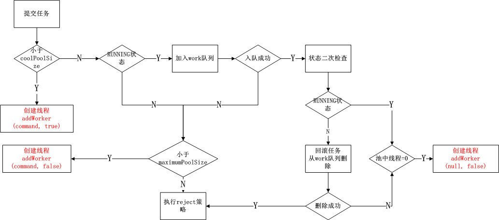

# 池化技术

池化技术的思想主要是为了**减少每次获取资源的消耗，提高对资源的利用率**。线程池、数据库连接池、Http 连接池等等都是对这个思想的应用。

## 线程池

线程池提供了一种限制和管理资源（包括执行一个任务）的方式。 每个线程池还维护一些基本统计信息，例如已完成任务的数量。
使用线程池的好处包括了：

- 降低资源消耗。通过重复利用已创建的线程降低线程创建和销毁造成的消耗。
- 提高响应速度。当任务到达时，任务可以不需要等到线程创建就能立即执行。
- 提高线程的可管理性。线程是稀缺资源，如果无限制的创建，不仅会消耗系统资源，还会降低系统的稳定性，使用线程池可以进行统一的分配，调优和监控。

### Java线程池

这里不做java线程池的使用详解，主要是记录线程的开销以及线程池实现的源码分析。

#### 开销对比
```java
public class PoolTest {
    private static final int CORE_POOL_SIZE = 5; //线程池的核心线程数量
    private static final int MAX_POOL_SIZE = 10; //线程池的最大线程数，当待执行任务大于核心线程，则会临时增加线程来执行任务，总线程数不大于最大线程数
    private static final int QUEUE_CAPACITY = 10000; //当待执行任务大于最大线程数时，通过任务队列来储存等待执行的任务
    private static final Long KEEP_ALIVE_TIME = 1L; //当线程数大于核心线程数时，多余的空闲线程存活的最长时间

	//开启100个任务，保证所有任务执行完成后才计算endTime
    private final static int num = QUEUE_CAPACITY;
    private static CountDownLatch latch = new CountDownLatch(num);

	//1. 通过线程池创建线程
    public static void poolTest() throws Exception {
        long start = System.currentTimeMillis();
        //ThreadPoolExecutor executor = (ThreadPoolExecutor) Executors.newFixedThreadPool(5);
        ThreadPoolExecutor executor = new ThreadPoolExecutor(CORE_POOL_SIZE,
                MAX_POOL_SIZE,
                KEEP_ALIVE_TIME,
                TimeUnit.SECONDS,
                new ArrayBlockingQueue<Runnable>(QUEUE_CAPACITY),
                new ThreadPoolExecutor.CallerRunsPolicy());

        for (int i = 0; i < num; i++) {
            //创建WorkerThread对象（WorkerThread类实现了Runnable 接口）
            Runnable worker = new MyRunnable(latch);
            //执行Runnable
            executor.execute(worker);
        }
        //终止线程池
        latch.await();
        executor.shutdown();
        long end = System.currentTimeMillis();
        System.out.printf("Finished all threads, time used %d milliseconds \r\n", end - start);
    }
	//2. 直接new Thread创建野线程
    public static void threadTest() throws Exception {
        //new Thread创建线程
        long start = System.currentTimeMillis();
        for (int i = 0; i < num; i++) {
            Thread tmpThread = new Thread(new MyRunnable(latch));
            tmpThread.start();
        }
        latch.await();
        long end = System.currentTimeMillis();
        System.out.printf("Finished all threads, time used %d milliseconds \r\n", end - start);
    }
	//3. 做简单的时间对比
    public static void main(String[] args) throws Exception {
        System.out.println("thread test start");
        threadTest();
        System.out.println("pool test start");
        poolTest();
    }

}

//其输出对比如下：
thread test start
Finished all threads, time used 4190 milliseconds 
pool test start
Finished all threads, time used 28 milliseconds 
```

#### 关键参数

Java线程池中比较重要的类是**ThreadPoolExecutor**， 其完整的构造函数入参如下:
```java
/**
     * Creates a new {@code ThreadPoolExecutor} with the given initial
     * parameters.
     *
     * @param corePoolSize the number of threads to keep in the pool, even
     *        if they are idle, unless {@code allowCoreThreadTimeOut} is set
     * @param maximumPoolSize the maximum number of threads to allow in the
     *        pool
     * @param keepAliveTime when the number of threads is greater than
     *        the core, this is the maximum time that excess idle threads
     *        will wait for new tasks before terminating.
     * @param unit the time unit for the {@code keepAliveTime} argument
     * @param workQueue the queue to use for holding tasks before they are
     *        executed.  This queue will hold only the {@code Runnable}
     *        tasks submitted by the {@code execute} method.
     * @param threadFactory the factory to use when the executor
     *        creates a new thread
     * @param handler the handler to use when execution is blocked
     *        because the thread bounds and queue capacities are reached
     * @throws IllegalArgumentException if one of the following holds:<br>
     *         {@code corePoolSize < 0}<br>
     *         {@code keepAliveTime < 0}<br>
     *         {@code maximumPoolSize <= 0}<br>
     *         {@code maximumPoolSize < corePoolSize}
     * @throws NullPointerException if {@code workQueue}
     *         or {@code threadFactory} or {@code handler} is null
     */
    public ThreadPoolExecutor(int corePoolSize, //核心线程数线程数定义了最小可以同时运行的线程数量。
                              int maximumPoolSize, //当池中线程数大于corePoolSize，如果还有任务待执行，则继续创建线程至最大线程数maximumPoolSize
                              long keepAliveTime,  //当线程池中的线程数量大于corePoolSize时，如无新任务提交，核心线程外的线程不会立即销毁，而是等待keepAliveTime后被回收销毁
                              TimeUnit unit,//keepAliveTime 参数的时间单位
                              BlockingQueue<Runnable> workQueue, //当新任务来的时候会先判断当前运行的线程数量是否达到核心线程数，如果达到的话，新任务就会被存放在队列中
                              ThreadFactory threadFactory, //创建新线程的工厂
                              RejectedExecutionHandler handler) //拒绝策略，运行的线程数量达到最大线程数量并且队列也已经被放满了任务时被执行
							  {...}
```
其中具体的拒绝策略包括了:
- `ThreadPoolExecutor.AbortPolicy` ：抛出 RejectedExecutionException来拒绝新任务的处理。
- `ThreadPoolExecutor.CallerRunsPolicy`：调用执行自己的线程运行任务，也就是直接在调用execute方法的线程中运行(run)被拒绝的任务，如果执行程序已关闭，则会丢弃该任务。因此这种策略会降低对于新任务提交速度，影响程序的整体性能。如果您的应用程序可以承受此延迟并且你要求任何一个任务请求都要被执行的话，你可以选择这个策略。
- `ThreadPoolExecutor.DiscardPolicy` ：不处理新任务，直接丢弃掉。
- `ThreadPoolExecutor.DiscardOldestPolicy` ： 此策略将丢弃最早的未处理的任务请求。

#### 代码分析

ThreadPoolExecutor针对线程池一共维护了五种状态，实现上**用高3位表示ThreadPoolExecutor的执行状态，低29位维持线程池线程个数**，具体为：
```java
public class ThreadPoolExecutor extends AbstractExecutorService {
	//使用原子变量标记状态，注意这里不是volatile，因为后者只能保证可见性，不能保证原子性
    private final AtomicInteger ctl = new AtomicInteger(ctlOf(RUNNING, 0));
    
	// Integer.SIZE=32, Integer.SIZE-3=29, COUNT_BITS=29， 用来表示线程池数量的位数是29
    private static final int COUNT_BITS = Integer.SIZE - 3;
    
	// 线程池最大线程数=536870911（2^29-1）,CAPACITY二进制中低29为1，高3位为0，即00011111111111111111111111111111
    private static final int CAPACITY   = (1 << COUNT_BITS) - 1;

    // 线程池有5种runState状态，所以需要3位来表示，即高3位表示ThreadPoolExecutor的执行状态
    // RUNNING=111
    private static final int RUNNING    = -1 << COUNT_BITS;
    // SHUTDOWN=000
    private static final int SHUTDOWN   =  0 << COUNT_BITS;
    // STOP=001
    private static final int STOP       =  1 << COUNT_BITS;
    // TIDYING=010
    private static final int TIDYING    =  2 << COUNT_BITS;
    // TERMINATED=110
    private static final int TERMINATED =  3 << COUNT_BITS;

   
    // 获取高3位的值，即线程池状态
    private static int runStateOf(int c)     { return c & ~CAPACITY; }
    // 获取低29位的值，即线程数量
    private static int workerCountOf(int c)  { return c & CAPACITY; }
	...
```

**这里注意，只有RUNNING状态对应的int值为负数，即RUNNING<SHUTDOWN<STOP<TIDYING<TERMINATED**

核心方法`public void execute(Runnable command){...}`的分析如下，首先整体流程上：


1. **execute**

具体看实现：
```java
public void execute(Runnable command) {
		...
        //执行的流程实际上分为三步：
		
        //1. 获取当前【线程状态-线程数量】信息，即c，workerCountOf取低29位，即线程数量，如果运行的线程小于corePoolSize，以用户给定的Runable对象新开一个线程去执行
        int c = ctl.get();
        if (workerCountOf(c) < corePoolSize) {
            if (addWorker(command, true))
                return;
            c = ctl.get();
        }				
		//2. 如果当前线程数量>=coolPoolSize，则判断线程池状态是否为running，如果为running，则进入阻塞队列workQueue
        if (isRunning(c) && workQueue.offer(command)) {
			//当入队成功后，再次获取ctl，在并发环境下，可能之前获取的ctl状态已经发生改变
			//当然，此处获取也未必是线程池的最新状态(比如在后面的if(xxx)之前状态又发生变化了)，只是尽最大努力判断
            int recheck = ctl.get();
			//如果线程池非running，则回滚
            if (! isRunning(recheck) && remove(command))
				//回滚后执行reject策略
                reject(command);
			//否则，即线程池还在running或者回滚失败，判断当前线程池中线程数，如果==0，则添加一个null的command
            else if (workerCountOf(recheck) == 0)
                addWorker(null, false);
        }
		//3. 如果线程池不为running，或队满无法入队，则调用addWorker
		// 后者会判断当前线程数是否<=maximumPoolSize，如果是，则创建线程
        else if (!addWorker(command, false))
			//否则，执行拒绝策略
            reject(command);
    }

```

2. **addWorker**
其中的addWorker方法实现如下:
```java
    private boolean addWorker(Runnable firstTask, boolean core) {
        retry:
        for (;;) {
			//获取当前的线程池状态
            int c = ctl.get();
            int rs = runStateOf(c);

            // Check if queue empty only if necessary.
			// 约束检查，以下情况返回addWorker添加任务失败：
			// 1. rs >= SHUTDOWN为true ,即线程池不是RUNNING状态
			// 2. 子句!(rs == SHUTDOWN &&firstTask == null &&!workQueue.isEmpty())，即3个子条件有一个不满足，则整个语句为true，具体为：
			// 	  2.1 如果rs不等于SHUTDOWN，说明不能再添加任务，返回失败
			// 	  2.2 如果rs等于SHUTDOWN，但传入的task不为空，代表线程池已经关闭了还在传任务进来，返回失败
			//    2.3 如果rs等于SHUTDOWN，传入的task为空，且队列是为空，此时就不需要往线程池添加任务了，返回失败
            if (rs >= SHUTDOWN &&
                ! (rs == SHUTDOWN &&
                   firstTask == null &&
                   ! workQueue.isEmpty()))
                return false;
            for (;;) {
				//获取线程池的workerCount数量
                int wc = workerCountOf(c);
				//如果workerCount超出最大值或者大于corePoolSize/maximumPoolSize，返回false
                if (wc >= CAPACITY ||
                    wc >= (core ? corePoolSize : maximumPoolSize))
                    return false;
				//通过CAS操作，使workerCount数量+1，如果成功，跳出循环，回到retry标记
                if (compareAndIncrementWorkerCount(c))
                    break retry;
				//如果CAS操作失败，说明在从ctl.get()到刚才的执行过程中，线程池状态发生改变了，则再次获取线程池的控制状态
                c = ctl.get();  // Re-read ctl
				//如果当前runState不等于刚开始获取的runState，则跳出内层循环，继续外层循环
                if (runStateOf(c) != rs)
                    continue retry;
                // else CAS failed due to workerCount change; retry inner loop
            }
        }
		//通过以上循环，当执行以下语句时，说明线程池数量成功+1
		
		
        boolean workerStarted = false;
        boolean workerAdded = false;
        Worker w = null;
        try {
			//初始化一个当前Runnable对象的worker对象，后者调用factory的newThread()方法创建一个线程，作为自身的成员变量
            w = new Worker(firstTask);
			//获取刚才factory创建的线程
            final Thread t = w.thread;
            if (t != null) {
				//加锁
                final ReentrantLock mainLock = this.mainLock;
                mainLock.lock();
                try {
                    // Recheck while holding lock.
                    // Back out on ThreadFactory failure or if
                    // shut down before lock acquired.
					//获取锁后再次检查，获取线程池runState
                    int rs = runStateOf(ctl.get());
					//当:
					//1. runState小于SHUTDOWN，即为RUNNING状态
					//2. 或者runState等于SHUTDOWN并且firstTask为null时，将worker对象加入集合，并更新集合大小
                    if (rs < SHUTDOWN ||
                        (rs == SHUTDOWN && firstTask == null)) {
						//此时线程还没有启动，如果alive，就报错
                        if (t.isAlive()) // precheck that t is startable
                            throw new IllegalThreadStateException();
                        workers.add(w);
                        int s = workers.size();
                        if (s > largestPoolSize)
                            largestPoolSize = s;
                        workerAdded = true;
                    }
                } finally {
                    mainLock.unlock();
                }
				//如果worker添加成功，启动线程并标记已经启动
                if (workerAdded) {
                    t.start();
                    workerStarted = true;
                }
            }
        } finally {
			//如果worker没有启动成功，执行workerCount-1的操作
            if (! workerStarted)
                addWorkerFailed(w);
        }
		//返回worker是否启动的标记
        return workerStarted;
    }


```

总结来看，addWorker主要用于在*当前线程<corePoolSize 或者 当前线程>corePoolSize且队满* 后被调用，调用时通过new Worker(firstTask)封装一个worker对象并执行。那么，相比于每个task执行new Thread去跑野线程，通过worker对象封装并执行worker.thread.start()，其对所管理线程如何利用的呢，即在传入的task执行完毕后，如何处理线程的回收、复用？答案是：*将由封装的Worker对象进行管理。*

3. **Worker**

接下来对Worker对象进行分析：
```java
private final class Worker
        extends AbstractQueuedSynchronizer
        implements Runnable
    {
       ...

        /**
         * Creates with given first task and thread from ThreadFactory.
         * @param firstTask the first task (null if none)
         */
        Worker(Runnable firstTask) {
            setState(-1); // inhibit interrupts until runWorker
			// 在addWorker中，w = new Worker(firstTask)，因此Worker中的firstTask就是线程池执行时传入的自定义的Runnable接口实现
            this.firstTask = firstTask;
			// 即上文分析的，task会通过factory创建一个Thread对象
            this.thread = getThreadFactory().newThread(this);
        }
		//可以看到Worker实现了Runnable接口，因此上文addWorker函数中最终的线程执行t.start()即执行此处的runWorker函数
        /** Delegates main run loop to outer runWorker  */
        public void run() {
            runWorker(this);
        }
```

4 **runWorker**

再看runWorker的实现：
```java
final void runWorker(Worker w) {
        Thread wt = Thread.currentThread();
        Runnable task = w.firstTask;
        w.firstTask = null;
        w.unlock(); // allow interrupts
        boolean completedAbruptly = true;
        try {
			//此处可以理解为一个无限循环， worker对象就通过这个方法的持续运行来不断处理新的任务
			//因此，调用pool的execute(Runnable task)时，如果：
			//1. 如果当前线程数<corePoolSize 或 无法入队且 当前线程数<maximumPoolSize，则进行addWorker调用，此时task != null
			//2. 如果task为null，则通过getTask方法获取阻塞队列中的下一个任务
            while (task != null || (task = getTask()) != null) {
			    //每一次任务的执行都必须获取锁来保证下方临界区代码的线程安全
                w.lock();
                // If pool is stopping, ensure thread is interrupted;
                // if not, ensure thread is not interrupted.  This
                // requires a recheck in second case to deal with
                // shutdownNow race while clearing interrupt
				// 如果状态值大于等于STOP（即STOP、TIDYING、TERMINATED）且当前线程还没有被中断，则主动中断线程
                if ((runStateAtLeast(ctl.get(), STOP) ||
                     (Thread.interrupted() &&
                      runStateAtLeast(ctl.get(), STOP))) &&
                    !wt.isInterrupted())
                    wt.interrupt();
                try {
					//执行任务前处理操作，默认是一个空实现；在子类中可以通过重写来改变任务执行前的处理行为
                    beforeExecute(wt, task);
					//保存任务执行过程中抛出的异常，提供给下面finally块中的afterExecute方法使用
                    Throwable thrown = null;
                    try {
						//业务的实际执行，此处直接调用run函数，因此task的执行是在Worker这个线程中进行的
                        task.run();
                    } catch (RuntimeException x) {
                        thrown = x; throw x;
                    } catch (Error x) {
                        thrown = x; throw x;
                    } catch (Throwable x) {
                        thrown = x; throw new Error(x);
                    } finally {
						//任务后处理，同beforeExecute
                        afterExecute(task, thrown);
                    }
                } finally {
					//将循环变量task设置为null，表示已处理完成
                    task = null;
                    w.completedTasks++;
                    w.unlock();
                }
            }
			//将completedAbruptly变量设置为false，表示任务正常处理完成
            completedAbruptly = false;
        } finally {
			//销毁当前的worker对象，并完成一些诸如完成任务数量统计之类的辅助性工作
            //在线程池当前状态小于STOP的情况下会创建一个新的worker来替换被销毁的worker
            processWorkerExit(w, completedAbruptly);
        }
    }
```
从上述代码可以看到：**线程池中维护的线程其实是Worker对象，后者实现了Runnable接口，其run()函数本质上是一个while(true)的死循环，通过在循环内部，执行task.run()，以函数调用的方式，完成了实际task业务的执行。**，这里注意，以下细节：
```java
//定义一个Runnable实现
class R1 implements Runnable {
    public void run() { … }
    …
}
public static void main() {
	//调用没有单独拉起一个新线程
    R1 r1 = new R1();
    r1.run();
	//另起一个新线程t1，去跑R1的run
	Thread t1 = new Thread(r1);
    t1.start();
}
```
综上，可以得到以下情况：

- 线程数<corePoolSize： 调用runWorker，会新建worker对象，即一个core线程，此时task不为null，然后在while循环中处理task的run逻辑。如果run调用完毕，清空task，从队列中再取值，否则将一直占用这个core线程。
- 线程数<=maximumPoolSize: 即通过execute添加任务，如果core线程均在运行，且阻塞队列满后，同样会调用runWorker新建worker对象，此时为一个野线程，即while中的task不为空，去执行task的run逻辑。

那么对于入队满而创建的野线程，如何进行回收呢？注意在runWorker循环中的条件`(task != null || (task = getTask()!=null)`,其中getTask方法为一个阻塞方法，直到获取task后才返回，但也有可能返回null，如果返回null，则退出了worker对象的while循环，并销毁这个worker线程。下面进行具体分析：

5. **getTask**

```java

/**
     * Performs blocking or timed wait for a task, depending on
     * current configuration settings, or returns null if this worker
     * must exit because of any of:
     * 1. There are more than maximumPoolSize workers (due to
     *    a call to setMaximumPoolSize).
     * 2. The pool is stopped.
     * 3. The pool is shutdown and the queue is empty.
     * 4. This worker timed out waiting for a task, and timed-out
     *    workers are subject to termination (that is,
     *    {@code allowCoreThreadTimeOut || workerCount > corePoolSize})
     *    both before and after the timed wait, and if the queue is
     *    non-empty, this worker is not the last thread in the pool.
     *
     * @return task, or null if the worker must exit, in which case
     *         workerCount is decremented
     */
    private Runnable getTask() {
        boolean timedOut = false; // Did the last poll() time out?

        for (;;) {
            int c = ctl.get();
            int rs = runStateOf(c);

            // Check if queue empty only if necessary.
			// 如果 线程池状态>=STOP
			//    或者 (线程池状态==SHUTDOWN && 阻塞队列为空)
			// 则直接减少一个worker计数并返回null（返回null会导致当前worker被销毁）
            if (rs >= SHUTDOWN && (rs >= STOP || workQueue.isEmpty())) {
                decrementWorkerCount();
                return null;
            }

            int wc = workerCountOf(c);

            // Are workers subject to culling?
			// 判断当前线程是否会被超时销毁，即 线程池允许核心线程超时 或 当前线程数大于核心线程数
			// 因此，对于入队满而创建的野线程，其timed=true，继而根据后续对timed的判断，调用workQueue.poll(keepAliveTime, TimeUnit.NANOSECONDS)，如果超时则最终返回null
            boolean timed = allowCoreThreadTimeOut || wc > corePoolSize;


			// 如果同时满足：
			// 1. (当前线程数大于最大线程数) 或 (允许超时销毁 且 当前发生了空闲时间超时))
			// 2. (当前线程数大于1 或 阻塞队列为空)
			// 则 减少worker计数并返回null（返回null会导致当前worker被销毁）
            if ((wc > maximumPoolSize || (timed && timedOut))
                && (wc > 1 || workQueue.isEmpty())) {
                if (compareAndDecrementWorkerCount(c))
                    return null;
                continue;
            }

            try {
				// 从阻塞队列中取出一个任务（如果队列为空会进入阻塞等待状态）
				// 如果允许空闲超时销毁线程的话则带有一个等待的超时时间
                Runnable r = timed ?
                    workQueue.poll(keepAliveTime, TimeUnit.NANOSECONDS) :
                    workQueue.take();
                if (r != null)
                    return r;
				// 如果任务为null，则说明发生了等待超时，将空闲时间超时标志设置为true
                timedOut = true;
            } catch (InterruptedException retry) {
				// 如果等待被中断了，那说明空闲时间（等待任务的时间）还没有超时
                timedOut = false;
            }
        }
    }
```
从实现上可以看到：getTask方法在阻塞队列中有待执行的任务时会从队列中弹出一个任务并返回，如果阻塞队列为空，那么就会阻塞等待新的任务提交到队列中直到超时（在一些配置下会一直等待而不超时），如果在超时之前获取到了新的任务，那么就会将这个任务作为返回值返回。所以一般getTask方法是不会返回null的，只会阻塞等待下一个任务并在之后将这个新任务作为返回值返回。

当getTask方法返回null时会导致当前Worker退出，当前线程被销毁。在以下情况下getTask方法才会返回null：
- 当前线程池中的线程数超过了最大线程数。这是因为运行时通过调用setMaximumPoolSize修改了最大线程数而导致的结果；
- 线程池处于STOP状态。这种情况下所有线程都应该被立即回收销毁；
- 线程池处于SHUTDOWN状态，且阻塞队列为空。这种情况下已经不会有新的任务被提交到阻塞队列中了，所以线程应该被销毁；
- 线程被超时回收，具体包括了：超出核心线程数部分的线程等待任务超时  、 允许核心线程超时（线程池配置）的情况下线程等待任务超时

6. **processWorkerExit**

最终，看下当getTask返回null后，worker线程的清理工作：
```java
/**
     * Performs cleanup and bookkeeping for a dying worker. Called
     * only from worker threads. Unless completedAbruptly is set,
     * assumes that workerCount has already been adjusted to account
     * for exit.  This method removes thread from worker set, and
     * possibly terminates the pool or replaces the worker if either
     * it exited due to user task exception or if fewer than
     * corePoolSize workers are running or queue is non-empty but
     * there are no workers.
     *
     * @param w the worker
     * @param completedAbruptly if the worker died due to user exception
     */
    private void processWorkerExit(Worker w, boolean completedAbruptly) {
		// 如果completedAbruptly为true则表示任务执行过程中抛出了未处理的异常
		// 所以还没有正确地减少worker计数，这里需要减少一次worker计数
        if (completedAbruptly) // If abrupt, then workerCount wasn't adjusted
            decrementWorkerCount();
		// 获取线程池的主锁
        final ReentrantLock mainLock = this.mainLock;
		
        mainLock.lock();
        try {
			// 把将被销毁的线程已完成的任务数累计到线程池的完成任务总数上
            completedTaskCount += w.completedTasks;
			// 从worker集合中去掉将会销毁的worker
            workers.remove(w);
        } finally {
            mainLock.unlock();
        }	
		
		// 尝试结束线程池
		// 这里是为了在关闭线程池时等到所有worker都被回收后再结束线程池
        tryTerminate();
		// 如果线程池状态 < STOP，即RUNNING或SHUTDOWN
		// 则需要考虑创建新线程来代替被销毁的线程
        int c = ctl.get();
        if (runStateLessThan(c, STOP)) {
            if (!completedAbruptly) {
				// 如果允许核心线程超时则最小线程数是0，否则最小线程数等于核心线程数
                int min = allowCoreThreadTimeOut ? 0 : corePoolSize;
				// 如果阻塞队列非空，则至少要有一个线程继续执行剩下的任务
                if (min == 0 && ! workQueue.isEmpty())
                    min = 1;
				// 如果当前线程数已经满足最小线程数要求
				// 那么就不创建替代线程了
                if (workerCountOf(c) >= min)
                    return; // replacement not needed
            }
			// 重新创建一个worker来代替被销毁的线程
            addWorker(null, false);
        }
    }
```
processWorkerExit方法会销毁当前线程对应的Worker对象，并执行一些累加总处理任务数等辅助操作，但在线程池当前状态小于STOP的情况下会创建一个新的Worker来替换被销毁的Worker

参考:  https://www.cnblogs.com/zjfjava/p/13909285.html

### golang协程池

由于golang的并发使用协程实现，协程的创建与销毁均在用户态，因此不存在开销问题，故不存在单纯的协程池。以是简化的协程池的实现：
```go
type Pool struct {
	timeout time.Duration	//核心协程超时
	core  chan struct{}		//核心协程数
	queue chan Task			//任务队列， 生产者消费者模型，核心协程从该队列不断取任务执行
}

func NewPool(coreSize, queueSize uint32, timeout time.Duration) *Pool {
	//队列总长度（可处理任务数） = 核心协程数  + 等待任务队列长度
	return &Pool{core: make(chan struct{}, coreSize), queue: make(chan Task, queueSize+coreSize),timeout:timeout}
}

func (p *Pool) Execute(t *Task) {
	//任务直接入队，队满则拒绝
	select {
	case p.queue <- *t:
		select {
		//如果协程数没有达到core，则创建，否则仅仅入队
		case p.core <- struct{}{}:
			logs.Debug("task %s enter core goroutine", t.Name)
			worker := NewWorker(p)
			worker.run()
			return
		default:
			logs.Warning("core routine is full")
		}
	default:
		logs.Error("queue is full. reject")
	}
}

type Worker interface {
	run()
}

func (p *Pool) run() {
	to := time.NewTimer(p.timeout)
	go func() {
		//协程实体，不停从queue中取出任务执行
		for {
			select {
			case task := <-p.queue:
				logs.Debug("get %s from queue", task.Name)
				task.run()
				logs.Debug("%s finished", task.Name)
				to.Reset(p.timeout)
			//如果timeout时间内取不到任务，就退出了
			case <-to.C:
				logs.Warning("time out")
				<-p.core
				return
			}
		}
	}()
}
```

## DB连接池

### gorm连接池的实现

[参考此处笔记](https://github.com/jzdwk/notes/blob/master/db/gorm-sql.md#%E8%BF%9E%E6%8E%A5%E6%B1%A0%E4%BB%A3%E7%A0%81%E5%88%86%E6%9E%90)

## http连接池