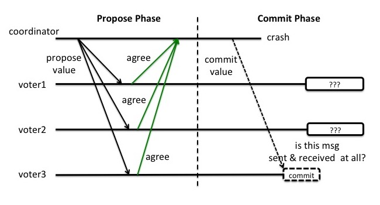
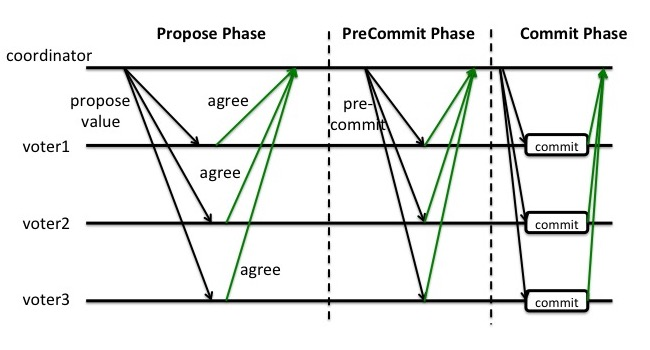

# distributed-transaction

## 理论

### CAP

CAP的含义：

- C：Consistency 一致性，同一数据的多个副本是否实时相同。
- A：Availability 可用性，一定时间内，系统返回一个明确的结果。
- P：Partition tolerance 分区容错性，将同一服务分布在多个系统中，保证某一个系统宕机，其他系统提供相同的服务。

在一个分布式系统中，最多**只能满足C、A、P中的两个需求**,因此，在多数场景下，我们只能通过**牺牲一致性来换取系统的可用性和分区容错性**。即BASE理论

### BASE

牺牲一致性并不是完全放弃数据一致性，而是牺牲强一致性换取弱一致性。

- BA,Basic Available：基本可用，整个系统在某些不可抗力的情况下，仍然能够保证*可用性*，即一定时间内仍然能够返回一个明确的结果。只不过和*高可用*有区别，主要体现为响应时间可以适当延长，另外返回的明确结果不一定是最终用户期待结果。

- S,Soft State：柔性状态
同一数据的不同副本的状态，可以不需要实时一致。

- E,Eventual Consisstency：最终一致性
同一数据的不同副本的状态，可以不需要实时一致，但一定要保证经过一定时间后仍然是一致的。

## 酸碱平衡

ACID能够保证事务的强一致性，即数据是实时一致的。这在本地事务中是没有问题的，在分布式事务中，强一致性会极大影响分布式系统的性能，因此分布式系统中遵循BASE理论即可。

但分布式系统的不同业务场景对一致性的要求也不同。如交易场景下，就要求强一致性，此时就需要遵循ACID理论，而在注册成功后发送短信验证码等场景下，并不需要实时一致，因此遵循BASE理论即可。因此要根据具体业务场景，在ACID和BASE之间寻求平衡。

## 协议

### 2PC

2PC协议有两个阶段:Propose和Commit. 在*无failure情况下的*2PC协议流程如下:

- Propose阶段:

coordinator: "准备好了么"(propose)
voter1/voter2/voter3: "准备好了!"(agree,此时的voter可以执行事务操作，并记录redo/undo)

- Commit阶段：

coordinator: "跑"(commit)
voter1/voter2/voter3: "跑了"(ack) 

如果有至少一个voter (比如voter3)在propose阶段投了反对票, 那么propose通过失败. coordinator就会在commit(or abort)阶段跟所有voter说, 放弃这个propose. 

### 2PC缺陷

2PC的缺点在于不能处理**fail-stop**形式的节点failure。，即存在**事务状态不确定性**问题。

假设coordinator和voter3都在commit这个阶段crash了, 而voter1和voter2没有收到commit消息. 这时候voter1和voter2就陷入了一个困境. 因为他们并不能判断现在是两个场景中的哪一种:

1. 上轮全票通过然后voter3第一个收到了commit的消息并在commit操作之后crash了,此时，voter1/2需要和voter3的数据保持一致，即提交事务
2. 上轮voter3反对所以干脆没有通过，此时，voter1/2则需要回滚事务

2PC在这种fail-stop情况下会失败是因为**voter在得知propose结果后就直接commit了, 而并没有在commit之前告知其他voter自己已收到propose的结果. 从而导致在coordinator和一个voter双双掉线的情况下, 其余voter不但无法复原propose的结果, 也无法知道掉线的voter是否打算甚至已经commit.** 

另外，2PC也存在：

- 同步阻塞问题

执行过程中，所有参与节点都是事务阻塞型的。当参与者占有公共资源时，其他第三方节点访问公共资源不得不处于阻塞状态。也就是说从投票阶段到提交阶段完成这段时间，资源是被锁住的。

- 单点故障。

由于协调者的重要性，一旦协调者发生故障。参与者会一直阻塞下去。
尤其在第二阶段，协调者发生故障，那么所有的参与者还都处于锁定事务资源的状态中，而无法继续完成事务操作。

- 数据不一致

在二阶段提交的阶段二中，当协调者向参与者发送commit请求之后，发生了局部网络异常或者在发送commit请求过程中协调者发生了故障，这回导致只有一部分参与者接受到了commit请求。而在这部分参与者接到commit请求之后就会执行commit操作。但是其他部分未接到commit请求的机器则无法执行事务提交。于是整个分布式系统便出现了数据不一致性的现象。

为了解决这一问题, 提出了3PC.

### 3PC 

3PC就是把2PC的Commit阶段拆成了PreCommit和Commit两个阶段. 通过进入增加的这一个PreCommit阶段, voter可以得到Propose阶段的投票结果, 但不会commit; 当进入Commit阶段, **某voter没有收到coordinator的commit消息时，也可以确定其他每个voter也都打算commit了, 从而可以放心的commit**.

原因在于，当进入Commit阶段时，说明voter在第二阶段已经收到了preCommit请求，而coordinator产生preCommit请求的前提条件是他在preCommit阶段阶段开始之前，收到所有voter的propose响应都是agree。一旦voter收到了preCommit，意味他知道大家其实都同意修改了。
所以，当进入Commit阶段时，由于网络超时等原因，虽然voter没有收到commit或者abort响应，但是他有理由相信：成功提交的几率很大。

再考虑2PC的事务状态不确定问题，3PC在2PC的Commit阶段里增加了一个barrier(即preCommit阶段，相当于告诉其他所有voter, 我收到了Propose的结果了). 在这个barrier之前coordinator掉线的话, 即某些voter没有收到preCommit请求,其他voter可以得出结论不是每个voter都收到Propose Phase的结果, 从而放弃或选出新的coordinator; 在这个barrier之后coordinator掉线的话, 每个voter会放心的commit, 因为他们知道其他voter也都做同样的计划.

但是这种机制也会导致数据一致性问题，因为，由于网络原因，coordinator发送的abort响应没有及时被voter接收到，那么voter在等待超时之后执行了commit操作。这样就和其他接到abort命令并执行回滚的参与者之间存在数据不一致的情况。所以无论是2PC还是3PC都存在问题.

参考

- https://juejin.im/post/6844903573667446797
- https://zhuanlan.zhihu.com/p/35298019
- https://zhuanlan.zhihu.com/p/35616810

