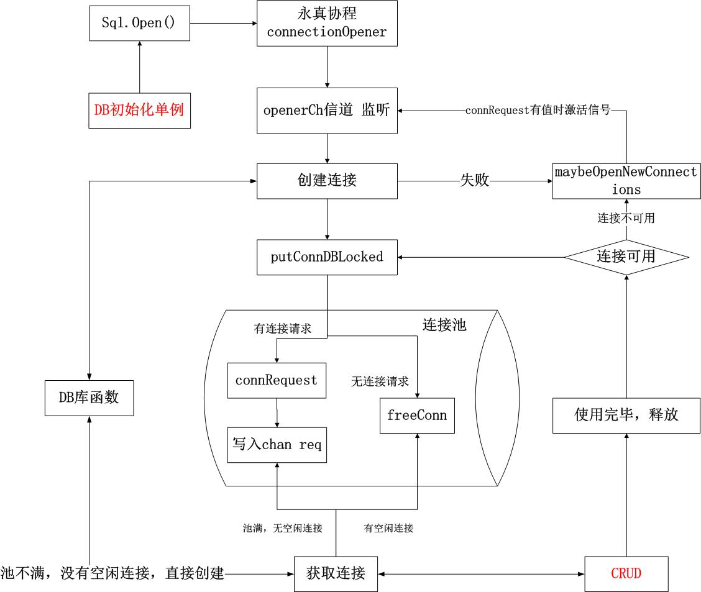

# gorm 连接池

golang的持久层框架，比如gorm，beego的orm，其底层都引用了官方sql包的连接池。

思考一个基本的连接池所基本的功能：

1. 从池中获取一个连接，`getConn`
2. 使用完这个连接后，将连接放回池中，`releaseConn`
3. 关闭连接池，同时关闭池中的所有连接，`poolClose`

## 为什么需要连接池

1. 复用tcp连接，减少系统开销
2. gorm作为客户端，连接的db作为服务端，考虑tcp 4次挥手场景下，减少客户端主动关闭时的**TIME_WAIT状态过多**问题。

具体[参考此处笔记](../base/concurrency-pool.md)

## 连接池相关的测试

在搞清楚连接池的工作之前，考虑一个场景：*多个client端代码执行sql查询，访问pg数据库*，此时涉及连接池的配置参数包括了：
1. gorm的连接池参数配置
```golang
	dataSourceName := fmt.Sprintf("user=%s password=%s dbname=%s host=%s port=%s timezone=%s sslmode=disable",
		DBUSER,DBPASSWD,DBNAME,HOST,PORT,TIMEZONE)
	gdb, err = gorm.Open(postgres.Open(dataSourceName), &gorm.Config{
		NamingStrategy: schema.NamingStrategy{SingularTable: true},
	})

	pgsqlDB, err := gdb.DB()
	...
	//配置连接池的最大idle数、最大可打开的连接数以及连接的ttl
	pgsqlDB.SetMaxOpenConns(10)
	
```
2. postgres的连接参数配置
```
//位于/var/lib/postgresql/data/postgresql.conf
// pg的最大连接数
max_connections = 20                    # (change requires restart)
```

那么，两者有何关系？答案是，**gorm连接池配置主要用于在client调用db时，对连接进行复用，而pg的连接配置则是pg真实的连接数**，测试如下
```
//1. gorm连接数>pg连接数，pgsqlDB.SetMaxOpenConns(50)，max_connections = 20   
pg日志： 2022-09-27 15:18:06.432 CST [8056] FATAL:  sorry, too many clients already
gorm日志： ailed to connect to `host=xxx user=postgres database=test`: server error (FATAL: sorry, too many clients already (SQLSTATE 53300))
	
//2. gorm连接数<=pg连接数
通过并发查询将gorm池连接打满后，在pg上查询： select count(*), usename from pg_stat_activity group by usename;   得到结果 pg的连接数=gorm池定义的连接数
注： 由于除了client代码，其他client(比如监控、navicat)也需要连接db，因此应该是pg连接数<=gorm连接数+其他连接数，否则将too many clients already
```
3. 空闲连接处理

在gorm池或pg中，对于空闲连接的处理有以下参数

- gorm池：
```
	pgsqlDB.SetMaxIdleConns(4)
	pgsqlDB.SetMaxOpenConns(10)
	pgsqlDB.SetConnMaxLifetime(time.Second)
	pgsqlDB.SetConnMaxIdleTime(time.Second)
```

- pg参数：
```
//session
idle_in_transaction_session_timeout = 2000      # in milliseconds, 0 is disabled
//tcp
tcp_keepalives_idle = 60                # TCP_KEEPIDLE, in seconds;
tcp_keepalives_interval = 5             # TCP_KEEPINTVL, in seconds;
tcp_keepalives_count = 3                # TCP_KEEPCNT;
```
那么，池中的空闲参数与pg设置的空闲参数有何相关？


## 连接池代码分析

### 初始化

gorm的初始化执行类似如下代码：
```go
~~~~~~~~~~~~~~~~~~~~~~~~~~~~~~~~~~~~~
initDB(){
	...
	//dataSourceName define
	dataSourceName := fmt.Sprintf("user=%s password=%s dbname=%s host=%s port=%s timezone=%s sslmode=disable",
		dbUser, dbPwd, dbName, dbHost, dbPort, dbTimeZone)
	//Open db
	//postgres.Open(dataSourceName)封装一个&Dialector{&Config{DSN: dsn}} Dialector对象，即DB的初始化委托给了dialector创建
	db, err := gorm.Open(postgres.Open(dataSourceName), &gorm.Config{
		NamingStrategy: schema.NamingStrategy{SingularTable: true},
	})
}
~~~~~~~~~~~~~~~~~~~~~~~~~~~~~~~~~~~~~
//gorm.Open 	
func Open(dialector Dialector, config *Config) (db *DB, err error) {
	...
	db = &DB{Config: config, clone: 1}
	db.callbacks = initializeCallbacks(db)
	...
	//dialector即调用postgres.Open(dataSourceName)封装的pg配置信息对象，执行初始化
	if config.Dialector != nil {
		err = config.Dialector.Initialize(db)
	}
	preparedStmt := &PreparedStmtDB{
		ConnPool:    db.ConnPool,
		Stmts:       map[string]Stmt{},
		Mux:         &sync.RWMutex{},
		PreparedSQL: make([]string, 0, 100),
	}
	...
	return
}
~~~~~~~~~~~~~~~~~~~~~~~~~~~~~~~~~~~~~
func (dialector Dialector) Initialize(db *gorm.DB) (err error) {
	// register callbacks
	...
	//dialector尚未赋值Conn以及DriverName
	if dialector.Conn != nil {
		db.ConnPool = dialector.Conn
	} else if dialector.DriverName != "" {
		db.ConnPool, err = sql.Open(dialector.DriverName, dialector.Config.DSN)
	} else {
		//执行此分支，解析dialector
		var config *pgx.ConnConfig
		config, err = pgx.ParseConfig(dialector.Config.DSN)
		...
		//调sql包的OpenDB
		db.ConnPool = stdlib.OpenDB(*config)
	}
	return
}
```
因此，OpenDB将由golang的sql包完成：
```	
func OpenDB(config pgx.ConnConfig, opts ...OptionOpenDB) *sql.DB {
	//封装 driver.Connector对象，
	c := GetConnector(config, opts...)
	return sql.OpenDB(c)
}

func GetConnector(config pgx.ConnConfig, opts ...OptionOpenDB) driver.Connector {
	c := connector{
		ConnConfig:    config,
		BeforeConnect: func(context.Context, *pgx.ConnConfig) error { return nil }, // noop before connect by default
		AfterConnect:  func(context.Context, *pgx.Conn) error { return nil },       // noop after connect by default
		ResetSession:  func(context.Context, *pgx.Conn) error { return nil },       // noop reset session by default
		//pgxDriver 来自init()
		//	pgxDriver = &Driver{
		//     configs: make(map[string]*pgx.ConnConfig),
	    //  }
		driver:        pgxDriver,
	}

	for _, opt := range opts {
		opt(&c)
	}
	return c
}
```
以上逻辑比较清晰，总的来说就是根据dataSource描述，封装为sql的connector对象，它实现了sql driver包的Connector接口，该接口用于定义如何获取连接。接着调用sql的OpenDB函数，继续看sql.OpenDB：
```go
// OpenDB opens a database using a Connector, allowing drivers to
// bypass a string based data source name.
//
// Most users will open a database via a driver-specific connection
// helper function that returns a *DB. No database drivers are included
// in the Go standard library. See https://golang.org/s/sqldrivers for
// a list of third-party drivers.
//
// OpenDB may just validate its arguments without creating a connection
// to the database. To verify that the data source name is valid, call
// Ping.
//
// The returned DB is safe for concurrent use by multiple goroutines
// and maintains its own pool of idle connections. Thus, the OpenDB
// function should be called just once. It is rarely necessary to
// close a DB.
func OpenDB(c driver.Connector) *DB {
	ctx, cancel := context.WithCancel(context.Background())
	db := &DB{
		connector:    c,
		
		//开启新连接的请求channel，注意这里的队列长度connectionRequestQueueSize并不是池的最大连接数pgsqlDB.SetMaxOpenConns设置
		openerCh:     make(chan struct{}, connectionRequestQueueSize),	
		
		lastPut:      make(map[*driverConn]string),		
		connRequests: make(map[uint64]chan connRequest),//当连接数超过连接池的最大值时，连接请求将被放入connRequests 
		stop:         cancel,
	}
	//当openerCh中有新消息，说明可以新建连接，调用db.openNewConnection(ctx)
	go db.connectionOpener(ctx)
	
	return db
}
```

### DB数据类型

OpenDB函数创建了一个DB类型的对象，该对象在使用时定义为全局单例，维护了连接池的信息，它的完整定义如下：
```go
// DB is a database handle representing a pool of zero or more
// underlying connections. It's safe for concurrent use by multiple
// goroutines.
//
// The sql package creates and frees connections automatically; it
// also maintains a free pool of idle connections. If the database has
// a concept of per-connection state, such state can be reliably observed
// within a transaction (Tx) or connection (Conn). Once DB.Begin is called, the
// returned Tx is bound to a single connection. Once Commit or
// Rollback is called on the transaction, that transaction's
// connection is returned to DB's idle connection pool. The pool size
// can be controlled with SetMaxIdleConns.
type DB struct {

	// Atomic access only. At top of struct to prevent mis-alignment
	// on 32-bit platforms. Of type time.Duration.
	waitDuration int64 // Total time waited for new connections.
	

	connector driver.Connector	 // 数据库连接作为一个对象，需要实现的接口
	// numClosed is an atomic counter which represents a total number of
	// closed connections. Stmt.openStmt checks it before cleaning closed
	// connections in Stmt.css.
	
	//维护连接池中连接操作的容器集合
	numClosed uint64
	mu           sync.Mutex // protects following fields  //一个全局的互斥锁，保证操作db中属性的线程安全
	freeConn     []*driverConn	//用一个切片来保存空闲连接
	
	connRequests map[uint64]chan connRequest	//连接请求队列，当池中没有空闲连接时，对于新的连接请求将被放入这个connRequests列表中
	nextRequest  uint64 // Next key to use in connRequests.
	numOpen      int    // number of opened and pending open connections	//已打开的连接数量
	// Used to signal the need for new connections
	// a goroutine running connectionOpener() reads on this chan and
	// maybeOpenNewConnections sends on the chan (one send per needed connection)
	// It is closed during db.Close(). The close tells the connectionOpener
	// goroutine to exit.
	openerCh          chan struct{}		// 通知channel，当需要创建新的连接时会写入值
	resetterCh        chan *driverConn
	closed            bool
	dep               map[finalCloser]depSet
	lastPut           map[*driverConn]string // stacktrace of last conn's put; debug only
	
	//连接池基本参数配置
	maxIdle           int                    // zero means defaultMaxIdleConns; negative means 0	
	maxOpen           int                    // <= 0 means unlimited
	maxLifetime       time.Duration          // maximum amount of time a connection may be reused
	cleanerCh         chan struct{} 		// 用于通知清理过期的连接，maxlife时间改变或者连接被关闭时会通过该channel通知
	waitCount         int64 // Total number of connections waited for.
	maxIdleClosed     int64 // Total number of connections closed due to idle.
	maxLifetimeClosed int64 // Total number of connections closed due to max free limit.

	stop func() // stop cancels the connection opener and the session resetter.
}
```

### 连接的创建

回到之前的函数调用，继续看连接处理函数：
```go
// Runs in a separate goroutine, opens new connections when requested.
func (db *DB) connectionOpener(ctx context.Context) {
	for {
		select {
		case <-ctx.Done():
			return
		//每当有值被写入openerCh时，即接收到连接创建信号后，调用openNewConnection
		case <-db.openerCh:
			db.openNewConnection(ctx)
		}
	}
}


// Open one new connection
func (db *DB) openNewConnection(ctx context.Context) {
	// maybeOpenNewConnections has already executed db.numOpen++ before it sent
	// on db.openerCh. This function must execute db.numOpen-- if the
	// connection fails or is closed before returning.
	
	//db.connector 即上文中GetConnector函数的返回
	//如果执行成功，将返回一条真实的连接对象
	ci, err := db.connector.Connect(ctx)
	
	//后续通过加锁去维护db中连接池的信息
	db.mu.Lock()
	defer db.mu.Unlock()
	//如果db关闭，关闭相应的连接
	if db.closed {
		if err == nil {
			ci.Close()
		}
		db.numOpen--
		return
	}
	//如果连接创建失败，则进行一次补偿操作
	if err != nil {
		db.numOpen--
		//向连接请求队列中connRequest放入一条连接信息为nil，错误为err的连接请求
		db.putConnDBLocked(nil, err)
		//遍历连接请求队列connRequest中的所有值，逐个调用db.openerCh <- struct{}{}去触发新建连接的请求
		db.maybeOpenNewConnections()
		return
	}
	
	//如果db.connector.Connect(ctx)执行成功了
	dc := &driverConn{
		db:         db,
		createdAt:  nowFunc(),
		returnedAt: nowFunc(),
		ci:         ci,
	}
	//处理新连接成功
	if db.putConnDBLocked(dc, err) {
		db.addDepLocked(dc, dc)
	} else {
		//如果连接没有处理成功，将连接数-1，并将连接减一
		db.numOpen--
		ci.Close()
	}
}
```
这里关注2个调用，`db.putConnDBLocked(nil, err)`与`ci, err := db.connector.Connect(ctx)`。

1. **connector.Connect**

首先是第一句`ci, err := db.connector.Connect(ctx)`，这里返回的`driver.Conn`即代表了一个真实的db连接封装，它封装了不同db的真实连接实现。其实现如下:
```
// Connect implement driver.Connector interface
func (c connector) Connect(ctx context.Context) (driver.Conn, error) {
	...
	// Create a shallow copy of the config, so that BeforeConnect can safely modify it
	connConfig := c.ConnConfig
	//Before、AfterConnect均为空定义
	if err = c.BeforeConnect(ctx, &connConfig);...
	
	//调用pg库，"github.com/jackc/pgx/v4"，的连接实现
	if conn, err = pgx.ConnectConfig(ctx, &connConfig); err != nil {
		return nil, err
	}
	if err = c.AfterConnect(ctx, conn); ...

	return &Conn{conn: conn, driver: c.driver, connConfig: connConfig, resetSessionFunc: c.ResetSession}, nil
}
~~~~~~~~~~~~~~~~~~~~~~~~~~~~~~~
//conn, err = pgx.ConnectConfig(ctx, &connConfig)的实现如下
func connect(ctx context.Context, config *ConnConfig) (c *Conn, err error) {
	// Default values are set in ParseConfig. Enforce initial creation by ParseConfig rather than setting defaults from
	// zero values.
	...
	//保存原始config
	originalConfig := config

	// This isn't really a deep copy. But it is enough to avoid the config.Config.OnNotification mutation from affecting
	// other connections with the same config. See https://github.com/jackc/pgx/issues/618.
	{
		configCopy := *config
		config = &configCopy
	}

	//定义Connector对象
	c = &Conn{
		config:   originalConfig,
		connInfo: pgtype.NewConnInfo(),
		logLevel: config.LogLevel,
		logger:   config.Logger,
	}

	// Only install pgx notification system if no other callback handler is present.
	if config.Config.OnNotification == nil {
		config.Config.OnNotification = c.bufferNotifications
	} else {
		if c.shouldLog(LogLevelDebug) {
			c.log(ctx, LogLevelDebug, "pgx notification handler disabled by application supplied OnNotification", map[string]interface{}{"host": config.Config.Host})
		}
	}
	//...log 
	//调用"github.com/jackc/pgconn"库去创建一个pg的连接
	c.pgConn, err = pgconn.ConnectConfig(ctx, &config.Config)
	....

	c.preparedStatements = make(map[string]*pgconn.StatementDescription)
	c.doneChan = make(chan struct{})
	c.closedChan = make(chan error)
	c.wbuf = make([]byte, 0, 1024)

	if c.config.BuildStatementCache != nil {
		c.stmtcache = c.config.BuildStatementCache(c.pgConn)
	}

	// Replication connections can't execute the queries to
	// populate the c.PgTypes and c.pgsqlAfInet
	if _, ok := config.Config.RuntimeParams["replication"]; ok {
		return c, nil
	}

	return c, nil
}
```
可以看到`pgconn.ConnectConfig(ctx, &config.Config)`将最终调用pg的连接库去创建一条真正的和pg server的tcp连接，其具体实现不再展开。

2. **putConnDBLocked**

该函数用于将创建的连接放入连接池，这里首先看数据connRequest的数据定义，上文中说明了当池中没有idle连接是，会将连接请求放入这个队列：
```go
// connRequest represents one request for a new connection
// When there are no idle connections available, DB.conn will create
// a new connRequest and put it on the db.connRequests list.
type connRequest struct {
	//连接信息即为封装的driver.Conn
	conn *driverConn
	err  error
}
```
回到具体的实现，返回值代表连接是否正确处理了，true 代表正确处理成功，false 代表处理失败:
```go
// Satisfy a connRequest or put the driverConn in the idle pool and return true
// or return false.
// putConnDBLocked will satisfy a connRequest if there is one, or it will
// return the *driverConn to the freeConn list if err == nil and the idle
// connection limit will not be exceeded.
// If err != nil, the value of dc is ignored.
// If err == nil, then dc must not equal nil.
// If a connRequest was fulfilled or the *driverConn was placed in the
// freeConn list, then true is returned, otherwise false is returned.

func (db *DB) putConnDBLocked(dc *driverConn, err error) bool {
	//数据库实例已经关闭，返回false
	if db.closed {
		return false 
	}
	//如果设置打开最大连接数，并且目前连接数超过最大连接数返回
	if db.maxOpen > 0 && db.numOpen > db.maxOpen {
		return false
	}
	//如果连接队列中有连接请求，则随机取一个，并将创建的连接写入req
	if c := len(db.connRequests); c > 0 {
		var req chan connRequest
		var reqKey uint64
		for reqKey, req = range db.connRequests {
			break
		}
		delete(db.connRequests, reqKey) // Remove from pending requests.
		if err == nil {
			dc.inUse = true
		}
		//将连接发给请求的req 管道，并且附带传进来的err
		req <- connRequest{
			conn: dc,
			err:  err,
		}
		return true
	} else if err == nil && !db.closed {
		//没有连接请求，并且数据库没有关闭
		//空闲连接没有超过最大空闲连接数，将连接添加到空闲连接列表，并且开始清理
		if db.maxIdleConnsLocked() > len(db.freeConn) {
			db.freeConn = append(db.freeConn, dc)
			//开启一个协程去处理定时任务，任务为根据设置的最大空闲连接时间，去close掉超期的连接
			db.startCleanerLocked()
			return true
		}
		db.maxIdleClosed++
	}
	return false
}
```
这里注意区分2个channel,**chan Opener**和**chan connRequest**。前者的作用是通知去创建一个连接，后者的作用是维护一个请求队列，将创建好的连接发给请求者。那么，这两个chan如何配合使用呢？

### 创建连接的触发条件

上节展示了一条pg连接的创建过程，总的来说是**在sql.Open()后开启个无限循环协程db.connectionOpener(ctx)去监听db.openerCh信道，每当有信号到达，便调用具体pg库去创建连接。创建成功后，将这个连接放入池中。具体来说，如果请求队列有值，则放入某个请求的connRequest chan，否则，则直接放入池中的空闲连接队列freeConn**。

上述过程中的起点是触发一个连接信息，而该信号位于query处。以`tx.callbacks.Query().Execute(tx)`代码为例，gorm的查询最终调用了`processor`中的fns，processor对象维护了CRUD场景中需要的各个执行函数
```go
// callbacks gorm callbacks manager
type callbacks struct {
	processors map[string]*processor
}
func initializeCallbacks(db *DB) *callbacks {
	return &callbacks{
		processors: map[string]*processor{
			"create": {db: db},
			"query":  {db: db},
			"update": {db: db},
			"delete": {db: db},
			"row":    {db: db},
			"raw":    {db: db},
		},
	}
}
```
所有函数以有序数组的形式在初始化时被注册，执行函数的注册将在后文**transaction与connection**章节分析。以Query的为例：
```go
func (p *processor) Execute(db *DB) {
	...
	//执行CRUD业务链
	for _, f := range p.fns {
		f(db)
	}
	...
}

//位于/gorm/callbacks/query.go

func Query(db *gorm.DB) {
	if db.Error == nil {
		//创建sql
		BuildQuerySQL(db)

		if !db.DryRun && db.Error == nil {
			//调用具体Query逻辑，执行时又分为了db(普通)查询与tx(事务)查询
			rows, err := db.Statement.ConnPool.QueryContext(db.Statement.Context, db.Statement.SQL.String(), db.Statement.Vars...)
			...
			defer rows.Close()
			gorm.Scan(rows, db, false)
		}
	}
}
~~~~~~~~~~~~~~~~~~~~~~~~~~~~~~~~~~~~~~~~~~~~~~~~~~~~~
//以db查询为例，这个查询内部做了2件事，1：获取连接conn 2：将返回值封装，这里只关注1
func (db *PreparedStmtDB) QueryContext(ctx context.Context, query string, args ...interface{}) (rows *sql.Rows, err error) {
	stmt, err := db.prepare(ctx, db.ConnPool, false, query)
	if err == nil {
		rows, err = stmt.QueryContext(ctx, args...)
		...
	}
	return rows, err
}
~~~~~~~~~~~~~~~~~~~~~~~~~~~~~~~~~~~~~~~~~~~~~~~~~~~~~
/ QueryContext executes a prepared query statement with the given arguments
// and returns the query results as a *Rows.
func (s *Stmt) QueryContext(ctx context.Context, args ...interface{}) (*Rows, error) {
	s.closemu.RLock()
	defer s.closemu.RUnlock()

	var rowsi driver.Rows
	strategy := cachedOrNewConn
	for i := 0; i < maxBadConnRetries+1; i++ {
		...
		//获取连接
		dc, releaseConn, ds, err := s.connStmt(ctx, strategy)
		...
		//执行sql并返回数据
		rowsi, err = rowsiFromStatement(ctx, dc.ci, ds, args...)
		//封装返回值
		...
		//释放连接
		releaseConn(err)
		...
	}
	return nil, driver.ErrBadConn
}
~~~~~~~~~~~~~~~~~~~~~~~~~~~~~~~~~~~~~~~~~~~~~~~~~~~~~
// connStmt returns a free driver connection on which to execute the
// statement, a function to call to release the connection, and a
// statement bound to that connection.
func (s *Stmt) connStmt(ctx context.Context, strategy connReuseStrategy) (dc *driverConn, releaseConn func(error), ds *driverStmt, err error) {
	//连接池关闭的处理
	...
	// In a transaction or connection, we always use the connection that the
	// stmt was created on.
	if s.cg != nil {
		s.mu.Unlock()
		dc, releaseConn, err = s.cg.grabConn(ctx) // blocks, waiting for the connection.
		if err != nil {
			return
		}
		return dc, releaseConn, s.cgds, nil
	}
	
	s.removeClosedStmtLocked()
	s.mu.Unlock()
	//调用sql的conn去获取连接
	dc, err = s.db.conn(ctx, strategy)
	...
	s.mu.Lock()
	for _, v := range s.css {
		if v.dc == dc {
			s.mu.Unlock()
			return dc, dc.releaseConn, v.ds, nil
		}
	}
	s.mu.Unlock()
	// No luck; we need to prepare the statement on this connection
	withLock(dc, func() {
		ds, err = s.prepareOnConnLocked(ctx, dc)
	})
	if err != nil {
		dc.releaseConn(err)
		return nil, nil, nil, err
	}
	return dc, dc.releaseConn, ds, nil
}
```
继续进入`conn`函数内部，这里对连接的处理主要分为了3种情况:

1. 连接池中有可用空闲连接，直接返回，**对应了在创建连接时，putConnDBLocked函数中connRequest队列为空的情况**
2. 连接池已满，即连接池中的连接数量已经大于最大值，此时该请求被加入等待队列connRequest，**对应了在创建连接时，putConnDBLocked函数中connRequest队列不为空的情况**
3. 连接池不满，但也没有可用连接，此时需要创建新的连接，并入池

```go
// conn returns a newly-opened or cached *driverConn.
func (db *DB) conn(ctx context.Context, strategy connReuseStrategy) (*driverConn, error) {
	//判断是否关闭时，加锁
	db.mu.Lock()
	if db.closed {
		db.mu.Unlock()
		return nil, errDBClosed
	}
	// Check if the context is expired.
	// 如果context已经过期了，直接返回，通常context为设置了超时的cancelctx, 因为请求不可能一直请求，影响正常业务
	select {
	default:
	case <-ctx.Done():
		db.mu.Unlock()
		return nil, ctx.Err()
	}
	lifetime := db.maxLifetime

	// Prefer a free connection, if possible.
	numFree := len(db.freeConn)
	//1. 如果存在空闲的连接
	if strategy == cachedOrNewConn && numFree > 0 {
		//取出第一个
		conn := db.freeConn[0]
		//切片元素前移
		copy(db.freeConn, db.freeConn[1:])
		db.freeConn = db.freeConn[:numFree-1]
		//设置conn状态
		conn.inUse = true
		db.mu.Unlock()
		//如果连接超时，关闭
		if conn.expired(lifetime) {
			conn.Close()
			return nil, driver.ErrBadConn
		}
		// Lock around reading lastErr to ensure the session resetter finished.
		conn.Lock()
		err := conn.lastErr
		conn.Unlock()
		if err == driver.ErrBadConn {
			conn.Close()
			return nil, driver.ErrBadConn
		}
		//返回连接
		return conn, nil
	}
	//2. 如果请求连接时，连接池中的连接数量已经大于最大值，此时该连接被加入等待队列（connRequest,其实是一个map）
	// Out of free connections or we were asked not to use one. If we're not
	// allowed to open any more connections, make a request and wait.
	if db.maxOpen > 0 && db.numOpen >= db.maxOpen {
		// Make the connRequest channel. It's buffered so that the
		// connectionOpener doesn't block while waiting for the req to be read.
		//创建一个容量为1的channel，作为请求通知，当channle中有值时，说明池中有新的连接了，直接返回
		req := make(chan connRequest, 1)
		//生成请求索引
		reqKey := db.nextRequestKeyLocked()
		//放入连接请求map，key为索引，value为channel
		db.connRequests[reqKey] = req
		db.waitCount++
		db.mu.Unlock()
		
		waitStart := time.Now()

		// Timeout the connection request with the context.
		// select执行阻塞调用，要么超时返回，要么拿到了新的连接
		select {
		case <-ctx.Done():
			//上下文结束时，清空请求map
			// Remove the connection request and ensure no value has been sent
			// on it after removing.
			db.mu.Lock()
			delete(db.connRequests, reqKey)
			db.mu.Unlock()

			atomic.AddInt64(&db.waitDuration, int64(time.Since(waitStart)))
			// 虽然context已经结束，但由于已经在map中添加了连接请求的kv对，所以可能已经执行了连接，因此需要注意归还
			select {
			default:
			case ret, ok := <-req:
				if ok && ret.conn != nil {
					db.putConn(ret.conn, ret.err, false)
				}
			}
			return nil, ctx.Err()
		// ok，说明连接请求中已经被放入可用的连接，即在上文中收到了Opener信号，创建了新的链接
		case ret, ok := <-req:
			//检测一下获得连接的状况，是否过期等等
						atomic.AddInt64(&db.waitDuration, int64(time.Since(waitStart)))

			if !ok {
				return nil, errDBClosed
			}
			// Only check if the connection is expired if the strategy is cachedOrNewConns.
			// If we require a new connection, just re-use the connection without looking
			// at the expiry time. If it is expired, it will be checked when it is placed
			// back into the connection pool.
			// This prioritizes giving a valid connection to a client over the exact connection
			// lifetime, which could expire exactly after this point anyway.
			if strategy == cachedOrNewConn && ret.err == nil && ret.conn.expired(lifetime) {
				db.mu.Lock()
				db.maxLifetimeClosed++
				db.mu.Unlock()
				ret.conn.Close()
				return nil, driver.ErrBadConn
			}
			//对应在创建连接是出错，然后向req赋值nil的逻辑
			//req <- connRequest{
			//	conn: nil,
			//	err:  err,
			//}
			//
			if ret.conn == nil {
				return nil, ret.err
			}

			// Reset the session if required.
			if err := ret.conn.resetSession(ctx); err == driver.ErrBadConn {
				ret.conn.Close()
				return nil, driver.ErrBadConn
			}
			return ret.conn, ret.err
		}
	}
	//3. 如果没有空闲的可用连接，连接池中的连接数量又没有满，则此时新建连接，db.connector.Connect调用pg库的新建连接操作
	db.numOpen++ // optimistically
	db.mu.Unlock()
	//执行真正的连接发起操作，封装并返回
	ci, err := db.connector.Connect(ctx)
	if err != nil {
		db.mu.Lock()
		db.numOpen-- // correct for earlier optimism
		db.maybeOpenNewConnections()
		db.mu.Unlock()
		return nil, err
	}
	db.mu.Lock()
	dc := &driverConn{
		db:        db,
		createdAt: nowFunc(),
		ci:        ci,
		inUse:     true,
	}
	db.addDepLocked(dc, dc)
	db.mu.Unlock()
	return dc, nil
}
```

### 连接的释放

当通过freeConn或connRequest获取到连接后，执行对应的sql查询，查询后连接的释放即释放到池中，具体见：
```go

// QueryContext executes a prepared query statement with the given arguments
// and returns the query results as a *Rows.
func (s *Stmt) QueryContext(ctx context.Context, args ...interface{}) (*Rows, error) {
	...
	for i := 0; i < maxBadConnRetries+1; i++ {
		...
		//releaseConn即链接释放的实现
		dc, releaseConn, ds, err := s.connStmt(ctx, strategy)
		...
		}
		releaseConn(err)
		...
	}
	return nil, driver.ErrBadConn
}
~~~~~~~~~~~~~~~~~~~~
func (dc *driverConn) releaseConn(err error) {
	dc.db.putConn(dc, err, true)
}
```
其实现如下：
```go
// putConn adds a connection to the db's free pool.
// err is optionally the last error that occurred on this connection.
func (db *DB) putConn(dc *driverConn, err error, resetSession bool) {

	if err != driver.ErrBadConn {
		if !dc.validateConnection(resetSession) {
			err = driver.ErrBadConn
		}
	}
	db.mu.Lock()
	if !dc.inUse { //db 没有使用则panic,因为放回来的连接都是在使用的
		db.mu.Unlock()
		if debugGetPut {
			fmt.Printf("putConn(%v) DUPLICATE was: %s\n\nPREVIOUS was: %s", dc, stack(), db.lastPut[dc])
		}
		panic("sql: connection returned that was never out")
	}
	
	//连接已经过期
	if err != driver.ErrBadConn && dc.expired(db.maxLifetime) {
		db.maxLifetimeClosed++
		err = driver.ErrBadConn
	}
	if debugGetPut {
		db.lastPut[dc] = stack()
	}
	dc.inUse = false
	dc.returnedAt = nowFunc()

	for _, fn := range dc.onPut {
		fn()
	}
	dc.onPut = nil

	//处理过期连接的逻辑
	if err == driver.ErrBadConn {
		// Don't reuse bad connections.
		// Since the conn is considered bad and is being discarded, treat it
		// as closed. Don't decrement the open count here, finalClose will
		// take care of that.
		// 有坏连接，激活申请连接的信号，尝试创建一个新连接，放在池子里面
		db.maybeOpenNewConnections()
		db.mu.Unlock()
		//关闭这个连接
		dc.Close()
		return
	}
	if putConnHook != nil {
		putConnHook(db, dc)
	}
	//这里依然调用putConnDBLocked，即将连接入池
	added := db.putConnDBLocked(dc, nil)
	db.mu.Unlock()
	if !added {
		dc.Close()
		return
	}
}

```

### 总结

综上，连接的创建、使用与回收的整体流程如下：

1. DB初始化时，调用stdlib库中OpenDB(c driver.Connector)函数开启一个**永真协程connectionOpener**在信道openerCh接收新建链接信号
2. 当信道到达，调用openNewConnection(ctx context.Context)去创建一条连接
3. 如果创建失败，调用putConnDBLocked写入错误信息到connRequest，并执行maybeOpenNewConnections补偿逻辑，去重新发送opener信号到openerCh
4. 如果创建成功，调用putConnDBLocked将连接放入池中，在放入的过程中，如果连接请求队列connRequest有值，则随机取出一请求，将连接放入对应req chan；否则，将连接放入空闲队列freeConn
5. 执行某个CRUD操作，调用conn从池中获取链接
6. 连接池中有可用空闲连接，直接返回
7. 连接池已满，即连接池中的连接数量已经大于最大值，此时该请求被加入等待队列connRequest，并select等待创建连接逻辑将新连接放入对应的req，即步骤4
8. 连接池不满，但也没有可用连接，调用对应db的库函数创建新的连接并返回
9. 链接使用后，调用releaseConn释放连接，即调用putConnDBLocked，即将连接入池



另外，从程序实现角度上来说，连接池中的连接即对应了一个conn的对象。使用连接与释放连接，都是将这个对象放入对应的容器。


## transaction 与 connection

### 注册函数链

在分析transaction前，首先捋清gorm执行sql的大致流程，在上文的`Open`函数中，只说明了初始化一个db的抽象对象。但除此之外，**Open中也注册了执行sql时需要的各种业务函数，比如开启事务，执行查询，封装返回等，思路类似一个责任链**，继续看该函数:
```go
// Open initialize db session based on dialector
func Open(dialector Dialector, opts ...Option) (db *DB, err error) {
	config := &Config{}
	...
	//初始化CRUD场景中的各个processor对象，并返回封装的callbacks，内部结构为一个map[string,processor]，每个processor中只有db信息
	db.callbacks = initializeCallbacks(db)
	...
	//初始化db
	if config.Dialector != nil {
		err = config.Dialector.Initialize(db)
	}
	...
	return
}
//算上返回值处理，一共6个场景，6类处理函数
func initializeCallbacks(db *DB) *callbacks {
	return &callbacks{
		processors: map[string]*processor{
			"create": {db: db},
			"query":  {db: db},
			"update": {db: db},
			"delete": {db: db},
			"row":    {db: db},
			"raw":    {db: db},
		},
	}
}
~~~~~~~~~~~~~~~~~~~~~~~~~~~~~~~~~~~~~~~~~~~~~~~~~~
func (dialector Dialector) Initialize(db *gorm.DB) (err error) {
	//注册真正需要执行的，在CRUD场景下的业务链
	// register callbacks
	callbacks.RegisterDefaultCallbacks(db, &callbacks.Config{
		WithReturning: !dialector.WithoutReturning,
	})
	//省略，后续代码在上文已经分析
	...
	return
}
```
继续看函数`func RegisterDefaultCallbacks(db *gorm.DB, config *Config)`，该函数即注册了具体的函数链:
```go
func RegisterDefaultCallbacks(db *gorm.DB, config *Config) {
	//设置不跳过事务，在下列场景中的Match中被调用
	enableTransaction := func(db *gorm.DB) bool {
		return !db.SkipDefaultTransaction
	}
	//create场景，CallBack
	createCallback := db.Callback().Create()
	createCallback.Match(enableTransaction).Register("gorm:begin_transaction", BeginTransaction) //注册事务
	createCallback.Register("gorm:before_create", BeforeCreate)
	createCallback.Register("gorm:save_before_associations", SaveBeforeAssociations(true))
	createCallback.Register("gorm:create", Create(config))
	createCallback.Register("gorm:save_after_associations", SaveAfterAssociations(true))
	createCallback.Register("gorm:after_create", AfterCreate)
	createCallback.Match(enableTransaction).Register("gorm:commit_or_rollback_transaction", CommitOrRollbackTransaction)
	//query场景
	...
	//delete场景
	deleteCallback := db.Callback().Delete()
	...
	//update场景
	...
	//数据返回处理，row场景
	db.Callback().Row().Register("gorm:row", RowQuery)
	//raw场景
	db.Callback().Raw().Register("gorm:raw", RawExec)
}
```
以Create场景为例,其过程为：

1. 获取create场景中具体的processor
```go
createCallback := db.Callback().Create()
func (db *DB) Callback() *callbacks {
	return db.callbacks
}
//processor的key为create
func (cs *callbacks) Create() *processor {
	return cs.processors["create"]
}
```
2. 初始化一个callback对象，用于维护函数链
```go
createCallback.Match(enableTransaction).Register("gorm:begin_transaction", BeginTransaction)
func (p *processor) Match(fc func(*DB) bool) *callback {
	//match字段为true 反向引用processor
	return &callback{match: fc, processor: p}
}
```
3. 将BeginTransaction注册至具体的callback
```go
func (c *callback) Register(name string, fn func(*DB)) error {
	c.name = name
	c.handler = fn
	c.processor.callbacks = append(c.processor.callbacks, c)
	//执行complie的作用是将注册的函数进行排序，并放进processor的fns字段中，供执行类似Query时调用，具体可见上文的“connection获取”段落
	return c.processor.compile()
}
```
这里，将`db/callback/processor`等对象的依赖关系屡一下：
```
//DB 定义
type DB struct {
	*Config	//Config中维护了DB的大多数信息
	Error        error
	RowsAffected int64
	Statement    *Statement
	clone        int
}
// Config GORM config
type Config struct {
	...
	// ConnPool db conn pool
	ConnPool ConnPool
	...
	//callbacks
	callbacks  *callbacks
	
}
// callbacks字段
// callbacks gorm callbacks manager
type callbacks struct {
	//mep[string,processor]形式的map，其中key即queryCallback := db.Callback().Query()中的create/query/delete等
	processors map[string]*processor
}
//processor
type processor struct {
	db        *DB			//反向维护一个db信息
	fns       []func(*DB)	//fns即具体Delete等函数执行时的函数链
	callbacks []*callback	//注册的callback
}
//callback，在createCallback.Match(enableTransaction).Register("gorm:begin_transaction", BeginTransaction)的Register中被Match初始化，并被Register赋值具体的操作函数
type callback struct {
	name      string			//名称，gorm:begin_transaction
	before    string		
	after     string
	remove    bool
	replace   bool
	match     func(*DB) bool	//enableTransaction函数
	handler   func(*DB)			//具体的执行函数，BeginTransaction
	processor *processor		//所属的processor，反向引用
}
```
所以，**注册函数链的整体流程就是，首选根据业务场景，从callbacks的map[string,processor]中获取processor对象，然后向该对象的callbacks中添加具体的执行函数，并通过complie排序，赋值给fns，供后续实际业务函数有序调用**

### transaction场景

transaction与connection的关系分为以下两个场景：

1. 没有显式的声明一个transaction，执行单一的sql，代码类似：
```go
func (m mepMeta) Create(value *mepmd.MepMeta) error {
	return models.PostgresDB.Create(value).Error
}
```
进入`Create`的内部实现：
```go
func (db *DB) Create(value interface{}) (tx *DB) {
	...
	tx = db.getInstance()
	tx.Statement.Dest = value
	//Create()首先从callbacks的mep[string,processor]中获取create的processor，然后执行Exectue
	tx.callbacks.Create().Execute(tx)
	return
}
func (p *processor) Execute(db *DB) {
	//根据上一小节，这里会首先执行注册的BeginTransaction函数
	...
	for _, f := range p.fns {
		f(db)
	}
}
func BeginTransaction(db *gorm.DB) {
	//SkipDefaultTransaction返回false
	if !db.Config.SkipDefaultTransaction {
		//调用db.Begin
		if tx := db.Begin(); tx.Error == nil {
			db.Statement.ConnPool = tx.Statement.ConnPool
			db.InstanceSet("gorm:started_transaction", true)
		} else if tx.Error == gorm.ErrInvalidTransaction {
			tx.Error = nil
		}
	}
}
// Begin begins a transaction
func (db *DB) Begin(opts ...*sql.TxOptions) *DB {
	var (
		创建一个tx对象
		tx  = db.getInstance().Session(&Session{Context: db.Statement.Context})
		...
	)
	...
	//无声明的transaction走这个分支
	if beginner, ok := tx.Statement.ConnPool.(TxBeginner); ok {
		//开启事务，并赋值给ConnPool，之后的查询都使用该conn
		tx.Statement.ConnPool, err = beginner.BeginTx(tx.Statement.Context, opt)
	} else if beginner, ok := tx.Statement.ConnPool.(ConnPoolBeginner); ok {
		tx.Statement.ConnPool, err = beginner.BeginTx(tx.Statement.Context, opt)
	} else {
		err = ErrInvalidTransaction
	}
	...
	return tx
}
```


2. 使用了transaction，多个sql在一个tx对象中执行，代码类似：
```go
	return models.PostgresDB.Transaction(func(tx *gorm.DB) error {
		if err := dao.ServiceDao.Create(tx, &svcInfo); ...
		if err := tx.CreateInBatches(&apis, len(apis)).Error; ...
		if err := tx.CreateInBatches(&args, len(args)).Error; ...
		...
		return nil
	})
```
此时的事务已在Transaction函数中被创建：
```go
func (db *DB) Transaction(fc func(tx *DB) error, opts ...*sql.TxOptions) (err error) {
	panicked := true
	//走else分支
	if committer, ok := db.Statement.ConnPool.(TxCommitter); ok && committer != nil {
		// nested transaction
		if !db.DisableNestedTransaction {
			err = db.SavePoint(fmt.Sprintf("sp%p", fc)).Error
			defer func() {
				// Make sure to rollback when panic, Block error or Commit error
				if panicked || err != nil {
					db.RollbackTo(fmt.Sprintf("sp%p", fc))
				}
			}()
		}
		if err == nil {
			err = fc(db.Session(&Session{}))
		}
	} else {
		//创建transaction
		tx := db.Begin(opts...)
		...
		//执行业务函数fc,commit
		...
	}
}
~~~~~~~~~~~~~~~~~~~~~~~~~~~~~~~~~~~~~~~~~~~~~
func (db *DB) Begin(opts ...*sql.TxOptions) *DB {
	var (
		// clone statement
		tx  = db.Session(&Session{Context: db.Statement.Context})
		...
	)
	...
	if beginner, ok := tx.Statement.ConnPool.(TxBeginner); ok {
	//走此分支，创建一个trasaction对象
		tx.Statement.ConnPool, err = beginner.BeginTx(tx.Statement.Context, opt)
	} else if beginner, ok := tx.Statement.ConnPool.(ConnPoolBeginner); ok {
		tx.Statement.ConnPool, err = beginner.BeginTx(tx.Statement.Context, opt)
	} else {
		err = ErrInvalidTransaction
	}
	if err != nil {
		tx.AddError(err)
	}
	return tx
}
```
相应的，当在事务中的函数执行具体操作，比如示例代码中的:
```
dao.ServiceDao.Create(tx, &svcInfo):
func (s service) Create(tx *gorm.DB, svc *apigwmd.Service) error {
	if tx == nil {
		tx = models.PostgresDB
	}
	return s.RewriteDbError(tx.Create(svc).Error)

}
```
此函数**会执行Create的函数链**
```go
func (p *processor) Execute(db *DB) {
	//执行注册的第一个函数，BeginTransaction
	...
	for _, f := range p.fns {
		f(db)
	}
}
```
由于此时已经存在创建好的Transaction,因此，在Begin的具体函数中，会走else分支：
```go
func BeginTransaction(db *gorm.DB) {
	//SkipDefaultTransaction返回false
	if !db.Config.SkipDefaultTransaction {
		//执行Begin抛出error
		if tx := db.Begin(); tx.Error == nil {
			db.Statement.ConnPool = tx.Statement.ConnPool
			db.InstanceSet("gorm:started_transaction", true)
		} else if tx.Error == gorm.ErrInvalidTransaction {
			//因为err为ErrInvalidTransaction，因此至空，这说明BeginTransaction将不再创建新的事务
			tx.Error = nil
		}
	}
}
//
// Begin begins a transaction
func (db *DB) Begin(opts ...*sql.TxOptions) *DB {
	...
	if beginner, ok := tx.Statement.ConnPool.(TxBeginner); ok {
		tx.Statement.ConnPool, err = beginner.BeginTx(tx.Statement.Context, opt)
	} else if beginner, ok := tx.Statement.ConnPool.(ConnPoolBeginner); ok {
		tx.Statement.ConnPool, err = beginner.BeginTx(tx.Statement.Context, opt)
	} else {
		//走此分支，抛出ErrInvalidTransaction
		err = ErrInvalidTransaction
	}

	if err != nil {
		tx.AddError(err)
	}

	return tx
}
```
接下来将执行后续函数链。此为**业务函数Create的流程，后续业务函数同理，他们将共用同一个事务对象**：
```go
	//使用同一个对象
	return models.PostgresDB.Transaction(func(tx *gorm.DB) error {
		if err := dao.ServiceDao.Create(tx, &svcInfo); ...
		if err := tx.CreateInBatches(&apis, len(apis)).Error; ...
		if err := tx.CreateInBatches(&args, len(args)).Error; ...
		...
		return nil
	})
```

### 与connection的关系

上文为transaction在不同场景的使用，继续看函数链中的`BeginTrasaction`如何处理事务与连接的关系：
```go
func BeginTransaction(db *gorm.DB) {
	if !db.Config.SkipDefaultTransaction {
		if tx := db.Begin(); tx.Error == nil {
			db.Statement.ConnPool = tx.Statement.ConnPool
			db.InstanceSet("gorm:started_transaction", true)
		} else if tx.Error == gorm.ErrInvalidTransaction {
			tx.Error = nil
		}
	}
}
```
进入创建事务的`Begin`：
```go
// Begin begins a transaction
func (db *DB) Begin(opts ...*sql.TxOptions) *DB {
	...
	if beginner, ok := tx.Statement.ConnPool.(TxBeginner); ok {
		tx.Statement.ConnPool, err = beginner.BeginTx(tx.Statement.Context, opt)
	} else if beginner, ok := tx.Statement.ConnPool.(ConnPoolBeginner); ok {
		tx.Statement.ConnPool, err = beginner.BeginTx(tx.Statement.Context, opt)
	} else {
		err = ErrInvalidTransaction
	}
	...
	return tx
}
// BeginTx starts a transaction.
//
// The provided context is used until the transaction is committed or rolled back.
// If the context is canceled, the sql package will roll back
// the transaction. Tx.Commit will return an error if the context provided to
// BeginTx is canceled.
//
// The provided TxOptions is optional and may be nil if defaults should be used.
// If a non-default isolation level is used that the driver doesn't support,
// an error will be returned.
func (db *DB) BeginTx(ctx context.Context, opts *TxOptions) (*Tx, error) {
	var tx *Tx
	var err error
	for i := 0; i < maxBadConnRetries; i++ {
		tx, err = db.begin(ctx, opts, cachedOrNewConn)
		if err != driver.ErrBadConn {
			break
		}
	}
	if err == driver.ErrBadConn {
		return db.begin(ctx, opts, alwaysNewConn)
	}
	return tx, err
}
//执行db.begin，将调用conn函数，后者将返回一个可用连接
func (db *DB) begin(ctx context.Context, opts *TxOptions, strategy connReuseStrategy) (tx *Tx, err error) {
	dc, err := db.conn(ctx, strategy)
	if err != nil {
		return nil, err
	}
	//获取连接后，调用beginDC开启事务
	return db.beginDC(ctx, dc, dc.releaseConn, opts)
}
```
**至此，可以看到，创建一个transaction对象，将首先从连接池中获取一个连接，获取的具体策略在上文已经分析，获取连接后，在该连接上开启事务**

## release connection

根据上文中，gorm通过注册函数链执行sql，可推断连接的释放位于函数链的最后一个函数，以`create`场景为例：
```go
	createCallback := db.Callback().Create()
	createCallback.Match(enableTransaction).Register("gorm:begin_transaction", BeginTransaction)
	createCallback.Register("gorm:before_create", BeforeCreate)
	createCallback.Register("gorm:save_before_associations", SaveBeforeAssociations)
	createCallback.Register("gorm:create", Create(config))
	createCallback.Register("gorm:save_after_associations", SaveAfterAssociations)
	createCallback.Register("gorm:after_create", AfterCreate)
	//连接释放的入口
	createCallback.Match(enableTransaction).Register("gorm:commit_or_rollback_transaction", CommitOrRollbackTransaction)
```
进入`CommitOrRollbackTransaction`内部，并一直跟进`Commit函数`，可以看到最终的释放位于`tx.close`中的`tx.releaseConn(err)`：
```go
func (tx *Tx) Commit() error {
	// Check context first to avoid transaction leak.
	// If put it behind tx.done CompareAndSwap statement, we can't ensure
	// the consistency between tx.done and the real COMMIT operation.
	select {
	default:
	case <-tx.ctx.Done():
		if atomic.LoadInt32(&tx.done) == 1 {
			return ErrTxDone
		}
		return tx.ctx.Err()
	}
	if !atomic.CompareAndSwapInt32(&tx.done, 0, 1) {
		return ErrTxDone
	}
	var err error
	withLock(tx.dc, func() {
		err = tx.txi.Commit()
	})
	if err != driver.ErrBadConn {
		tx.closePrepared()
	}
	//
	tx.close(err)
	return err
}
~~~~~~~~~~~~~~~~~~~~~~~~~~~~~~~~~~~~~~~~~~~~~~~~~~~~~
// close returns the connection to the pool and
// must only be called by Tx.rollback or Tx.Commit.
func (tx *Tx) close(err error) {
	tx.cancel()

	tx.closemu.Lock()
	defer tx.closemu.Unlock()
	//此函数为将连接放入pool中
	tx.releaseConn(err)
	tx.dc = nil
	tx.txi = nil
}
```
那么该函数在何处被注册？回到函数链的注册逻辑，进入`BeginTransaction`，并一直跟进至`begin`：
```go
func (db *DB) begin(ctx context.Context, opts *TxOptions, strategy connReuseStrategy) (tx *Tx, err error) {
	dc, err := db.conn(ctx, strategy)
	if err != nil {
		return nil, err
	}
	//在此处，获取到transaction的同时，注册了一个dc.releaseConn函数
	return db.beginDC(ctx, dc, dc.releaseConn, opts)
}
~~~~~~~~~~~~~~~~~~~~~~~~~~~~~~~~~~~~~~~~~~~~~~~~~~
// beginDC starts a transaction. The provided dc must be valid and ready to use.
func (db *DB) beginDC(ctx context.Context, dc *driverConn, release func(error), opts *TxOptions) (tx *Tx, err error) {
	var txi driver.Tx
	withLock(dc, func() {
		txi, err = ctxDriverBegin(ctx, opts, dc.ci)
	})
	if err != nil {
		//如果开启事务失败，直接释放连接
		release(err)
		return nil, err
	}

	// Schedule the transaction to rollback when the context is cancelled.
	// The cancel function in Tx will be called after done is set to true.
	ctx, cancel := context.WithCancel(ctx)
	tx = &Tx{
		db:          db,
		dc:          dc,
		//填写release域
		releaseConn: release,
		txi:         txi,
		cancel:      cancel,
		ctx:         ctx,
	}
	go tx.awaitDone()
	return tx, nil
}
```
因此，这个`dc.releaseConn`即连接释放的具体实现，上文已经分析，不再赘述。


## 参考

[1](https://learnku.com/articles/41137)

[2](https://blog.51cto.com/muhuizz/2577451)