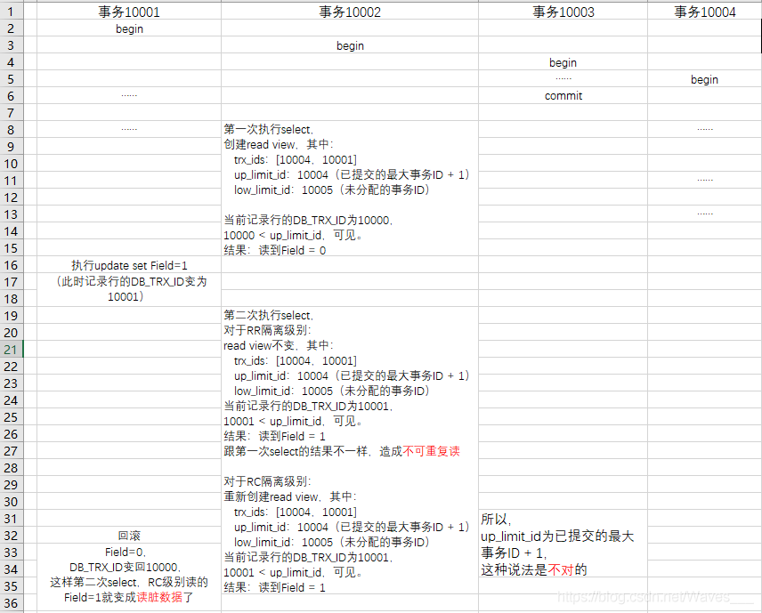
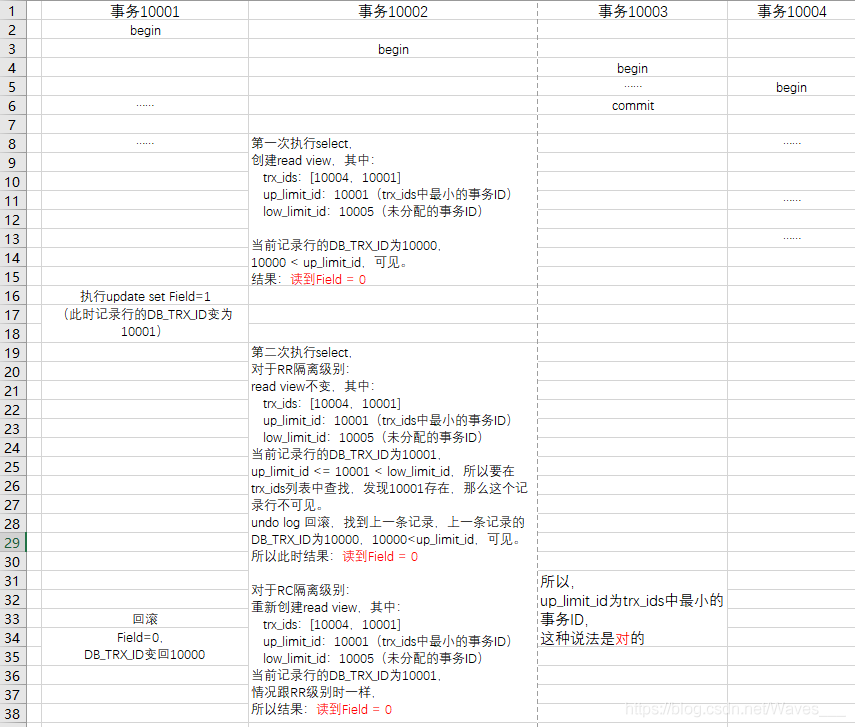

# undo log

undo log主要用来进行**事务的回滚**,保证事务的**原子性**。

undo存放在db内部**特殊的segment中，称为undo段**。 

undo log**并不能将DB恢复事务执行前的物理状态，而只能恢复到执行前的逻辑状态**。这里的物理状态比如页号等。比如A执行了INSERT 10W的记录的事务，这个事务会导致DB分配一个新的段，表空间会增大。然而ROLL BACK后，表空间并不会缩小（因为事务的并发性，比如B事务ROLL BACK后，不能删除A事务需要的物理段、页）。因此回滚的实现，**是在逻辑上做反向操作，比如用DELETE回滚INSERT，用INSERT回滚SELETE，用UPDATE回滚UPDATE**

undo log的另一个作用是**MVCC**，保证事务的**一致性**。当用户读取一条记录，如果该记录被多个事务同时读取/更新，该事务将根据MVCC的设计，执行读取策略，比如读取undo log中的内容来保证一致性读。

## 字段说明

在DB表中，每行记录除了有我们自定义的字段外，还有数据库隐式定义的
`DB_TRX_ID`,`DB_ROLL_PTR`,`DB_ROW_ID`字段

1. `DB_TRX_ID` :最近修改(修改/插入)事务ID,记录创建这条记录/最后一次修改该记录的事务ID，即该行的最近一次提交的事务ID，TRX_ID = transaction id

2. `DB_ROLL_PTR`:回滚指针，其实就是指向undo log的一条记录的指针，而指向的这个undo log内部是一个**链表**，链表存储了多个并发事务的更改记录。

3. `DB_ROW_ID`:隐含的自增ID（隐藏主键），如果数据表没有主键，InnoDB会自动以DB_ROW_ID产生一个聚簇索引

新增一个事务时事务id会增加，trx_id能够表示事务开始的先后顺序。

## Undo log原理

undo log分为**Insert**和**Update**两种，delete可以看做是一种特殊的update，即在记录上修改删除标记。update undo log记录了数据之前的数据信息，通过这些信息可以还原到之前版本的状态:

1. 当进行插入操作时，生成的`insert undo log`在事务提交后即可删除，因为其他事务不需要这个undo log(因为事务提交前，其他事务根据隔离性要求，不感知该insert;事务提交后，更改记录将刷新原表，并更改表记录和`DB_TRX_ID`;业务失败事务回滚，只对该事务本身操作，反向恢复该insert中的记录，其他事务也不感知)。

2. 进行删除修改操作时，会生成对应的`update undo log`，并将当前数据记录中的`DB_ROLL_PTR`指向新的undo log。update undo log不仅在事务回滚时需要，在快照读时也需要，所以不能随便删除，只有在快照读或事务回滚不涉及该日志时，对应的日志才会被**purge线程**统一清除

假设有两个事务`SessionA(trx_id = 100)`和`SessionB(trx_id = 150)`,并已经存在一条记录:

|name|age|DB_TRX_ID(事务ID)|DB_ROLL_PTR(回滚指针)|DB_ROW_ID(隐藏主键)|
|--|--|--|--|--|
|jiao|29|50|NULL|1|

- SessionA 对该记录进行了修改，改age为30，并Commit：

1. 在SessionA修改该行(记录)数据时，数据库会先对该行加排他锁(X Lock)

2. 把该行数据拷贝到undo log中，作为旧记录，即在undo log中有当前行的拷贝副本

3. 修改该age为30，并且修改`DB_TRX_ID(事务ID)`为SessionA的ID 100, DB_ROLL_PTR(回滚指针)指向拷贝到undo log的副本记录，既表示我的上一个版本就是它

4. 释放锁

- 此时的表记录为：

|name|age|DB_TRX_ID(事务ID)|DB_ROLL_PTR(回滚指针)|DB_ROW_ID(隐藏主键)|
|--|--|--|--|--|
|jiao|30|100|PTR_A|1|

- undo的记录类似：

|address(地址)|name|age|DB_TRX_ID(事务ID)|DB_ROLL_PTR(回滚指针)|DB_ROW_ID(隐藏主键)|
|--|--|--|--|--|--|
|PTR_A|jiao|29|50|NULL|1|

- SessionB 对该记录又进行了修改，改age为31，并Commit：

1. 在SessionB修改该行(记录)数据时，数据库会先对该行加排他锁(X Lock)

2. 把该行数据拷贝到undo log中，作为旧记录。但是在拷贝时，发现该行记录已经有undo log了，那么**最新的旧数据作为链表的表头，插在该行记录的undo log最前面**。

3. 修改该age为31，并且修改`DB_TRX_ID(事务ID)`为SessionB的ID 150, DB_ROLL_PTR(回滚指针)指向刚刚拷贝到undo log的副本记录

4. 释放锁

此时的表记录为：

|name|age|DB_TRX_ID(事务ID)|DB_ROLL_PTR(回滚指针)|DB_ROW_ID(隐藏主键)|
|--|--|--|--|--|
|jiao|31|150|PTR_B|1|

undo的记录类似：

|address(地址)|name|age|DB_TRX_ID(事务ID)|DB_ROLL_PTR(回滚指针)|DB_ROW_ID(隐藏主键)|
|--|--|--|--|--|--|
|PTR_B|jiao|30|100|PTR_A|1|
|PTR_A|jiao|29|50|NULL|1|


## MVCC和undo log

**Innodb实现MVCC的方式是通过undo log， 因此以下结论都是建立在innodb的基础之上**

### mvcc

- 一致性锁定读(当前读)
 
像select lock in share mode(共享锁), select for update ; update, insert ,delete(排他锁)这些操作都是一种*当前读*，它读取的是记录的最新版本，读取时还要保证其他并发事务不能修改当前记录，会对读取的记录进行加锁。

- 一致性非锁定读(快照读)

像不加锁的select操作就是*快照读*，即不加锁的非阻塞读；快照读的前提是隔离级别不是串行级别，是基于提高并发性能的考虑。快照读的实现是基于多版本并发控制，即MVCC。

### read view

- 定义

Read View是**事务进行快照读操作时产生的，用于做记录可见性判断的，数据结构**。当开启一个事务，执行快照读时，会创建一个Read View对象，并把它当做**条件**，来判断当前事务能够看到哪个版本的数据。(当前在表中的最新数据，or该行记录的undo log里面的某个版本的数据）

ReadView的[定义见](https://github.com/facebook/mysql-5.6/blob/42a5444d52f264682c7805bf8117dd884095c476/storage/innobase/include/read0read.h#L125)


Read View对象可简单定义为：
```
struct ReadView {

	trx_ids //生成RV时，其他未提交事务列表，不在这个列表中，说明已经提交了。后续即使这个列表中的事务修改了记录行的值，对于当前事务也是不可见的
	
	up_limit_id //生成RV时，trx_ids列表中最小的事务id，如果trx_ids 为空，则up_limit_id=low_limit_id
	
	low_limit_id //生成RV时，系统中应该分配给下一个事务的id值(全局)
	
	creator_trx_id：表示生成该ReadView的事务的id
}
```

- 算法

在进行快照读时，当创建一个新事务，然后执行*第一个select*语句的时候，根据当前状态，按上述描述生成一个ReadView对象，在读取某条记录时，innodb会将该记录行的DB_TRX_ID与该Read View中的一些变量进行比较，判断是否满足可见性条件：

1. `DB_TRX_ID < up_limit_id`，比如这条记录的`DB_TRX_ID=50，up_limit_id=100`,说明*最新修改该行的事务(50)*在*当前事务(100)*创建快照之前就提交了，所以该记录行的值对当前事务是可见的。跳转到5

2. `DB_TRX_ID >= low_limit_id`, 比如这条记录的`DB_TRX_ID=150 low_limit_id=140`,说明该记录是被一个*比本事务开启时，全局事务号最大值(140)更靠后(时间上)的未来事务（150）提交的*，即*最新修改该行的事务*在*当前事务*创建快照之后才修改该行，那对当前事务肯定不可见。转到步骤4.

3. `up_limit_id <= DB_TRX_ID < low_limit_id`,比如这条记录的`DB_TRX_ID=120，up_limit_id=100,low_limit_id=140`,表明*最新修改该行的事务(120)*在*当前事务*创建快照的时候，可能处于*活动状态*或者*已提交状态*；所以就要对活跃事务列表trx_ids进行查找（二分查找）：

	3.1 如果在活跃事务列表trx_ids中能找到id为DB_TRX_ID的事务(120)，表明:

		- 在*当前事务*创建快照前，*该记录行的值*被id为DB_TRX_ID的事务(120)修改了，但没有提交；因为没有提交，所以当前事务不可见。

		- 在*当前事务*创建快照后，*该记录行的值*被id为DB_TRX_ID的事务(120)修改了（不管有无提交）；因为快照已经创建，所以当前事务不可见。

		这些情况下，这个记录行的值对当前事务都是不可见的，跳到步骤4；

	3.2 如果在活跃事务列表trx_ids中找不到，则表明*id为DB_TRX_ID的事务(120)*在修改*该记录行的值*后，在*当前事务*创建快照前就已经提交了，所以记录行对当前事务可见，跳到步骤5

4. 在该记录行的DB_ROLL_PTR指针所指向的undo log回滚段中，取出最新的的旧事务号OLD_DB_TRX_ID, 将它赋给DB_TRX_ID，然后跳到步骤1重新开始判断

5. 将该可见行的值返回

图例说明[来自](https://blog.csdn.net/Waves___/article/details/105295060#1.2%E3%80%81Read%20View%20%E7%BB%93%E6%9E%84)：

假设数据为

|Filed|DB_TRX_ID(事务ID)|DB_ROLL_PTR(回滚指针)|DB_ROW_ID(隐藏主键)|
|--|--|--|--|
|0|10000|0x13525342|10|

正常情况:


证明**up_limit_id**为已提交的最大事务ID+1是错误的:



**up_limit_id**变为trx_ids中最小的事务ID:




### 结论

1. 数据表`DB_TRX_ID`中记录的，都是最近提交的事务记录，并通过这一行去定位到undo log

2. 定位的undo log是一个链表，记录了多个并发事务的操作记录

3. 根据事务的隔离级别RC/RR，在读取时选择匹配数据，匹配的依据是事务开始后的第一个select时，生成一个ReadView对象，RC生成时机为每次查询，RR则为事务开始时，而后根据ReadView的属性去做筛选。

参考

https://www.cnblogs.com/rongdi/p/13378892.html

[MVCC](https://blog.csdn.net/Waves___/article/details/105295060#1.2%E3%80%81Read%20View%20%E7%BB%93%E6%9E%84) 

[源码分析](http://www.leviathan.vip/2019/03/20/InnoDB%E7%9A%84%E4%BA%8B%E5%8A%A1%E5%88%86%E6%9E%90-MVCC/)
