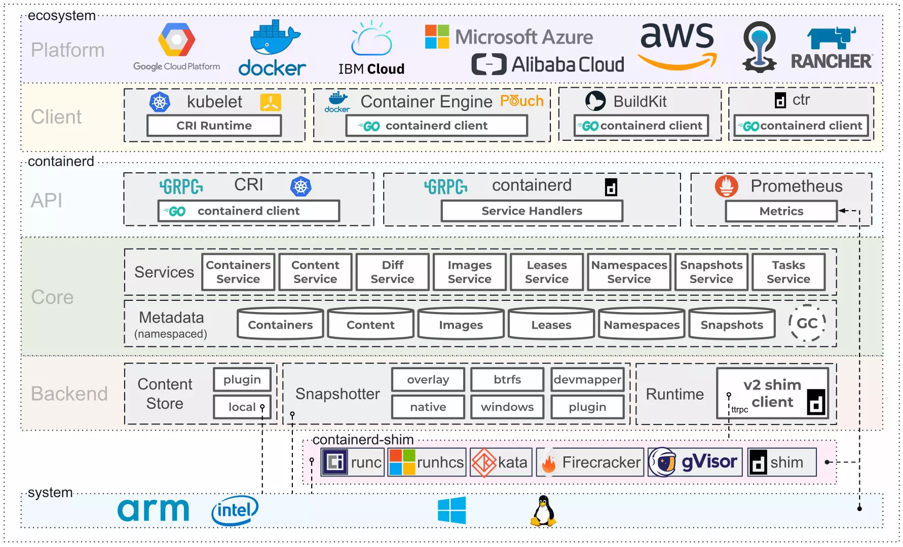

# containerd

Containerd 是一个工业级的容器运行时，和docker的关系可以看为：`docker->containerd->shim/runC`。docker通过调用containerd的grpc client接口拉起容器。

它强调简单性、健壮性和可移植性。containerd 可以在宿主机中管理完整的容器生命周期，包括：

- 管理容器的生命周期(从创建容器到销毁容器)
- 拉取/推送容器镜像
- 存储管理(管理镜像及容器数据的存储)
- 调用 runC 运行容器(与 runC 等容器运行时交互)
- 管理容器网络接口及网络

架构如

Containerd仍然采用标准的C/S架构，服务端通过GRPC协议提供稳定的API，客户端**ctr组件**通过调用服务端的API进行高级的操作。

为了解耦，Containerd将不同的职责划分给不同的组件，每个组件就相当于一个**子系统（subsystem）**。连接不同子系统的组件被称为模块。总体上 Containerd 被划分为两个子系统：

- **Bundle** : 在 Containerd 中，Bundle包含了配置、元数据和根文件系统数据，你可以理解为容器的文件系统。而Bundle 子系统允许用户从镜像中提取和打包 Bundles。

- **Runtime** : Runtime 子系统用来执行 Bundles，比如创建容器。

## plugins

其中，每一个子系统的行为都由一个或多个模块协作完成（架构图中的Core部分）。每一种类型的模块都以插件的形式集成到 Containerd 中，而且插件之间是相互依赖的。

在架构图中，每一个长虚线的方框都表示**一种类型的插件集合**，包括 Service Plugin、Metadata Plugin、GC Plugin、Runtime Plugin ，其中 Service Plugin又会依赖Metadata Plugin、GC Plugin和 Runtime Plugin。

每一个小方框都表示一个细分的插件，例如 Metadata Plugin 依赖Containers Plugin、Content Plugin 等。

常见插件有：

- **Content Plugin**:提供对镜像中可寻址内容的访问，所有不可变的内容都被存储在这里。

- **Snapshot Plugin**:用来管理容器镜像的文件系统快照。镜像中的每一个layer都会被解压成文件系统快照，类似于Docker中的 graphdriver。

- **Metrics**:暴露各个组件的监控指标。

Containerd被分为三个大块：Storage、Metadata和Runtime，可以将上面的架构图提炼一下：


[参考](https://blog.bwcxtech.com/posts/24a5cd7/)

## containerd & docker & k8s

- dockerd启动时会启动containerd子进程，dockerd与containerd通过rpc进行通信
- ctr是containerd的cli, containerd通过shim操作runc，runc真正控制容器生命周期
- 启动一个容器就会启动一个shim进程
- shim直接调用runc的包函数,shim与containerd之前通过rpc通信

因此存在以下路径：
```
 docker cli -> docker daemon -> containerd -> containerd-shim -> runC
```

由于containerd包含了拉起容器的所有功能，因此，在k8s中拉起pod内的容器时，存在以下路径：
```
1. k8s集成docker：k8s->kubelete->docker-shim->docker api->docker-daemon->containerd->containerd-shim->oci/runC
2. k8s绕过docker:  k8s->kubelete->containerd->containerd-shim->oci/runC
```
目前正朝路径2进行技术演进。containerd 被设计成嵌入到一个更大的系统中，而不是直接由开发人员或终端用户使用。

使用containerd API拉取镜像并创建redis容器，可[移步](https://containerd.io/docs/getting-started/)

containerd的namespaces、client options可[移步](https://github.com/containerd/containerd/blob/master/README.md)

## grpc service define

以下内容基于containerd [!v1.2](https://github.com/containerd/containerd/tree/release/1.2) 版本

containerd的grpc服务定义位于`/containerd/api/services/containers/v1/containers.proto`，可以看到对容器crud的定义:
```
service Containers {
	rpc Get(GetContainerRequest) returns (GetContainerResponse);
	rpc List(ListContainersRequest) returns (ListContainersResponse);
	rpc ListStream(ListContainersRequest) returns (stream ListContainerMessage);
	rpc Create(CreateContainerRequest) returns (CreateContainerResponse);
	rpc Update(UpdateContainerRequest) returns (UpdateContainerResponse);
	rpc Delete(DeleteContainerRequest) returns (google.protobuf.Empty);
}
//...具体结构体定义省略
```
相应的，生成的go文件`containers.pb.go`中，该服务被描述为`ContainersServer`接口。注册该服务的方法`RegisterContainersServer`在`/containerd/cmd/main.go`的`command.App()`中被调用
```go
func App() *cli.App {
...
server, err := server.New(ctx, config)
...
}

// New creates and initializes a new containerd server
func New(ctx context.Context, config *srvconfig.Config) (*Server, error) {
	...
	}
	// 执行各个组件的grpc服务注册，比如containers组件，调用RegisterContainersServer函数
	// register services after all plugins have been initialized
	for _, service := range services {
		if err := service.Register(rpc); err != nil {
			return nil, err
		}
	}
	return s, nil
}
```

## mian & plugin

main函数位于`cmd/containerd/main.go`
```go
func main() {
	//创建app对象
	app := command.App()
	if err := app.Run(os.Args); err != nil {
		fmt.Fprintf(os.Stderr, "containerd: %s\n", err)
		os.Exit(1)
	}
}

//
func App() *cli.App {
	app := cli.NewApp()
	app.Name = "containerd"
	app.Version = version.Version
	app.Usage = usage
	app.Description = \`****\`
	app.Flags = []cli.Flag{
		cli.StringFlag{
			Name:  "config,c",
			Usage: "path to the configuration file",
			Value: defaultConfigPath,
		},
		//各种flag设置
		...
	}
	app.Flags = append(app.Flags, serviceFlags()...)
	//三个子命令
	app.Commands = []cli.Command{
		//用于生成配置文件，默认文件路径在/etc/containerd/config.toml
		configCommand,
		publishCommand,
		ociHook,
	}
```
其中的config.toml内容默认为：
```
disabled_plugins = ["cri"]

#root = "/var/lib/containerd"
#state = "/run/containerd"
#subreaper = true
#oom_score = 0

#[grpc]
#  address = "/run/containerd/containerd.sock"
#  uid = 0
#  gid = 0

#[debug]
#  address = "/run/containerd/debug.sock"
#  uid = 0
#  gid = 0
#  level = "info"
```
继续看app的action设置：
```go
	//在mian函数的app.Run(os.Args)中被调用执行
	app.Action = func(context *cli.Context) error {
		var (
			start   = time.Now()
			signals = make(chan os.Signal, 2048)
			serverC = make(chan *server.Server, 1)
			ctx     = gocontext.Background()
			config  = defaultConfig()
		)
		//从指定路径（context.GlobalString("config")）加载containerd server的配置，返回config对象
		if err := srvconfig.LoadConfig(context.GlobalString("config"), config); err != nil && !os.IsNotExist(err) {
			return err
		}

		// Apply flags to the config，将指定的flag覆盖上一步的config对象相应字段
		if err := applyFlags(context, config); err != nil {
			return err
		}
		
		...
		// cleanup temp mounts
		...
		// config中的grpc
		address := config.GRPC.Address
		if address == "" {
			return errors.New("grpc address cannot be empty")
		}
		...
```
以上部分相当于对config内容的check和一些初始化操作，接下来创建containerd server对象，该对象代表了一个containerd daemon：
```go
	server, err := server.New(ctx, config)
	if err != nil {
		return err
	}
//进入New函数	
func New(ctx context.Context, config *srvconfig.Config) (*Server, error) {
	//config的route/state属性检查
	...
	//根据config描述，创建root/state目录
	...
	//加载plugins对象
	plugins, err := LoadPlugins(ctx, config)
```
这里重点关注`loadPlugins`函数，该函数
1. 首先从config的root目录茜load插件，load的插件以及方式为[golang 插件](https://draveness.me/golang/docs/part4-advanced/ch08-metaprogramming/golang-plugin/)。
2. 向返回的注册列表Registration中添加内置插件，包括了ContentPlugin、MetadataPlugin
3. 返回的plugins为一个Registration对象的数组。数组中每个Registration对象定义了自己的plugin类型/Id/初始化方法InitFn/个性化配置config。
```go
func LoadPlugins(ctx context.Context, config *srvconfig.Config) ([]*plugin.Registration, error) {
	// load all plugins into containerd
	// 从../root/plugins目录下load插件
	if err := plugin.Load(filepath.Join(config.Root, "plugins")); err != nil {
		return nil, err
	}
	// load additional plugins that don't automatically register themselves
	// 注册内置插件
	plugin.Register(&plugin.Registration{
		Type: plugin.ContentPlugin,
		ID:   "content",
		InitFn: func(ic *plugin.InitContext) (interface{}, error) {
			ic.Meta.Exports["root"] = ic.Root
			return local.NewStore(ic.Root)
		},
	})
	plugin.Register(&plugin.Registration{
		Type: plugin.MetadataPlugin,
		ID:   "bolt",
		Requires: []plugin.Type{
			plugin.ContentPlugin,
			plugin.SnapshotPlugin,
		},
		InitFn: func(ic *plugin.InitContext) (interface{}, error) {
			...
		},
	})

	clients := &proxyClients{}
	for name, pp := range config.ProxyPlugins {
		var (
			t plugin.Type
			f func(*grpc.ClientConn) interface{}

			address = pp.Address
		)

		switch pp.Type {
		case string(plugin.SnapshotPlugin), "snapshot":
			t = plugin.SnapshotPlugin
			ssname := name
			f = func(conn *grpc.ClientConn) interface{} {
				return ssproxy.NewSnapshotter(ssapi.NewSnapshotsClient(conn), ssname)
			}

		case string(plugin.ContentPlugin), "content":
			t = plugin.ContentPlugin
			f = func(conn *grpc.ClientConn) interface{} {
				return csproxy.NewContentStore(csapi.NewContentClient(conn))
			}
		default:
			log.G(ctx).WithField("type", pp.Type).Warn("unknown proxy plugin type")
		}

		plugin.Register(&plugin.Registration{
			Type: t,
			ID:   name,
			InitFn: func(ic *plugin.InitContext) (interface{}, error) {
				ic.Meta.Exports["address"] = address
				conn, err := clients.getClient(address)
				if err != nil {
					return nil, err
				}
				return f(conn), nil
			},
		})

	}

	// return the ordered graph for plugins
	// 返回的插件列表中剔除了config.DisabledPlugins中的配置项
	return plugin.Graph(config.DisabledPlugins), nil
}
```
继续回到server的New：
```go
	...
	//创建grpc服务
	serverOpts := []grpc.ServerOption{
		grpc.UnaryInterceptor(grpc_prometheus.UnaryServerInterceptor),
		grpc.StreamInterceptor(grpc_prometheus.StreamServerInterceptor),
	}
	...
	rpc := grpc.NewServer(serverOpts...)
	...
	//声明service对象
	var (
		services []plugin.Service
		s        = &Server{
			rpc:    rpc,
			events: exchange.NewExchange(),
			config: config,
		}
		//记录已加载的plugin的集合
		initialized = plugin.NewPluginSet()
	)
	//遍历刚才注册的所有plugins
	for _, p := range plugins {
		id := p.URI()
		...
		//初始化initContext，该对象作为plugin调用InitFn的入参
		initContext := plugin.NewContext(
			ctx,
			p,
			initialized,
			config.Root,
			config.State,
		)
		initContext.Events = s.events
		initContext.Address = config.GRPC.Address
		//load the plugin specific configuration if it is provided
		//load plugin的自定义config配置
		if p.Config != nil {
			pluginConfig, err := config.Decode(p.ID, p.Config)
			...
			initContext.Config = pluginConfig
		}
		//调用Registration的InitFn方法。每个注册的plugin需要定义该接口
		result := p.Init(initContext)
		//加入全局的已初始化plugin集合
		if err := initialized.Add(result); err != nil {
			return nil, errors.Wrapf(err, "could not add plugin result to plugin set")
		}
		instance, err := result.Instance()
		...
		//如果这个plugin实现了Service接口，说明提供了grpc服务，加入服务集合services，并在之后注册服务
		// check for grpc services that should be registered with the server
		if service, ok := instance.(plugin.Service); ok {
			services = append(services, service)
		}
		s.plugins = append(s.plugins, result)
	}
	// register services after all plugins have been initialized
	// 逐个注册grpc服务
	for _, service := range services {
		if err := service.Register(rpc); err != nil {
			return nil, err
		}
	}
	return s, nil
}
				
```
至此，server的创建工作完成，返回server对象并回到main.go的App()中:
```go
		...
		serverC <- server
		//debug地址配置，默认本地/run/containerd/debug.sock
		if config.Debug.Address != "" {
			var l net.Listener
			if filepath.IsAbs(config.Debug.Address) {
				if l, err = sys.GetLocalListener(config.Debug.Address, config.Debug.UID, config.Debug.GID); err != nil {
					return errors.Wrapf(err, "failed to get listener for debug endpoint")
				}
			} else {
				if l, err = net.Listen("tcp", config.Debug.Address); err != nil {
					return errors.Wrapf(err, "failed to get listener for debug endpoint")
				}
			}
			serve(ctx, l, server.ServeDebug)
		}
		//监控监听
		if config.Metrics.Address != "" {
			l, err := net.Listen("tcp", config.Metrics.Address)
			if err != nil {
				return errors.Wrapf(err, "failed to get listener for metrics endpoint")
			}
			serve(ctx, l, server.ServeMetrics)
		}
		//拉起服务，本地注册api
		//创建unix的sock文件，位于/run/containerd/containerd.sock
		l, err := sys.GetLocalListener(address, config.GRPC.UID, config.GRPC.GID)
		...
		//提供grpc服务的api
		serve(ctx, l, server.ServeGRPC)
		<-done
		return nil
	}
	return app
}
```

## container create

在[docker run](docker-run.md)的最后，docker daemon调用`/containerd.services.containers.v1.Containers/Create` Api，即`ContainersServer`接口的`Create`方法，其具体实现位于`/containerd/services/containers/service.go`中：

```go
type service struct {
	local api.ContainersClient
}

func (s *service) Create(ctx context.Context, req *api.CreateContainerRequest) (*api.CreateContainerResponse, error) {
	//local为grpc服务的客户端，实现了ContainersClient接口
	return s.local.Create(ctx, req)
}
//具体实现
func (l *local) Create(ctx context.Context, req *api.CreateContainerRequest, _ ...grpc.CallOption) (*api.CreateContainerResponse, error) {
	var resp api.CreateContainerResponse

	if err := l.withStoreUpdate(ctx, func(ctx context.Context) error {
		container := containerFromProto(&req.Container)
		//创建
		created, err := l.Store.Create(ctx, container)
		if err != nil {
			return err
		}

		resp.Container = containerToProto(&created)

		return nil
	}); err != nil {
		return &resp, errdefs.ToGRPC(err)
	}
	//发布
	if err := l.publisher.Publish(ctx, "/containers/create", &eventstypes.ContainerCreate{
		ID:    resp.Container.ID,
		Image: resp.Container.Image,
		Runtime: &eventstypes.ContainerCreate_Runtime{
			Name:    resp.Container.Runtime.Name,
			Options: resp.Container.Runtime.Options,
		},
	}); err != nil {
		return &resp, err
	}

	return &resp, nil
}
```
