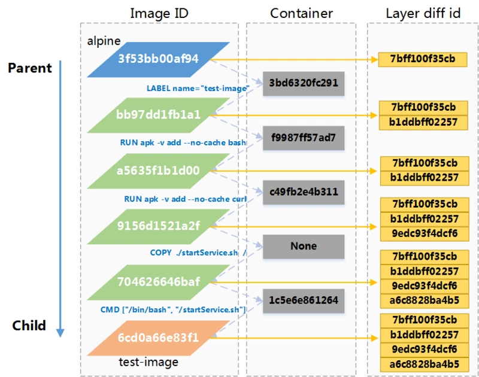

# docker image store

## 概念

### rootfs

全称是root file system，这是一个linux系统中的根文件系统 一个典型的Linux系统要能运行的话，它至少需要两个文件系统：

- boot file system （bootfs）：包含bootloader和 kernel。用户不会修改这个文件系统。在boot过程完成后，整个内核都会被加载进内存，此时bootfs 会被卸载掉从而释放出所占用的内存。对于同样内核版本的不同的Linux发行版的bootfs都是一致的。

- root file system （rootfs）：包含典型的目录结构，包括dev,proc,bin,etc,lib,usr,tmp 等再加上要运行用户应用所需要的所有配置文件，二进制文件和库文件。这个文件系统在不同的Linux 发行版中是不同的。而且用户可以对这个文件进行修改。

Linux操作系统内核启动时，内核首先会挂载一个只读( read-only)的rootfs，
当系统检测其完整性之后，决定是否将其切换为读写( read-write) 模式，或者最后在rootfs
之上另行挂载一种文件系统并忽略rootfs。

Docker架构下依然沿用Linux 中rootfs的思想。
当Docker Daemon为Docker容器挂载rootfs的时候，与传统Linux内核类似，将其设定为只
读模式。不同的是，docker在挂载rootfs之后，**并没有将docker容器的文件系统设为读写模式**，而是利用**Union Mount** 的技术，**在这个只读的rootfs之上再
挂载一个读写的文件系统**，挂载时该读写文件系统内空无一物。

### unionfs

全称是union file system， 代表一种文件系统挂载方式，允许同一时刻多种文件系统叠加挂载在一起，
并以一种文件系统的形式，呈现多种文件系统内容合并后的目录。举个例子：

```
$ tree
.
├── fruits
│   ├── apple
│   └── tomato
└── vegetables
    ├── carrots
    └── tomato
```

上面的目录结构，经过union mount：

```
$ sudo mount -t aufs -o dirs=./fruits:./vegetables none ./mnt
$ tree ./mnt
./mnt
├── apple
├── carrots
└── tomato
```

通常来讲，被合并的文件系统中只有一个会以读写(read-write)模式挂载，其他文件系统的挂载模式均
为只读( read-only)。实现这种Union Mount技术的文件系统一般称为联合文件系统(Union
Filesystem)，较为常见的有UnionFS、aufs 、OverlayFS 等

基于此，docker在所创建的容器中使用文件系统时，从内核角度来看，将出现rootfs以及一个可读写的文件系统，并通过union mount进行合并。所有的配置、install都是在读写层进行的，即使是删除操作，也是在读写层进行，只读层永远不会变。对于用户来说，感知不到这两个层次，只会通过fs的COW (copy-on-write)特性看到操作结果。

### image layer

最为简单地解释image layer,它就是Docker容器中只读文件系统rootfs的一部分。Docker容器的rootfs可以由多个image layer 来构成。多个image layer构成 rootfs的方式依然沿用Union Mount技术。下例为镜像层次从上至下：

- image_layer_n: /lib /etc
- image_layer_2：/media /opt /home
- image_layer_1：/var /boot /proc

比如上面的例子，rootfs被分成了n层，每一层包含其中的一部分，每一层的image layer都叠加在另一个image layer之上。基于以上概念，docker iamge layer产生两种概念:

- 父镜像：其余镜像都依赖于其底下的一个或多个镜像，Docker将下一层的镜像称为上一层镜像的父镜像。如image_layer_1是image_layer_2的父镜像。

- 基础镜像： rootfs最底层镜像，没有父镜像，如image_layer_1。

将一个整体的image拆分，就能够对子image进行复用，比如一个mysql和一个ubuntu的应用，复用的例子就如下：

- image_layer_0-> image_layer_1-> image_layer_3->image_layer_4（ubuntu）->image_layer_5(mysql)

需要注意，以上描述的多个image layer分层，都是**只读分层**

### container layer

除了只读的image之外，Docker Daemon在创建容器时会在容器的rootfs之上，再挂载
一层读写文件系统，而这一层文件系统称为容器的container layer， Docker还会在rootfs和top layer之间再挂载一个layer ，这一个 layer中主要包含/etc/hosts,/etc/hostname 以及/etc/resolv.conf，一般这一个layer称为init layer。

另外，根据image层次的复用逻辑，docker在设计时，**提供了commit和基于dockerfile的build来将container layer+下层image_layer转变为新的image**。开发者可以基于某个镜像创
建容器做开发工作，并且无论在开发周期的哪个时间点，都可以对容器进行commit,将container内容打包为一个image ，构成一个新的镜像。


## image store

了解docker对于image的存储有助于对docker源码的理解。一般默认安装启动Docker，所有相关的文件都会存储在/var/lib/docker下面，与Image相关的目录主要是image，再下一层是驱动目录名称，Ubuntu 18.04/Docker19.03 为[overlay2](https://docs.docker.com/storage/storagedriver/select-storage-driver/)

定位到/image/overlay2/后，使用`tree`查看目录结构，可以看到：

```
.
├── distribution    //从远端拉到本地的镜像相关元数据
│   ├── diffid-by-digest
│   │   └── sha256
│   └── v2metadata-by-diffid
│       └── sha256
├── imagedb			//镜像数据库
│   ├── content
│   │   └── sha256
│   └── metadata
│       └── sha256
├── layerdb			//镜像每个layer的元数据
│   ├── mounts
│   │   ├── 1d61dd1a08616425fea6a39dd8b9f0f5d710555bb0a5a3ae51348501f5a57e2a
...
│   ├── sha256
│   │   ├── 0232ab5d1efed0e8864d830b4179ac3aa3132d83852b41b3e36c92496115320a
...
│   └── tmp
└── repositories.json //全局的镜像/tag/sha256索引，类似go.mod
```

### repositories.json

repositories.json文件中存储了本地的所有镜像，里面主要涉及了image的name/tag以及image的sha256值。

以pull的镜像**alpine:latest**为例，其内容如下：

```json
{
    "Repositories": {
        "alpine": {
            "alpine:latest": "sha256:3f53bb00af943dfdf815650be70c0fa7b426e56a66f5e3362b47a129d57d5991",			
            "alpine@sha256:46e71df1e5191ab8b8034c5189e325258ec44ea739bba1e5645cff83c9048ff1": "sha256:3f53bb00af943dfdf815650be70c0fa7b426e56a66f5e3362b47a129d57d5991" //image的sha256
        }
		...
    }
}
```

### imagedb

imagedb目录中存放了**镜像基本配置信息和layer层次关系**。在imagedb下有两个子目录，

- **metadata**目录保存每个镜像的parent镜像ID，目录中是一个在build过程中产生的镜像的父子关系链。

- **content**目录下存储了镜像的JSON格式描述信息和配置信息，**配置信息用于在运行容器过程中使用**，文件名以image的sha256形式保存。以**alpine:latest**为例，通过repositories.json可以看到其sha256值为`3f53bb00af943dfdf8...`，因此在content下，可以看到以该sha256命名的文件，文件内容为：
```json
{
    "architecture": "amd64",
    "config": {
        "ArgsEscaped": true,
        "AttachStderr": false,
        "AttachStdin": false,
        "AttachStdout": false,
        "Cmd": [
            "/bin/sh"
        ],
        "Domainname": "",
        "Entrypoint": null,
        "Env": [
            "PATH=/usr/local/sbin:/usr/local/bin:/usr/sbin:/usr/bin:/sbin:/bin"
        ],
        "Hostname": "",
        "Image": "sha256:49573004c44f9413c7db63cbab336356e7a8843139fca5e68f92d84a56f0e6df",
        "Labels": null,
        "OnBuild": null,
        "OpenStdin": false,
        "StdinOnce": false,
        "Tty": false,
        "User": "",
        "Volumes": null,
        "WorkingDir": ""
    },
    "container": "c44d11fa67899a984d66f5542092b474f11ca95cc9b03b1470546f16ec8ce74f",
    "container_config": {
        "ArgsEscaped": true,
        "AttachStderr": false,
        "AttachStdin": false,
        "AttachStdout": false,
        "Cmd": [
            "/bin/sh",
            "-c",
            "#(nop) ",
            "CMD [\"/bin/sh\"]"
        ],
        "Domainname": "",
        "Entrypoint": null,
        "Env": [
            "PATH=/usr/local/sbin:/usr/local/bin:/usr/sbin:/usr/bin:/sbin:/bin"
        ],
        "Hostname": "c44d11fa6789",
        "Image": "sha256:49573004c44f9413c7db63cbab336356e7a8843139fca5e68f92d84a56f0e6df",
        "Labels": {},
        "OnBuild": null,
        "OpenStdin": false,
        "StdinOnce": false,
        "Tty": false,
        "User": "",
        "Volumes": null,
        "WorkingDir": ""
    },
    "created": "2018-12-21T00:21:30.122610396Z",
    "docker_version": "18.06.1-ce",
    "history": [
        {
            "created": "2018-12-21T00:21:29.97055571Z",
            "created_by": "/bin/sh -c #(nop) ADD file:2ff00caea4e83dfade726ca47e3c795a1e9acb8ac24e392785c474ecf9a621f2 in / "
        },
        {
            "created": "2018-12-21T00:21:30.122610396Z",
            "created_by": "/bin/sh -c #(nop)  CMD [\"/bin/sh\"]",
            "empty_layer": true
        }
    ],
    "os": "linux",
    "rootfs": {
        "diff_ids": [
            "sha256:7bff100f35cb359a368537bb07829b055fe8e0b1cb01085a3a628ae9c187c7b8"
        ],
        "type": "layers"
    }
}
```

其中：

- **config**: 未来根据这个image启动container时，config里面的配置就是运行container时的默认参数。

- **container**: 此处为一个容器ID，执行docker 

build构建镜像时，可以看见是不断地生成新的container，然后提交为新的image，此处的容器ID即生成该镜像时`临时容器`的ID

- **container_config**：上述临时容器的配置，可以对比containner_config与config的内容，字段完全一致，验证了config的作用。

- **history**：构建该镜像的所有历史命令

- **rootfs**：该镜像包含的layer层的diff id，这里的值主要用于描述layer，但注意：

1. 此处的diff_id**不一定等于**layer下的对应id，layer下存放的是chainID

2. diff_id的个数**不一定等于**在Dockerfile中Run的命令数

因为镜像是一个打包的静态OS，Layer可以认为是描述该OS的fs变化，即文件系统中文件或者目录发生的改变。所以**如果有些命令并不会引起fs的变化，只是会写入该镜像的config中，在生成容器时读取即可**，就不存在diff id。

### layerdb

layerdb根据命名即可理解该目录主要用来存储Docker的Layer信息，layerdb的大致结构如下：

```
layerdb/
├── sha256
│   └── 7bff100f35cb359a368537bb07829b055fe8e0b1cb01085a3a628ae9c187c7b8
│       ├── cache-id
│       ├── diff
│       ├── size
│       └── tar-split.json.gz
│       └── parent
└── tmp
└── mounts
```

- **mounts**: 当由镜像生成容器时，该目录下会生成容器的可读可写两个layer，可读即为由镜像生成，而可写就是未来对容器的修改的存放位置，由于alpine没有run，即生成容器，所以下方没有文件。

- **sha256**: 主要存储的就是layer，注意这里存储的sha256值是**layer的chainId**，而非在imagedb里的json描述的diff_id，diff_id用来描述单个变化，而chainId用来便于一些列的变化，diff id和chain id之间的计算公式为，其中A表示单层layer，A|B表示在A之上添加了layerB，A是B的父layer，同理于A|B|C：

```
ChainID(A) = DiffID(A)
ChainID(A|B) = Digest(ChainID(A) + " " + DiffID(B))
ChainID(A|B|C) = Digest(ChainID(A|B) + " " + DiffID(C))
```

因此，对于**alpine:latest**镜像的layerdb，由于其为单镜像，不存在parent，所以/layerdb/sha256/下的`7bff100f35cb...`与/imagedb/content/下的`3f53bb00af943dfdf8...`中描述的 `rootfs/diff_ids:7bff100f35cb...`相同。

进入目录`7bff100f35cb`:

1. `diff`就描述了该Layer层的diff_id

```
[root@docker-learn overlay2]# cat layerdb/sha256/7bff100f35cb359a368537bb07829b055fe8e0b1cb01085a3a628ae9c187c7b8/diff
sha256:7bff100f35cb359a368537bb07829b055fe8e0b1cb01085a3a628ae9c187c7b8
```

2. `size`描述了该Layer的大小，单位字节

```
[root@docker-learn overlay2]# cat layerdb/sha256/7bff100f35cb359a368537bb07829b055fe8e0b1cb01085a3a628ae9c187c7b8/size
4413428
```

3. `tar-split.json.gz`表示layer层数据tar压缩包的split文件，该文件生成需要依赖tar-split，通过这个文件可以还原layer的tar包

4. `cache_id`内容为一个uuid，指向Layer本地的真正存储位置。而这个真正的存储位置便是**/var/lib/docker/overlay2**目录:

```
[root@docker-learn layerdb]# cat sha256/7bff100f35cb359a368537bb07829b055fe8e0b1cb01085a3a628ae9c187c7b8/cache-id 
281c53a74496be2bfcf921ceee5ec2d95139c43fec165ab667a77899b3691d56
```

5. `parent`文件存储了当前Layer层的父层chain_id，因为当前alpine镜像只有一层，所以此时的parent下没有值。

### distribution

distribution目录主要用于和docker registry操作，包含了Layer的diff_id和image的digest(不是image的sha256)之间的对应关系。**注意，这个digest是由镜像仓库生成或维护，本地构建的镜像在没有push到仓库之前，没有digest。 push 完成后，registry生成digest给server，server将layer id和digest建立对应关系**，push后的digest在stdout打印：
```
The push refers to repository [docker.io/backbp/test-image]
a6c8828ba4b5: Pushed 
9edc93f4dcf6: Pushed 
b1ddbff02257: Pushed 
7bff100f35cb: Mounted from library/alpine 
lasted: digest: sha256:3dc66a43c28ea3e994e4abf6a2d04c7027a9330e8eeab5c609e4971a8c58f0b0 size: 1156
```
distribution的结构大致如下：

```
distribution/
├── diffid-by-digest
│   └── sha256
│       └── cd784148e3483c2c86c50a48e535302ab0288bebd587accf40b714fffd0646b3
└── v2metadata-by-diffid
    └── sha256
        └── 7bff100f35cb359a368537bb07829b055fe8e0b1cb01085a3a628ae9c187c7b8
```

这个结构里有两个目录:

- **v2metadata-by-diffid**: v2metadata-by-diffid目录下，可以通过Layer的diff_id，找到对应的 **digest描述，这个digest用于标记这个layer是否已经Push到了描述的registry上**，并且包含了生成该digest的源仓库,比如alpine镜像diff_id的描述：

```
[
    {
        "Digest": "sha256:cd784148e3483c2c86c50a48e535302ab0288bebd587accf40b714fffd0646b3",
        "HMAC": "",
        "SourceRepository": "docker.io/library/alpine"
    },
	{
        "Digest": "sha256:cd784148e3483c2c86c50a48e535302ab0288bebd587accf40b714fffd0646b3",
        "HMAC": "f2018b1faf11bbe4a7fcc951bdab9b1f1b356603c059fc8e8a50785ef27bbe0c",
        "SourceRepository": "myharbor.com/usr1test0/alpine"
    }
]
```

alpine的镜像**打了不同的tag并push**，所以，对于一份alpine，存在唯一的digest描述`cd784148e3483c2c86c50a48e535302ab0288bebd587accf40b714fffd0646b3`，而文件名就是layer diff_id：`7bff100f35cb359a368537bb07829b055fe8e0b1cb01085a3a628ae9c187c7b8`。

- **diffid-by-digest**: diffid-by-digest目录则与v2metadata-by-diffid相反，通过digest来得到对应的layer diff_id，如

```
[root@docker-learn overlay2]# cat distribution/diffid-by-digest/sha256/cd784148e3483c2c86c50a48e535302ab0288bebd587accf40b714fffd0646b3 

sha256:7bff100f35cb359a368537bb07829b055fe8e0b1cb01085a3a628ae9c187c7b8
```

## 复杂例子

alpine镜像是单层镜像，因此以制作的镜像test-image为例子:
```
FROM alpine

LABEL name="test-image"

RUN apk -v add --no-cache bash 
RUN apk -v add --no-cache curl
COPY ./startService.sh /

CMD ["/bin/bash", "/startService.sh"]
```

执行docker build后，有如下输出
```
[root@docker-learn docker]# docker build -t test-image .
Sending build context to Docker daemon  3.072kB
Step 1/6 : FROM alpine
 ---> 3f53bb00af94
Step 2/6 : LABEL name="test-image"
 ---> Running in 3bd6320fc291
Removing intermediate container 3bd6320fc291
 ---> bb97dd1fb1a1
Step 3/6 : RUN apk -v add --no-cache bash
 ---> Running in f9987ff57ad7
fetch http://dl-cdn.alpinelinux.org/alpine/v3.8/main/x86_64/APKINDEX.tar.gz
fetch http://dl-cdn.alpinelinux.org/alpine/v3.8/community/x86_64/APKINDEX.tar.gz
(1/5) Installing ncurses-terminfo-base (6.1_p20180818-r1)
(2/5) Installing ncurses-terminfo (6.1_p20180818-r1)
(3/5) Installing ncurses-libs (6.1_p20180818-r1)
(4/5) Installing readline (7.0.003-r0)
(5/5) Installing bash (4.4.19-r1)
Executing bash-4.4.19-r1.post-install
Executing busybox-1.28.4-r2.trigger
OK: 18 packages, 136 dirs, 2877 files, 13 MiB
Removing intermediate container f9987ff57ad7
 ---> a5635f1b1d00
Step 4/6 : RUN apk -v add --no-cache curl
 ---> Running in c49fb2e4b311
fetch http://dl-cdn.alpinelinux.org/alpine/v3.8/main/x86_64/APKINDEX.tar.gz
fetch http://dl-cdn.alpinelinux.org/alpine/v3.8/community/x86_64/APKINDEX.tar.gz
(1/5) Installing ca-certificates (20171114-r3)
(2/5) Installing nghttp2-libs (1.32.0-r0)
(3/5) Installing libssh2 (1.8.0-r3)
(4/5) Installing libcurl (7.61.1-r1)
(5/5) Installing curl (7.61.1-r1)
Executing busybox-1.28.4-r2.trigger
Executing ca-certificates-20171114-r3.trigger
OK: 23 packages, 141 dirs, 3040 files, 15 MiB
Removing intermediate container c49fb2e4b311
 ---> 9156d1521a2f
Step 5/6 : COPY ./startService.sh /
 ---> 704626646baf
Step 6/6 : CMD ["/bin/bash", "/startService.sh"]
 ---> Running in 1c5e6e861264
Removing intermediate container 1c5e6e861264
 ---> 6cd0a66e83f1
Successfully built 6cd0a66e83f1
Successfully tagged test-image:latest
```

镜像build过程为基于一个镜像(base image, FROM xxx)启动一个容器，在容器内执行Dockerfile里的一条命令，生成一个新的镜像。

根据上述的输入，test-image的构建过程可以表示为：


build完成后，image的sha256是`6cd0a66e83f1`,	此时再看image/overlay2:
```
image/
└── overlay2
    ├── distribution
    │   ├── diffid-by-digest
    │   │   └── sha256
    │   │       └── cd784148e3483c2c86c50a48e535302ab0288bebd587accf40b714fffd0646b3
    │   └── v2metadata-by-diffid
    │       └── sha256
    │           └── 7bff100f35cb359a368537bb07829b055fe8e0b1cb01085a3a628ae9c187c7b8
    ├── imagedb
    │   ├── content
    │   │   └── sha256
    │   │       ├── 3f53bb00af943dfdf815650be70c0fa7b426e56a66f5e3362b47a129d57d5991  //alpine镜像，之下为新增镜像
    │   │       ├── 6cd0a66e83f133a2bad37103ed03f6480330fa3c469368eb5871320996d3b924  
    │   │       ├── 704626646baf8bdea82da237819cded076a0852eb97dba2fc731569dd85ae836
    │   │       ├── 9156d1521a2fd50d972e1e1abc30d37df7c8e8f7825ca5955170f3b5441b3341
    │   │       ├── a5635f1b1d0078cd926f21ef3ed77b357aa899ac0c8bf80cae51c37129167e3a
    │   │       └── bb97dd1fb1a10b717655594950efb4605ff0d3f2f631feafc4558836c2b34c3c
    │   └── metadata  //存放parent image，之前只有alpine时为空
    │       └── sha256
    │           ├── 6cd0a66e83f133a2bad37103ed03f6480330fa3c469368eb5871320996d3b924
    │           │   ├── lastUpdated
    │           │   └── parent
    │           ├── 704626646baf8bdea82da237819cded076a0852eb97dba2fc731569dd85ae836
    │           │   └── parent
    │           ├── 9156d1521a2fd50d972e1e1abc30d37df7c8e8f7825ca5955170f3b5441b3341
    │           │   └── parent
    │           ├── a5635f1b1d0078cd926f21ef3ed77b357aa899ac0c8bf80cae51c37129167e3a
    │           │   └── parent
    │           └── bb97dd1fb1a10b717655594950efb4605ff0d3f2f631feafc4558836c2b34c3c
    │               └── parent
    ├── layerdb
    │   ├── mounts
    │   ├── sha256
    │   │   ├── 0e88764cdf90e8a5d6597b2d8e65b8f70e7b62982b0aee934195b54600320d47
    │   │   │   ├── cache-id
    │   │   │   ├── diff
    │   │   │   ├── parent
    │   │   │   ├── size
    │   │   │   └── tar-split.json.gz
    │   │   ├── 7bff100f35cb359a368537bb07829b055fe8e0b1cb01085a3a628ae9c187c7b8  //apline镜像，其余为新增
    │   │   │   ├── cache-id
    │   │   │   ├── diff
    │   │   │   ├── size
    │   │   │   └── tar-split.json.gz
    │   │   ├── 80fe1abae43103e3be54ac2813114d1dea6fc91454a3369104b8dd6e2b1363f5
    │   │   │   ├── cache-id
    │   │   │   ├── diff
    │   │   │   ├── parent
    │   │   │   ├── size
    │   │   │   └── tar-split.json.gz
    │   │   └── db7c15c2f03f63a658285a55edc0a0012ccd0033f4695d4b428b1b464637e655
    │   │       ├── cache-id
    │   │       ├── diff
    │   │       ├── parent
    │   │       ├── size
    │   │       └── tar-split.json.gz
    │   └── tmp
    └── repositories.json
```
可以看到，相比于只有alpine镜像的时候，在imagedb的content和metadata下，增加了build过程中产生的镜像（镜像ID能够一一对应），同时在layerdb下增加了三个Layer。

此时repositories.json的内容如下：

```
[root@docker-learn docker]# cat image/overlay2/repositories.json | python -m json.tool
{
    "Repositories": {
        "alpine": {
            "alpine:latest": "sha256:3f53bb00af943dfdf815650be70c0fa7b426e56a66f5e3362b47a129d57d5991",
            "alpine@sha256:46e71df1e5191ab8b8034c5189e325258ec44ea739bba1e5645cff83c9048ff1": "sha256:3f53bb00af943dfdf815650be70c0fa7b426e56a66f5e3362b47a129d57d5991"
        },
        "test-image": {
            "test-image:latest": "sha256:6cd0a66e83f133a2bad37103ed03f6480330fa3c469368eb5871320996d3b924"
        }
    }
}
```
### imagedb

可以看到新增加了test-image的项，image sha256为`6cd0a66e83f133a2bad37103ed03f6480330fa3c469368eb5871320996d3b924`.
接着回到/imagedb目录，在构建test-image之前，metadata目录为空，因为alpine没有parent，在build之后，新增了5个目录，分别对应docker build test-image所产生的5个镜像，每一层以上一层为parent，即parent文件中存储了上一层image sha256：
```
[root@docker-learn overlay2]# tree imagedb/
imagedb/
├── content
│   └── sha256
│       ├── 3f53bb00af943dfdf815650be70c0fa7b426e56a66f5e3362b47a129d57d5991 // alpine
│       ├── 6cd0a66e83f133a2bad37103ed03f6480330fa3c469368eb5871320996d3b924 // test-image
│       ├── 704626646baf8bdea82da237819cded076a0852eb97dba2fc731569dd85ae836 //test-image的parent镜像，下同
│       ├── 9156d1521a2fd50d972e1e1abc30d37df7c8e8f7825ca5955170f3b5441b3341
│       ├── a5635f1b1d0078cd926f21ef3ed77b357aa899ac0c8bf80cae51c37129167e3a
│       └── bb97dd1fb1a10b717655594950efb4605ff0d3f2f631feafc4558836c2b34c3c
└── metadata
    └── sha256 
        ├── 6cd0a66e83f133a2bad37103ed03f6480330fa3c469368eb5871320996d3b924  //test-image 镜像
        │   ├── lastUpdated
        │   └── parent
        ├── 704626646baf8bdea82da237819cded076a0852eb97dba2fc731569dd85ae836  ///test-image的parent镜像，下同
        │   └── parent
        ├── 9156d1521a2fd50d972e1e1abc30d37df7c8e8f7825ca5955170f3b5441b3341
        │   └── parent
        ├── a5635f1b1d0078cd926f21ef3ed77b357aa899ac0c8bf80cae51c37129167e3a
        │   └── parent
        └── bb97dd1fb1a10b717655594950efb4605ff0d3f2f631feafc4558836c2b34c3c
            └── parent
```
通过查看test-image对应的sha256的文件，看到:
```
{
    "architecture": "amd64",
    "config": {
        "ArgsEscaped": true,
        "AttachStderr": false,
        "AttachStdin": false,
        "AttachStdout": false,
        "Cmd": [
            "/bin/bash",
            "/startService.sh"
        ],
        "Domainname": "",
        "Entrypoint": null,
        "Env": [
            "PATH=/usr/local/sbin:/usr/local/bin:/usr/sbin:/usr/bin:/sbin:/bin"
        ],
        "Hostname": "",
        "Image": "sha256:704626646baf8bdea82da237819cded076a0852eb97dba2fc731569dd85ae836",
        "Labels": {
            "name": "test-image"
        },
        "OnBuild": null,
        "OpenStdin": false,
        "StdinOnce": false,
        "Tty": false,
        "User": "",
        "Volumes": null,
        "WorkingDir": ""
    },
    "container": "1c5e6e861264654f79a190eba5157dd4dedce59ab3de098a3625fb4e5b6f1d98",
    "container_config": {
        "ArgsEscaped": true,
        "AttachStderr": false,
        "AttachStdin": false,
        "AttachStdout": false,
        "Cmd": [
            "/bin/sh",
            "-c",
            "#(nop) ",
            "CMD [\"/bin/bash\" \"/startService.sh\"]"
        ],
        "Domainname": "",
        "Entrypoint": null,
        "Env": [
            "PATH=/usr/local/sbin:/usr/local/bin:/usr/sbin:/usr/bin:/sbin:/bin"
        ],
        "Hostname": "1c5e6e861264",
        "Image": "sha256:704626646baf8bdea82da237819cded076a0852eb97dba2fc731569dd85ae836",
        "Labels": {
            "name": "test-image"
        },
        "OnBuild": null,
        "OpenStdin": false,
        "StdinOnce": false,
        "Tty": false,
        "User": "",
        "Volumes": null,
        "WorkingDir": ""
    },
    "created": "2019-01-01T02:29:19.701494089Z",
    "docker_version": "18.09.0",
    "history": [
        {
            "created": "2018-12-21T00:21:29.97055571Z",
            "created_by": "/bin/sh -c #(nop) ADD file:2ff00caea4e83dfade726ca47e3c795a1e9acb8ac24e392785c474ecf9a621f2 in / "
        },
        {
            "created": "2018-12-21T00:21:30.122610396Z",
            "created_by": "/bin/sh -c #(nop)  CMD [\"/bin/sh\"]",
            "empty_layer": true
        },
        {
            "created": "2019-01-01T02:29:06.530296297Z",
            "created_by": "/bin/sh -c #(nop)  LABEL name=test-image",
            "empty_layer": true
        },
        {
            "created": "2019-01-01T02:29:14.182236016Z",
            "created_by": "/bin/sh -c apk -v add --no-cache bash"
        },
        {
            "created": "2019-01-01T02:29:19.327280058Z",
            "created_by": "/bin/sh -c apk -v add --no-cache curl"
        },
        {
            "created": "2019-01-01T02:29:19.549474383Z",
            "created_by": "/bin/sh -c #(nop) COPY file:fff66db7f2d773b25215edcc9d5697d84813835e3b731e5a6afe9a9b9647ecec in / "
        },
        {
            "created": "2019-01-01T02:29:19.701494089Z",
            "created_by": "/bin/sh -c #(nop)  CMD [\"/bin/bash\" \"/startService.sh\"]",
            "empty_layer": true
        }
    ],
    "os": "linux",
    "rootfs": {
        "diff_ids": [
            "sha256:7bff100f35cb359a368537bb07829b055fe8e0b1cb01085a3a628ae9c187c7b8",
            "sha256:b1ddbff022577cd249a074285a1a7eb76d7c9139132ba5aa4272fc115dfa9e36",
            "sha256:9edc93f4dcf640f272ed73f933863dbefae6719745093d09c6c6908f402b1c34",
            "sha256:a6c8828ba4b58628284f783d3c918ac379ae2aba0830f4c926a330842361ffb6"
        ],
        "type": "layers"
    }
}
```
主要注意一下几个参数：

- **container**: 这里的容器ID与docker build过程中（stdout输出）生成该image的容器ID对应上。
    
- **container_config**：容器配置状态，可以看出是执行完dockerfile中命令之后的容器状态。

- **rootfs**：镜像包含的Layer的diff_id，可以看出test-image镜像包含了四个Layer。这里的layer为4而不是总共的命令数6，是因为`LABEL name="test-image"`和`CMD ["/bin/bash", "/startService.sh"]`这两行并未产生新的Layer。Layer可以认为是描述该OS的fs变化，即文件系统中文件或者目录发生的改变，上述两行命令并不会引起fs的变化，只是会写入该镜像的config中，在生成容器时读取即可，所以不存在diff_id。其layer diff_id和build过程如下：



总结来说，单个Image的**配置信息**在content目录中，以**image sha256**为文件名存储，Image之间关联信息在metadata中，以parent文件存储。

我们根据image生成容器的时候，是生成了一个文件系统，但是上述这些信息并不包含fs的数据,真正的fs数据是存储在Layer中的。如前面所述，Layer的信息存储在layerdb目录下，所以继续看layerdb目录。

### layerdb

layerdb目录如下：
```
[root@docker-learn overlay2]# tree layerdb/
layerdb/
├── mounts
├── sha256
│   ├── 0e88764cdf90e8a5d6597b2d8e65b8f70e7b62982b0aee934195b54600320d47
│   │   ├── cache-id
│   │   ├── diff
│   │   ├── parent
│   │   ├── size
│   │   └── tar-split.json.gz
│   ├── 7bff100f35cb359a368537bb07829b055fe8e0b1cb01085a3a628ae9c187c7b8
│   │   ├── cache-id
│   │   ├── diff
│   │   ├── size
│   │   └── tar-split.json.gz
│   ├── 80fe1abae43103e3be54ac2813114d1dea6fc91454a3369104b8dd6e2b1363f5
│   │   ├── cache-id
│   │   ├── diff
│   │   ├── parent
│   │   ├── size
│   │   └── tar-split.json.gz
│   └── db7c15c2f03f63a658285a55edc0a0012ccd0033f4695d4b428b1b464637e655
│       ├── cache-id
│       ├── diff
│       ├── parent
│       ├── size
│       └── tar-split.json.gz
└── tmp
```

相比于只有alpine镜像时，首先，layerdb目录多了一个mounts目录，简单来说，当由镜像生成容器时，该目录下会生成容器的可读可写两个layer，可读即为由镜像生成，而可写就是未来对容器的修改都会放在着了，因为本文只讨论镜像，这个目录就不再深入分析。

目前Layer已经增加至4个，这与我们上一节中看到的test-image的rootfs配置中有4个layer diif id能够对应上，

很显然除了第一层的`7bff100f35cb`能对应上，其他三个完全不同。因为这里目录名其实是layer的chainID，而非diff_id，我们可以理解为diff id用来描述单个变化，而chainID用来便于一些列的变化，两者的计算见上文。在这里以test-image的rootfs验证分析他们是如何关联的：
```
"rootfs": {
    "diff_ids": [
        "sha256:7bff100f35cb359a368537bb07829b055fe8e0b1cb01085a3a628ae9c187c7b8", //alpine
        "sha256:b1ddbff022577cd249a074285a1a7eb76d7c9139132ba5aa4272fc115dfa9e36",
        "sha256:9edc93f4dcf640f272ed73f933863dbefae6719745093d09c6c6908f402b1c34",
        "sha256:a6c8828ba4b58628284f783d3c918ac379ae2aba0830f4c926a330842361ffb6"
    ],
    "type": "layers"
}

ChainID(A) = DiffID(A) = sha256:7bff100f35cb359a368537bb07829b055fe8e0b1cb01085a3a628ae9c187c7b8 //alpine

ChainID(A|B) = Digest(ChainID(A) + " " + DiffID(B))
ChainID(A) = sha256:7bff100f35cb359a368537bb07829b055fe8e0b1cb01085a3a628ae9c187c7b8
DiffID(B) = sha256:b1ddbff022577cd249a074285a1a7eb76d7c9139132ba5aa4272fc115dfa9e36
计算：
[root@docker-learn overlay2]# echo -n "sha256:7bff100f35cb359a368537bb07829b055fe8e0b1cb01085a3a628ae9c187c7b8 sha256:b1ddbff022577cd249a074285a1a7eb76d7c9139132ba5aa4272fc115dfa9e36" | sha256sum -
db7c15c2f03f63a658285a55edc0a0012ccd0033f4695d4b428b1b464637e655  -

结果：
ChainID(A|B) = sha256:db7c15c2f03f63a658285a55edc0a0012ccd0033f4695d4b428b1b464637e655
chainID(A|B|C) = sha256:0e88764cdf90e8a5d6597b2d8e65b8f70e7b62982b0aee934195b54600320d47
chainID(A|B|C|D) = sha256:80fe1abae43103e3be54ac2813114d1dea6fc91454a3369104b8dd6e2b1363f5

```
其过程如下：


因此，test-image的第二层Layer对应的目录为：layerdb/sha256/db7c15c2f03f63a658285a55edc0a0012ccd0033f4695d4b428b1b464637e655，查看该Layer的信息:
```
[root@docker-learn sha256]# ls db7c15c2f03f63a658285a55edc0a0012ccd0033f4695d4b428b1b464637e655/
cache-id  diff  parent  size  tar-split.json.gz
```
与上一节中相比多了parent，包含了上一层Layer的chainID。

### distribution

使用docker push命令将test-image推送至dockerhub:
```
[root@docker-learn distribution]# docker push backbp/test-image:lasted
The push refers to repository [docker.io/backbp/test-image]
a6c8828ba4b5: Pushed 
9edc93f4dcf6: Pushed 
b1ddbff02257: Pushed 
7bff100f35cb: Mounted from library/alpine 
lasted: digest: sha256:3dc66a43c28ea3e994e4abf6a2d04c7027a9330e8eeab5c609e4971a8c58f0b0 size: 1156
```

从输出看到虽然test-image镜像包括四层Layer，但是因为最底层的`7bff100f35cb`本来就是在docker pull alpine时拉取得来，不需要再push.因此真正push的只有三层。而现在destribution目录也已经增加了对应Layer的digest，Image的digest可以在上面的过程输出中看到:

```
distribution/
├── diffid-by-digest
│   └── sha256
│       ├── 2826782ee82560ec5f90a8a9da80880d48dd4036763f5250024fab5b3ef8e8cf
│       ├── 8e905c02e6908fbb0e591cea285470208920d32408735bd6a8fcaf85ffba9089
│       ├── a5bec9983f6902f4901b38735db9c427190ffcb3734c84ee233ea391da81081b
│       └── cd784148e3483c2c86c50a48e535302ab0288bebd587accf40b714fffd0646b3
└── v2metadata-by-diffid
    └── sha256
        ├── 7bff100f35cb359a368537bb07829b055fe8e0b1cb01085a3a628ae9c187c7b8 //alpine
        ├── 9edc93f4dcf640f272ed73f933863dbefae6719745093d09c6c6908f402b1c34 //以下为3个layer 
        ├── a6c8828ba4b58628284f783d3c918ac379ae2aba0830f4c926a330842361ffb6
        └── b1ddbff022577cd249a074285a1a7eb76d7c9139132ba5aa4272fc115dfa9e36
```

## 总结

docker image目录下的repositories.json是一个总的*索引文件*，记录了本地image的name:sha256 id的基本映射信息（把一个镜像tag为另一个时，两个tag的镜像都指向同一个image sha256 id，所以这个命令相当于只有修改了repositories.json）。根据这个sha256 id，可以在iamgedb里找到这个image的详细config以及parent信息。根据详细的config，并通过计算layer diff_id -> layer chainId, 则可以对应到这个image的layerdb上去：
1. 根据chainId，在layerdb中定位实际的layer存储位置、size、tar包
2. 根据diff_id，在distribution中，得到仓库相关的digest信息，用于pull/push操作。

参考：

[docker image store](https://docs.docker.com/storage/storagedriver/)
[image overlay存储](https://segmentfault.com/a/1190000017579626)


