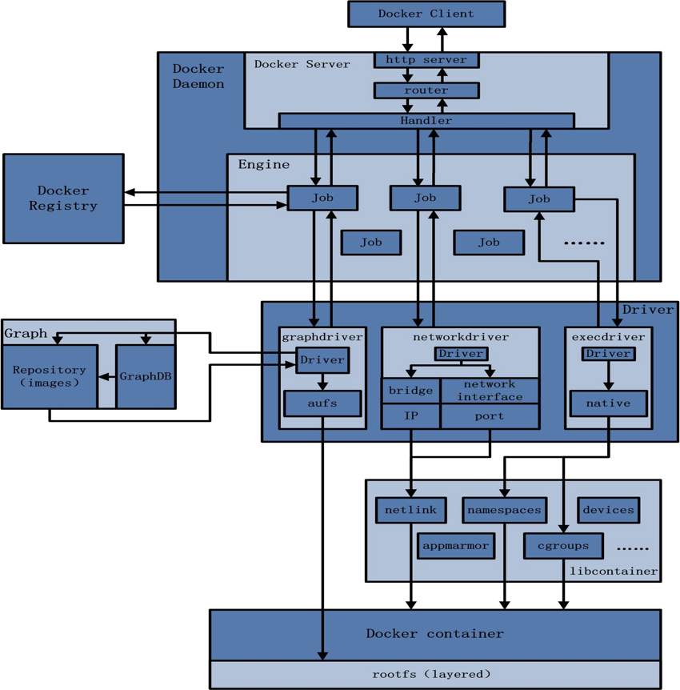

# 首先

部分参考了网上[资料](https://github.com/soh0ro0t/docker-source-analysis)、《docker 源码分析》，但其内容因版本差异较大，所以重新整理

# docker结构

代码来源于[docker-ce](https://github.com/docker/docker-ce/tree/19.03)，版本为19.03。docker主要还是采用c/s架构，c端使用docker client进行了封装。主要模块包括了：

* docker client
* docker daemon
* docker registry
* graph
* driver
* libcontainer
* container

docker整体的结构如下：

## docker client

没什么好说的，docker的client端，主要用于和daemon建立通信，调用[docker api](https://docs.docker.com/engine/api/latest/)发起请求

## docker daemon 

docker的后端服务实现，daemon说明这是一个常驻后代的进程，主要由2部分组成。一部分用于构建http server，接收并路由http请求；另一部分为具体的容器管理工作。

### docker server

docker的http server端，用于接收http请求，主要有router/handler来完成请求分发

### engine

docker 核心运行引擎，管理job的执行，后者是docker命令的实际执行单元。根据命令种类的不容分为多类。

### job

docker daemon可执行的每一项命令，都以job形式呈现

## docker registry

docker的镜像仓库，除了官方的[docker hub](https://hub.docker.com/)，也可以建立自己的私有hub，如[harbor](https://goharbor.io/).并通过docker tag/push 完成image upload. 以镜像pull为例，docker http server接收请求后，会handler至engine，并分派一个pull job用以和registry进行通信。

## graph
## driver
## libcontainer
## container
