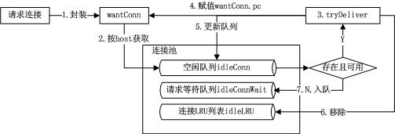

# go http client 连接池

http的连接池主要作用于http client端，在发送http请求时，复用tcp连接。

从实现上来说，其逻辑与db连接池一样，每一个tcp连接对应了一个conn对象，当使用时，从“容器(数组、切片、map)”取出这个对象，当使用完毕，将这个对象放回容器。

## TCP的4次挥手

使用netstat查看目前的tcp连接中各个状态的数量时，最常见的问题是，TIME_WAIT和CLOSE_WAIT状态的数量过多了，严重占用端口资源。
```
netstat -n | awk '/^tcp/ {++S[$NF]} END {for(a in S) print a, S[a]}'
```
其原因在于，TCP断开连接需要四次挥手。其流程图如下，

1. Client数据传输完毕需要断开连接，Client的应用进程向TCP发出连接释放报文段（FIN=1,序号seq=u）,并停止再发送数据，主动关闭TCP连接，进入**FIN_WAIT1状态**，等待Server的确认。

2. Server收到连接释放报文段后即发出确认报文段（ACK=1，确认号ack=u+1,序号seq=v）,Server进入**CLOSE_WAIT关闭等待状态**,此时的TCP处于半关闭状态。而Client收到Server的确认后，**进入FIN_WAIT2状态**，等待Server发出的连接释放报文段。

3. 当Server数据传输完毕后，Server发出连接释放报文段（FIN=1，ACK=1，序号seq=w,确认号ack=u+1）,Server**进入LAST_ACK（最后确认）状态**，等待Client的最后确认。

4. Client收到Server的连接释放报文段后，对此发出确认报文段（ACK=1，seq=u+1，ack=w+1）,Client**进入TIME_WAIT（时间等待）状态**。**此时TCP未释放掉，需要经过时间等待计时器设置的时间2MSL后，Client才进入CLOSE状态。**

此时需要注意主动关闭方的**TIME_WAIT**状态以及等待时间2MSL
```
为什么Client在TIME_WAIT状态必须等待2MSL（2个最大报文生存时间）的时间？

1.保证2者正常进入CLOSED状态。

TCP 在设计的时候，做了充分的容错性设计，比如，TCP 假设报文会出错，需要重传。在这里，如果图中主机 1 的 ACK 报文没有传输成功，那么主机 2 就会重新发送 FIN 报文。如果主机 1 没有维护 TIME_WAIT 状态，而直接进入 CLOSED 状态，它就失去了当前状态的上下文，只能回复一个 RST 操作，从而导致被动关闭方出现错误。现在主机 1 知道自己处于 TIME_WAIT 的状态，就可以在接收到 FIN 报文之后，重新发出一个 ACK 报文，使得主机 2 可以进入正常的 CLOSED 状态

2.旧连接的重复分节在网络中自然消失

我们知道，在网络中，经常会发生报文经过一段时间才能到达目的地的情况，产生的原因是多种多样的，如路由器重启，链路突然出现故障等。如果迷走报文到达时，发现 TCP 连接四元组（源 IP，源端口，目的 IP，目的端口）所代表的连接不复存在，那么很简单，这个报文自然丢弃。

考虑这样一个场景，在原连接中断后，又重新创建了一个新连接，新连接和原先的连接四元组完全相同，如果迷失报文经过一段时间也到达，那么这个报文会被误认为是连接“化身”的一个 TCP 分节，这样就会对 TCP 通信产生影响。所以，TCP 就设计出了这么一个机制，经过 2MSL 这个时间，足以让两个方向上的分组都被丢弃，使得原来连接的分组在网络中都自然消失，再出现的分组一定都是新化身所产生的。

引用：https://blog.csdn.net/michaelwoshi/article/details/121180561
```
因此，TIME_WAIT状态的消失只能通过2MSL时间转换为CLOSED状态后消失，无法人工删除。TIME_WAIT会过多的原因只有一个，就是本地主动关闭的连接太多了，即使用了大量的短连接，且用后释放。

## 连接池参数

首先看下默认的连接池参数，
```go
//net/http/transport.go
var DefaultTransport RoundTripper = &Transport{
	Proxy: ProxyFromEnvironment,
	//超时设置
	DialContext: (&net.Dialer{
		Timeout:   30 * time.Second,
		KeepAlive: 30 * time.Second,
	}).DialContext,
	ForceAttemptHTTP2:     true,
	//与连接池相关的参数，最大空闲连接
	MaxIdleConns:          100,
	IdleConnTimeout:       90 * time.Second,
	//其余和连接池相关参数
	MaxIdleConnsPerHost： 2,（=DefaultMaxIdleConnsPerHost）
    MaxConnsPerHost： 0（不限制）
	...
}
```
如果自定义http连接池，使用方式如下：
```go
	httpTransport := &http.Transport{
		//...自定义连接池参数
	}
	httpClient := &http.Client{
		Transport: httpTransport,
	}
	resp, err := httpClient.Get("http://httpbin.org/anything")
	...
```

## 连接池实现

### 函数入口

当创建一个http client对象后，会调用client.Do发请求：
```go
func (c *Client) Do(req *Request) (*Response, error) {
	return c.do(req)
}
//进入具体实现，最终调用的是send方法
func (c *Client) do(req *Request) (retres *Response, reterr error) {
	...
	if resp, didTimeout, err = c.send(req, deadline); err != nil {
            // c.send() always closes req.Body
            reqBodyClosed = true
            if !deadline.IsZero() && didTimeout() {
                err = &httpError{
                    err:     err.Error() + " (Client.Timeout exceeded while awaiting headers)",
                    timeout: true,
                }
            }
            return nil, uerr(err)
        }
    ...
}
```
这里真正发请求的函数就是c.send, 这个函数的实现也比较简单, 主要是调用了send函数，这个函数的实现主要如下:
```go
// didTimeout is non-nil only if err != nil.
func (c *Client) send(req *Request, deadline time.Time) (resp *Response, didTimeout func() bool, err error) {
    if c.Jar != nil {
        for _, cookie := range c.Jar.Cookies(req.URL) {
            req.AddCookie(cookie)
        }
    }
	//调用send函数
    resp, didTimeout, err = send(req, c.transport(), deadline)
    if err != nil {
        return nil, didTimeout, err
    }
    if c.Jar != nil {
        if rc := resp.Cookies(); len(rc) > 0 {
            c.Jar.SetCookies(req.URL, rc)
        }
    }
    return resp, nil, nil
}
// send issues an HTTP request.
// Caller should close resp.Body when done reading from it.
func send(ireq *Request, rt RoundTripper, deadline time.Time) (resp *Response, didTimeout func() bool, err error) {
	...
	resp, err = rt.RoundTrip(req)
	...
	return resp, nil, nil
}
```

### RoundTripper接口

这里真正进行网络交互的定位到的函数是rt.RoundTrip，即调用了RoundTripper接口的RoundTrip方法。RoundTrip代表一个http事务，给一个请求返回一个响应，且必须是并发安全的。对于http客户端，可以定义不同的RoundTripper 接口实现来完成诸如请求缓存等操作。具体可[参考此示例](https://lanre.wtf/blog/2017/07/24/roundtripper-go/) ：
```go
//https://github.com/adelowo/rounder/
//自定义一个缓存请求url的roundTripper，如果请求的url在缓存中，直接返回，否则，请求server并将结果缓存

func main() {

	cachedTransport := newTransport()

	//Create a custom client so we can make use of our RoundTripper
	//If you make use of http.Get(), the default http client located at http.DefaultClient is used instead
	//Since we have special needs, we have to make use of our own http.RoundTripper implementation
	client := &http.Client{
		Transport: cachedTransport,
		Timeout:   time.Second * 5,
	}

	//Time to clear the cache store so we can make request to the original server
	cacheClearTicker := time.NewTicker(time.Second * 5)

	//Make a new request every second
	//This would help demonstrate if the response is actually coming from the real server or from the cache
	reqTicker := time.NewTicker(time.Second * 1)

	terminateChannel := make(chan os.Signal, 1)

	signal.Notify(terminateChannel, syscall.SIGTERM, syscall.SIGHUP)

	req, err := http.NewRequest(http.MethodGet, "http://localhost:8000", strings.NewReader(""))

	if err != nil {
		log.Fatalf("An error occurred ... %v", err)
	}

	for {
		select {
		case <-cacheClearTicker.C:
			// Clear the cache so we can hit the original server
			cachedTransport.Clear()

		case <-terminateChannel:
			cacheClearTicker.Stop()
			reqTicker.Stop()
			return

		case <-reqTicker.C:

			resp, err := client.Do(req)

			if err != nil {
				log.Printf("An error occurred.... %v", err)
				continue
			}

			buf, err := ioutil.ReadAll(resp.Body)

			if err != nil {
				log.Printf("An error occurred.... %v", err)
				continue
			}

			fmt.Printf("The body of the response is \"%s\" \n\n", string(buf))
		}
	}
}

func cacheKey(r *http.Request) string {
	return r.URL.String()
}

type cacheTransport struct {
	data              map[string]string
	mu                sync.RWMutex
	originalTransport http.RoundTripper
}

func (c *cacheTransport) Set(r *http.Request, value string) {
	c.mu.Lock()
	defer c.mu.Unlock()
	c.data[cacheKey(r)] = value
}

func (c *cacheTransport) Get(r *http.Request) (string, error) {
	c.mu.RLock()
	defer c.mu.RUnlock()

	if val, ok := c.data[cacheKey(r)]; ok {
		return val, nil
	}

	return "", errors.New("key not found in cache")
}

// There be dragons!!!
func (c *cacheTransport) RoundTrip(r *http.Request) (*http.Response, error) {

	// Check if we have the response cached..
	// If yes, we don't have to hit the server
	// We just return it as is from the cache store.
	if val, err := c.Get(r); err == nil {
		fmt.Println("Fetching the response from the cache")
		return cachedResponse([]byte(val), r)
	}

	// Ok, we don't have the response cached, the store was probably cleared.
	// Make the request to the server.
	resp, err := c.originalTransport.RoundTrip(r)

	if err != nil {
		return nil, err
	}

	// Get the body of the response so we can save it in the cache for the next request.
	buf, err := httputil.DumpResponse(resp, true)

	if err != nil {
		return nil, err
	}

	// Saving it to the cache store
	c.Set(r, string(buf))

	fmt.Println("Fetching the data from the real source")
	return resp, nil
}

func (c *cacheTransport) Clear() error {
	c.mu.Lock()
	defer c.mu.Unlock()

	c.data = make(map[string]string)
	return nil
}

func cachedResponse(b []byte, r *http.Request) (*http.Response, error) {
	buf := bytes.NewBuffer(b)
	return http.ReadResponse(bufio.NewReader(buf), r)
}

func newTransport() *cacheTransport {
	return &cacheTransport{
		data:              make(map[string]string),
		originalTransport: http.DefaultTransport,
	}
}
```

对于连接池来说，如果在new client时没有定义transport对象，则使用实现了RoundTripper接口的DefaultTransport.
```go
func (c *Client) transport() RoundTripper {
    if c.Transport != nil {
        return c.Transport
    }
    return DefaultTransport
}
// RoundTrip implements the RoundTripper interface.
//
// For higher-level HTTP client support (such as handling of cookies
// and redirects), see Get, Post, and the Client type.
func (t *Transport) RoundTrip(req *Request) (*Response, error) {
    ...
        for {
            ...
				//t.getConn的作用是获取一个链接
                pconn, err := t.getConn(treq, cm)
                ...
                if pconn.alt != nil {
                    // HTTP/2 path.
                    t.setReqCanceler(req, nil) // not cancelable with CancelRequest
                        resp, err = pconn.alt.RoundTrip(req)
                } else {
                    resp, err = pconn.roundTrip(treq)
                }
        }
    ...
}
```

### 获取连接

具体来看获取连接的实现`func (t *Transport) getConn(treq *transportRequest, cm connectMethod) (pc *persistConn, err error)`，首先解释两个入参：
```go
// transportRequest对原始http req进行了封装，增加额外字段来处理RoundTrip过程中产生的错误或其他信息
// transportRequest is a wrapper around a *Request that adds
// optional extra headers to write and stores any error to return
// from roundTrip.
type transportRequest struct {
	*Request                         // original request, not to be mutated
	extra     Header                 // extra headers to write, or nil
	trace     *httptrace.ClientTrace // optional
	cancelKey cancelKey

	mu  sync.Mutex // guards err
	err error      // first setError value for mapRoundTripError to consider
}

// treq gets modified by roundTrip, so we need to recreate for each retry.
treq := &transportRequest{Request: req, trace: trace, cancelKey: cancelKey}


// 请求参数cm用来唯一标识一个连接请求，包括了请求Scheme,targetAddr，该对象将会用于标识与不同的host建立连接时，对应的连接池的key
type connectMethod struct {
	_            incomparable
	proxyURL     *url.URL // nil for no proxy, else full proxy URL
	targetScheme string   // "http" or "https"
	// If proxyURL specifies an http or https proxy, and targetScheme is http (not https),
	// then targetAddr is not included in the connect method key, because the socket can
	// be reused for different targetAddr values.
	targetAddr string
	onlyH1     bool // whether to disable HTTP/2 and force HTTP/1
}
//生成connectMethod的定义如下
func (t *Transport) connectMethodForRequest(treq *transportRequest) (cm connectMethod, err error) {
	cm.targetScheme = treq.URL.Scheme
	cm.targetAddr = canonicalAddr(treq.URL)
	if t.Proxy != nil {
		cm.proxyURL, err = t.Proxy(treq.Request)
	}
	cm.onlyH1 = treq.requiresHTTP1()
	return cm, err
}
```
继续看`getConn`实现：
```go

// getConn dials and creates a new persistConn to the target as
// specified in the connectMethod. This includes doing a proxy CONNECT
// and/or setting up TLS.  If this doesn't return an error, the persistConn
// is ready to write requests to.
func (t *Transport) getConn(treq *transportRequest, cm connectMethod) (pc *persistConn, err error) {
	req := treq.Request
	trace := treq.trace
	ctx := req.Context()
	if trace != nil && trace.GetConn != nil {
		trace.GetConn(cm.addr())
	}
	//wantConn连接的请求信息
	w := &wantConn{
		cm:         cm,
		key:        cm.key(),//标识一个请求
		ctx:        ctx,
		ready:      make(chan struct{}, 1),
		beforeDial: testHookPrePendingDial,
		afterDial:  testHookPostPendingDial,
	}
	defer func() {
		if err != nil {
			w.cancel(t, err)
		}
	}()

	// Queue for idle connection.
	// 1. 如果连接池中存在空闲连接，则取出并返回
	if delivered := t.queueForIdleConn(w); delivered {
		pc := w.pc
		// Trace only for HTTP/1.
		// HTTP/2 calls trace.GotConn itself.
		if pc.alt == nil && trace != nil && trace.GotConn != nil {
			trace.GotConn(pc.gotIdleConnTrace(pc.idleAt))
		}
		// set request canceler to some non-nil function so we
		// can detect whether it was cleared between now and when
		// we enter roundTrip
		t.setReqCanceler(treq.cancelKey, func(error) {})
		return pc, nil
	}

	cancelc := make(chan error, 1)
	t.setReqCanceler(treq.cancelKey, func(err error) { cancelc <- err })

	//2. 否则，新创建一个连接
	// Queue for permission to dial.
	t.queueForDial(w)


	//3. 无论是新建还是从池中获取，当获取连接完毕后，进入case <-w.ready，返回连接信息
	// Wait for completion or cancellation.
	select {
	case <-w.ready:
		// Trace success but only for HTTP/1.
		// HTTP/2 calls trace.GotConn itself.
		if w.pc != nil && w.pc.alt == nil && trace != nil && trace.GotConn != nil {
			trace.GotConn(httptrace.GotConnInfo{Conn: w.pc.conn, Reused: w.pc.isReused()})
		}
		if w.err != nil {
			// If the request has been cancelled, that's probably
			// what caused w.err; if so, prefer to return the
			// cancellation error (see golang.org/issue/16049).
			select {
			case <-req.Cancel:
				return nil, errRequestCanceledConn
			case <-req.Context().Done():
				return nil, req.Context().Err()
			case err := <-cancelc:
				if err == errRequestCanceled {
					err = errRequestCanceledConn
				}
				return nil, err
			default:
				// return below
			}
		}
		return w.pc, w.err
	case <-req.Cancel:
		return nil, errRequestCanceledConn
	case <-req.Context().Done():
		return nil, req.Context().Err()
	case err := <-cancelc:
		if err == errRequestCanceled {
			err = errRequestCanceledConn
		}
		return nil, err
	}
}
```
这里可以看到获取连接是有2个分支：创建新连接 以及 从连接池获取：

1. **连接池获取连接**

在进入`func (t *Transport) queueForIdleConn(w *wantConn) (delivered bool)`的实现之前，首先在Transport结构体中对于连接池的定义：
```go
// net/http/transport.go
type Transport struct {
	idleMu       sync.Mutex
	closeIdle    bool                                // user has requested to close all idle conns //用户是否已关闭所有的空闲连接
	idleConn     map[connectMethodKey][]*persistConn // most recently used at end   //空闲连接map，key标识针对一个host的连接，对应的value []*persistConn为该请求上已经在的空闲连接
	idleConnWait map[connectMethodKey]wantConnQueue  // waiting getConns  //连接请求队列，key标识针对一个host的连接，对应的value wantConnQueue为针对该host的连接请求队列
	idleLRU      connLRU 	//空闲连接LRU容器，标识最近最少未使用连接						

	reqMu       sync.Mutex
	reqCanceler map[cancelKey]func(error)

	altMu    sync.Mutex   // guards changing altProto only
	altProto atomic.Value // of nil or map[string]RoundTripper, key is URI scheme

	connsPerHostMu   sync.Mutex
	connsPerHost     map[connectMethodKey]int		//连接请求限制参数，key标识针对每一个host的连接请求，value标识对于该host目前的连接数
	connsPerHostWait map[connectMethodKey]wantConnQueue // waiting getConns //针对每一个host连接的连接请求等待队列
	...
}
```
可以看到，对于http连接池的定义，是以`connectMethodKey`来分割的，每一个key，其实就是对与连接host的请求，维护一个连接队列:
```
// connectMethodKey is the map key version of connectMethod, with a
// stringified proxy URL (or the empty string) instead of a pointer to
// a URL.
type connectMethodKey struct {
	proxy, scheme, addr string
	onlyH1              bool
}
```
回到实现，如果从池中连接获取成功则返回true，其整体流程如图所示

```go
// queueForIdleConn queues w to receive the next idle connection for w.cm.
// As an optimization hint to the caller, queueForIdleConn reports whether
// it successfully delivered an already-idle connection.
func (t *Transport) queueForIdleConn(w *wantConn) (delivered bool) {
	//禁用KeepAlive说明需要短连接，返回false
	if t.DisableKeepAlives {
		return false
	}
	t.idleMu.Lock()
	defer t.idleMu.Unlock()
	
	// Stop closing connections that become idle - we might want one.
	// (That is, undo the effect of t.CloseIdleConnections.)
	t.closeIdle = false

	...

	// If IdleConnTimeout is set, calculate the oldest
	// persistConn.idleAt time we're willing to use a cached idle
	// conn.
	//超时连接判断
	var oldTime time.Time
	if t.IdleConnTimeout > 0 {
		oldTime = time.Now().Add(-t.IdleConnTimeout)
	}

	// Look for most recently-used idle connection.
	// 获取对应host请求的空闲连接队列，如果有值，说明存在空闲连接
	if list, ok := t.idleConn[w.key]; ok {
		stop := false
		delivered := false
		//如果存在空闲连接，则使用
		for len(list) > 0 && !stop {
			//取出队尾的空闲连接对象
			pconn := list[len(list)-1]
			
			// See whether this connection has been idle too long, considering
			// only the wall time (the Round(0)), in case this is a laptop or VM
			// coming out of suspend with previously cached idle connections.
			// 如果这个连接已经超时，则异步开启协程go pconn.closeConnIfStillIdle() 将其从连接池中移除
			tooOld := !oldTime.IsZero() && pconn.idleAt.Round(0).Before(oldTime)
			if tooOld {
				// Async cleanup. Launch in its own goroutine (as if a
				// time.AfterFunc called it); it acquires idleMu, which we're
				// holding, and does a synchronous net.Conn.Close.
				//内部逻辑为，如果这个连接在LRU列表里，说明最近最少被使用，则将其从map[connectMethodKey][]*persistConn的[]*persistConn队列中移除
				go pconn.closeConnIfStillIdle()
			}
			// 如果这个连接存在err，但还没有被移除，则先跳过
			if pconn.isBroken() || tooOld {
				// If either persistConn.readLoop has marked the connection
				// broken, but Transport.removeIdleConn has not yet removed it
				// from the idle list, or if this persistConn is too old (it was
				// idle too long), then ignore it and look for another. In both
				// cases it's already in the process of being closed.
				list = list[:len(list)-1]
				continue
			}
			// tryDeliver即 将这个获取到的连接赋值给wantConn对象的persistConn字段，说明拿到了可用连接
			// 同时close(w.ready)，说明连接获取完成
			delivered = w.tryDeliver(pconn, nil)
			
			if delivered {
				if pconn.alt != nil {
					// HTTP/2: multiple clients can share pconn.
					// Leave it in the list.
				} else {
					// HTTP/1: only one client can use pconn.
					// Remove it from the list.
					//将这个连接从LRU列表中移除，说明已被使用，同时更新空闲列表List
					t.idleLRU.remove(pconn)
					list = list[:len(list)-1]
				}
			}
			//跳出for循环
			stop = true
		}
		//如果list还有值，则更新对应host的idleConn，否则直接从map删除这条host记录
		if len(list) > 0 {
			t.idleConn[w.key] = list
		} else {
			delete(t.idleConn, w.key)
		}
		if stop {
			return delivered
		}
	}
	
	// 如果针对这个host没有空闲连接，将这个获取连接请求加入idleConnWait队列，key为对应的host，value为该host对应的连接请求队列
	// 入队后，当新建连接时，会将连接赋值给队中的wantConn，具体看下节“新建连接”
	// Register to receive next connection that becomes idle.
	if t.idleConnWait == nil {
		t.idleConnWait = make(map[connectMethodKey]wantConnQueue)
	}
	q := t.idleConnWait[w.key]
	q.cleanFront()
	q.pushBack(w)
	t.idleConnWait[w.key] = q
	//没有从池中获取连接，连接请求也入队了，return false
	return false
}
```


2. **新建连接**

如果没有从连接池中获取到可用连接，则需要新建一个，进入函数`t.queueForDial(w)`：
```go
// queueForDial queues w to wait for permission to begin dialing.
// Once w receives permission to dial, it will do so in a separate goroutine.
func (t *Transport) queueForDial(w *wantConn) {
	//新建连接前的钩子函数，默认是空实现
	w.beforeDial()
	//如果没有设置每个host连接的最大连接数，则直接新建
	if t.MaxConnsPerHost <= 0 {
		//新建连接
		go t.dialConnFor(w)
		return
	}

	t.connsPerHostMu.Lock()
	defer t.connsPerHostMu.Unlock()
	//如果设置了每个host连接的最大连接数，更新对应的连接数并新建
	if n := t.connsPerHost[w.key]; n < t.MaxConnsPerHost {
		if t.connsPerHost == nil {
			t.connsPerHost = make(map[connectMethodKey]int)
		}
		t.connsPerHost[w.key] = n + 1
		go t.dialConnFor(w)
		return
	}
	//将这个获取连接请求加入connsPerHostWait队列，key为对应的host，value为该host对应的连接等待队列
	if t.connsPerHostWait == nil {
		t.connsPerHostWait = make(map[connectMethodKey]wantConnQueue)
	}
	q := t.connsPerHostWait[w.key]
	q.cleanFront()
	q.pushBack(w)
	t.connsPerHostWait[w.key] = q
}	
```
此处开启了一个协程创建连接：
```go
// dialConnFor dials on behalf of w and delivers the result to w.
// dialConnFor has received permission to dial w.cm and is counted in t.connCount[w.cm.key()].
// If the dial is cancelled or unsuccessful, dialConnFor decrements t.connCount[w.cm.key()].
func (t *Transport) dialConnFor(w *wantConn) {
	defer w.afterDial()
	//创建连接，并调用tryDeliver将新建的连接赋值给连接请求对象wantConn
	pc, err := t.dialConn(w.ctx, w.cm)
	delivered := w.tryDeliver(pc, err)
	if err == nil && (!delivered || pc.alt != nil) {
		// pconn was not passed to w,
		// or it is HTTP/2 and can be shared.
		// Add to the idle connection pool.
		// 如果没有赋值给请求对象wantConn，则入池，入池失败的话，关闭这个新建的连接
		t.putOrCloseIdleConn(pc)
	}
	if err != nil {
		t.decConnsPerHost(w.key)
	}
}

~~~~~~~~~~~~~~~~~~~~~~~~~~~~~~~~~~~~~
//具体的入池操作如下
// tryPutIdleConn adds pconn to the list of idle persistent connections awaiting
// a new request.
// If pconn is no longer needed or not in a good state, tryPutIdleConn returns
// an error explaining why it wasn't registered.
// tryPutIdleConn does not close pconn. Use putOrCloseIdleConn instead for that.
func (t *Transport) tryPutIdleConn(pconn *persistConn) error {
	//如果禁用keepalive或者 host不允许有空闲连接，则err
	if t.DisableKeepAlives || t.MaxIdleConnsPerHost < 0 {
		return errKeepAlivesDisabled
	}
	if pconn.isBroken() {
		return errConnBroken
	}
	pconn.markReused()
	
	t.idleMu.Lock()
	defer t.idleMu.Unlock()
	
    ...//暂时忽略http2处理

	// Deliver pconn to goroutine waiting for idle connection, if any.
	// (They may be actively dialing, but this conn is ready first.
	// Chrome calls this socket late binding.
	// See https://www.chromium.org/developers/design-documents/network-stack#TOC-Connection-Management.)
	// 如果在对应的host上存在空闲连接请求等待队列，则将新建的连接赋值给对应的连接请求wantConn
	key := pconn.cacheKey
	if q, ok := t.idleConnWait[key]; ok {
		done := false
		if pconn.alt == nil {
			// HTTP/1.
			// Loop over the waiting list until we find a w that isn't done already, and hand it pconn.
			for q.len() > 0 {
				w := q.popFront()
				if w.tryDeliver(pconn, nil) {
					done = true
					break
				}
			}
		} else {
			...
		}
		//更新连接请求队列
		if q.len() == 0 {
			delete(t.idleConnWait, key)
		} else {
			t.idleConnWait[key] = q
		}
		if done {
			return nil
		}
	}
	//如果没有空闲连接请求，则将这个连接放入host对应的空闲连接队列
	if t.closeIdle {
		return errCloseIdle
	}
	if t.idleConn == nil {
		t.idleConn = make(map[connectMethodKey][]*persistConn)
	}
	idles := t.idleConn[key]
	if len(idles) >= t.maxIdleConnsPerHost() {
		return errTooManyIdleHost
	}
	for _, exist := range idles {
		if exist == pconn {
			log.Fatalf("dup idle pconn %p in freelist", pconn)
		}
	}
	//放入host对应的空闲连接队列，并添加新LRU列表
	t.idleConn[key] = append(idles, pconn)
	t.idleLRU.add(pconn)
	if t.MaxIdleConns != 0 && t.idleLRU.len() > t.MaxIdleConns {
		oldest := t.idleLRU.removeOldest()
		oldest.close(errTooManyIdle)
		t.removeIdleConnLocked(oldest)
	}

	// Set idle timer, but only for HTTP/1 (pconn.alt == nil).
	// The HTTP/2 implementation manages the idle timer itself
	// (see idleConnTimeout in h2_bundle.go).
	if t.IdleConnTimeout > 0 && pconn.alt == nil {
		if pconn.idleTimer != nil {
			pconn.idleTimer.Reset(t.IdleConnTimeout)
		} else {
			pconn.idleTimer = time.AfterFunc(t.IdleConnTimeout, pconn.closeConnIfStillIdle)
		}
	}
	pconn.idleAt = time.Now()
	return nil
}

```
