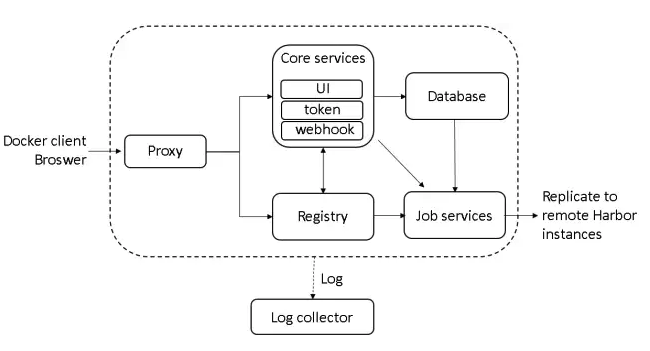

# harbor 结构

[harbor](https://goharbor.io/) 是一个开源的docker registry，提供了完整的企业级registry功能。

## struct

harbor由多个组件构成，使用docker-compose安装后，可以看到stdout的组件启动情况：
```
Creating harbor-log ... done
Creating registryctl ... done
Creating registry    ... done
Creating redis       ... done
Creating harbor-db   ... done
Creating chartmuseum ... done
Creating harbor-core ... done
Creating harbor-portal     ... done
Creating harbor-jobservice ... done
Creating nginx             ... done
```

各个组件的交互如下图所示：



各个组件的作用为：

- **nginx**：一个nginx的容器，将docker client或浏览器发送的请求反向代理到后端的Core、Registry组件。进入nginx容器内部，其配置位于`/etc/nginx/nginx.conf`。大致内容如下：

```
worker_processes auto;

events {
  worker_connections 1024;
  use epoll;
  multi_accept on;
}

http {
  tcp_nodelay on;
  include /etc/nginx/conf.d/*.upstream.conf;

  # this is necessary for us to be able to disable request buffering in all cases
  proxy_http_version 1.1;

  upstream core {
    server core:8080;
  }

  upstream portal {
    server portal:80;
  }
  ...
  access_log /dev/stdout timed_combined;

  include /etc/nginx/conf.d/*.server.conf;

  server {
    listen 443 ssl;
    server_tokens off;
    # SSL
    ssl_certificate /etc/cert/server.crt;
    ssl_certificate_key /etc/cert/server.key;
	... 
    include /etc/nginx/conf.d/harbor.https.*.conf;

    location / {
      proxy_pass http://portal/;
	  ...
    }

    location /c/ {
      proxy_pass http://core/c/;
      ...
    }
  
    location /api/ {
      proxy_pass http://core/api/;
     ...
    }
   ...
    server {
      listen 80;
      #server_name harbordomain.com;
      return 308 https://$host$request_uri;
  } 

```

上述除了使用基本的反向代理配置将请求转发到各个组件，也增加了ssl。当harbor以https方式部署，将加载证书和公钥信息` ssl_certificate /etc/cert/server.crt ssl_certificate_key /etc/cert/server.key;` 这些文件在docker compose中被挂载进容器。同时，当访问80端口，将被重定向到443。

- **registry**：官方的docker registry，负责保存镜像。其配置了到core的webhook，当镜像的状态发生变化时，通知core。通过habor的docker-compose.yaml文件，可以看到其镜像信息均挂载到了宿主机的/data/registry目录:
```
  registry:
    image: goharbor/registry-photon:v2.7.1-patch-2819-v1.8.2
    container_name: registry
    restart: always
    cap_drop:
      - ALL
    cap_add:
      - CHOWN
      - SETGID
      - SETUID
    volumes:
      - /data/registry:/storage:z
      - ./common/config/registry/:/etc/registry/:z
      - type: bind
        source: /data/secret/registry/root.crt
        target: /etc/registry/root.crt
    networks:
      - harbor
    dns_search: .
    depends_on:
      - log
    logging:
      driver: "syslog"
      options:  
        syslog-address: "tcp://127.0.0.1:1514"
        tag: "registry"
```
harbor的大部分数据均位于/data下，针对数据挂载路径的配置位于`harbor.yaml`的data_volume字段中：
```
# The default data volume
data_volume: /data
```

- **job Service**：定时执行一些任务，用于job镜像仓库同步使用。

- **portal**： harbor的前端门户。

- **core**： harbor自身的核心服务，完成的功能主要包括了：

1. 提供rest api入口

2. 监听registry上镜像的变化，做相应处理，比如记录日志、发起复制等

3. 充当Docker Authorization Service的角色，对镜像资源进行基于角色的鉴权

4. 连接Database，提供存取projects、users、roles、replication policies和images元数据的API接口

- **db**：db服务，用于存储projects、users、roles、replication policies和images的元数据,使用关系型数据库postgresql。

- **log**：一个syslog日志服务，其它组件可以将日志发送到这里，它负责集中存储。日志内容输出到了/var/log/harbor/中，log在harbor.yaml中配置：
```
# Log configurations
log:
  # options are debug, info, warning, error, fatal
  level: info
  # Log files are rotated log_rotate_count times before being removed. If count is 0, old versions are removed rather than rotated.
  rotate_count: 50
  # Log files are rotated only if they grow bigger than log_rotate_size bytes. If size is followed by k, the size is assumed to be in kilobytes. 
  # If the M is used, the size is in megabytes, and if G is used, the size is in gigabytes. So size 100, size 100k, size 100M and size 100G 
  # are all valid.
  rotate_size: 200M
  # The directory on your host that store log
  location: /var/log/harbor
```