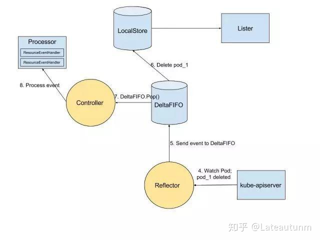

# k8s informer 笔记


## k8s的list-watch

从场景上说，etcd存储集群的数据信息，apiserver作为统一入口，任何对数据的操作都必须经过apiserver。客户端(kubelet/scheduler/controller-manager)通过list-watch监听apiserver中资源(pod/rs/rc等等)的create,update和delete事件，并针对事件类型调用相应的事件处理函数。

list-watch有两部分组成，分别是list和watch。
- list非常好理解，就是调用资源的rest API罗列资源，基于HTTP短链接实现.
- watch则是调用资源的watch API监听资源变更事件，基于**HTTP 长链接实现**

比如，对于default命名空间下pod的list和watch接口，访问如下(省略client证书等身份校验)：
- list： `curl -GET https://{apiserver:port}/api/v1/namespaces/default/pods`
- watch: `curl -GET https://{apiserver:port}/api/v1/namespaces/default/pods?watch=true`

### watch的实现

那么Watch是如何实现的呢？Watch是如何通过HTTP长链接接收apiserver发来的资源变更事件呢？

秘诀就是**Chunked transfer encoding(分块传输编码)**，它首次出现在HTTP/1.1：
```
    HTTP 分块传输编码允许服务器为动态生成的内容维持 HTTP 持久链接。通常，持久链接需要服务器在开始发送消息体前发送Content-Length消息头字段，但是对于动态生成的内容来说，在内容创建完之前是不可知的。使用分块传输编码，数据分解成一系列数据块，并以一个或多个块发送，这样服务器可以发送数据而不需要预先知道发送内容的总大小。
```
当客户端调用watch API时，apiserver 在response的HTTP Header中设置`Transfer-Encoding`的值为`chunked`，表示采用分块传输编码，客户端收到该信息后，便和服务端保持该链接，并等待下一个数据块，即资源的事件信息。例如：
```
$ curl -i https://{apiserver:port}/api/v1/namespaces/default/pods?watch=true
HTTP/1.1 200 OK
Content-Type: application/json
Transfer-Encoding: chunked
Date: Thu, 02 Jan 2019 20:22:59 GMT
Transfer-Encoding: chunked

{"type":"ADDED", "object":{"kind":"Pod","apiVersion":"v1",...}}
{"type":"ADDED", "object":{"kind":"Pod","apiVersion":"v1",...}}
{"type":"MODIFIED", "object":{"kind":"Pod","apiVersion":"v1",...}}
```

### 意义

当设计优秀的一个异步消息的系统时，对消息机制有至少如下四点要求：
- 消息可靠性：

list API可以查询当前的资源及其对应的状态(即期望的状态)，客户端通过拿期望的状态和实际的状态进行对比，纠正状态不一致的资源。Watch API和apiserver保持一个长链接，接收资源的状态变更事件并做相应处理。如果仅调用watch API，若某个时间点连接中断，就有可能导致消息丢失，所以需要通过list API解决消息丢失的问题。从另一个角度出发，我们可以认为list API获取全量数据，watch API获取增量数据。虽然仅仅通过轮询list API，也能达到同步资源状态的效果，但是存在开销大，实时性不足的问题。

- 消息实时性

消息必须是实时的，list-watch机制下，每当apiserver的资源产生状态变更事件，都会将事件及时的推送给客户端，从而保证了消息的实时性。

- 消息顺序性

消息的顺序性也是非常重要的，在并发的场景下，客户端在短时间内可能会收到同一个资源的多个事件，对于关注最终一致性的K8S来说，它需要知道哪个是最近发生的事件，并保证资源的最终状态如同最近事件所表述的状态一样。K8S在每个资源的事件中都带一个resourceVersion的标签，这个标签是递增的数字，所以当客户端并发处理同一个资源的事件时，它就可以对比resourceVersion来保证最终的状态和最新的事件所期望的状态保持一致。

- 高性能

List-watch还具有高性能的特点，虽然仅通过周期性调用list API也能达到资源最终一致性的效果，但是周期性频繁的轮询大大的增大了开销，增加apiserver的压力。而watch作为异步消息通知机制，复用一条长链接，保证实时性的同时也保证了性能。


## informer概念

通过上文，在获取/监控一个k8s资源对象时，可以直接调用k8s apiserver,如当我们要watch pod的资源状态并做处理时：

```
	resp, err := http.Get("http://apiserver:port/api/v1/watch/pods?watch=yes")
	...
    decoder := json.NewDecoder(resp.Body)
    for {
        var event Event
        err = decoder.Decode(&event)
        if err != nil {
            // ...
        }
        switch event.Type {
        case ADDED, MODIFIED:
            // ...
        case DELETED:
            // ...
        case ERROR:
            // ...
        }
    }
```

但这种做法的直接结果是api server的qps增加，所以，client-go除了提供基本的k8s操作封装，也引入了informer工具。 informer中文意思就是"通知者"，是一个**依赖于k8s list-watch api进行事件监听，并通过注册EventHandler实现事件回调，且带有本地缓存和索引机制的工具包**.

因此，informer的关键点有3：

- **依赖k8s List/Watch api**： Informer在初始化的时，先调用Kubernetes List API获得定义的k8s资源对象的全部Object，缓存在内存中; 然后，调用 Watch API去watch这类对象，从而维护缓存。之后，使用Informer实例的Lister()方法时，List/Get K8s中的Object时，Informer不会再去请求K8s API，而是直接查找缓存在本地内存中的数据(这份数据由Informer自己维护)。通过这种方式，Informer既可以更快地返回结果，又能减少对Kubernetes API的直接调用。另外注意，informer会定期relist来保证与k8s数据的一致性。


-- **二级缓存实现**：二级缓存属于Informer的底层缓存机制，这两级缓存分别是DeltaFIFO和LocalStore。这两级缓存的用途各不相同。

1. **DeltaFIFO**用来存储Watch API返回的各种事件 
2. **LocalStore**只会被Lister的List/Get方法访问 

虽然Informer和Kubernetes之间没有resync机制，但Informer内部的这两级缓存之间存在resync机制

- **ResourceEventHandler**:  通过添加ResourceEventHandler回调函数，并实现` OnAdd(obj interface{}) OnUpdate(oldObj, newObj interface{}) 和 OnDelete(obj interface{})` 三个方法，便可以在资源对象被操作时，加入需要的业务逻辑。

## informer 关键逻辑



以pod操作为例：

1. Informer初始化时，Reflector会先调用k8s apiserver的list API获得所有的Pod
2. Reflector组件拿到全部Pod后，会将全部Pod 放到LocalStore中
3. 如果有人调用Informer对象Lister的List/Get方法获取Pod， 那么Lister会直接从LocalStore中拿数据
4. Informer初始化完成之后，Reflector开始调用k8s apiserver的watch API来监听Pod相关的所有事件
5. 如果此时pod被删除，那么Reflector会监听到这个事件
6. Reflector将pod被删除的这个事件发送到DeltaFIFO
7. DeltaFIFO 首先会将这个事件存储在自己的数据结构中(实际上是一个 queue)，然后会直接操作LocalStore中的数据，删除LocalStore中的pod
8. DeltaFIFO 再Pop()这个事件到资源对应的Controller中
9. Controller收到这个事件，会触发Processor的回调函数ResourceEventHandler
10. LocalStore会周期性地把所有的Pod信息重新放到DeltaFIFO中

## 使用

client-go informer的使用场景有两个，一个是作为k8s client的cache使用，主要是完成资源对象的watch。另一个为自定义CRD：

1. client cache角色

```
	//k8s kubeconfig 文件获取
	var kubeconfig *string
    if home := homedir.HomeDir(); home != "" {
        kubeconfig = flag.String("kubeconfig", filepath.Join(home, ".kube", "config"), "(optional) absolute path to the kubeconfig file")
    } else {
        kubeconfig = flag.String("kubeconfig", "", "absolute path to the kubeconfig file")
    }
    flag.Parse()
	
    config, err := clientcmd.BuildConfigFromFlags("", *kubeconfig)
    if err != nil {
        panic(err)
    }

    // 初始化 client-set
    clientset, err := kubernetes.NewForConfig(config)
    if err != nil {
        log.Panic(err.Error())
    }
	//定义一个stopper开关，通过close这个channel，informer将执行一些清理操作
    stopper := make(chan struct{})
    defer close(stopper)
    
    //初始化 informer，推荐使用的是SharedInformerFactory，Shared 指的是在多个Informer中共享一个本地cache。
    factory := informers.NewSharedInformerFactory(clientset, 0)
	//定义watch node资源对象的informer
    nodeInformer := factory.Core().V1().Nodes()
    informer := nodeInformer.Informer()
    defer runtime.HandleCrash()
    
    // 启动 informer，list & watch
    go factory.Start(stopper)
    
    // 从 apiserver 同步资源，即 list 
    if !cache.WaitForCacheSync(stopper, informer.HasSynced) {
        runtime.HandleError(fmt.Errorf("Timed out waiting for caches to sync"))
        return
    }
	
    // 使用自定义 handler
    informer.AddEventHandler(cache.ResourceEventHandlerFuncs{
        AddFunc:    func...,
        UpdateFunc: func..., 
        DeleteFunc: func...,
    })
    
    // 创建 lister
    nodeLister := nodeInformer.Lister()
    // 从 lister 中获取所有 items
    nodeList, err := nodeLister.List(labels.Everything())
    if err != nil {
        fmt.Println(err)
    }
    fmt.Println("nodelist:", nodeList)
    <-stopper
```

2. controller角色

具体请参考[sample-controller示例](https://github.com/kubernetes/sample-controller)


