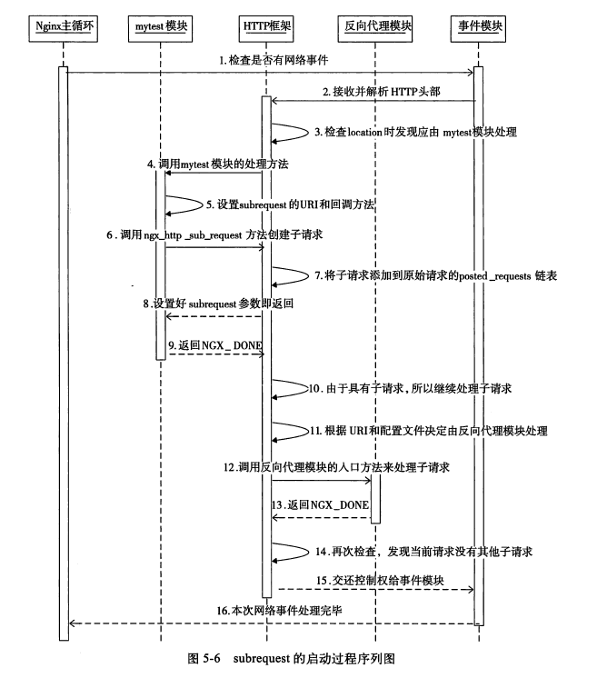
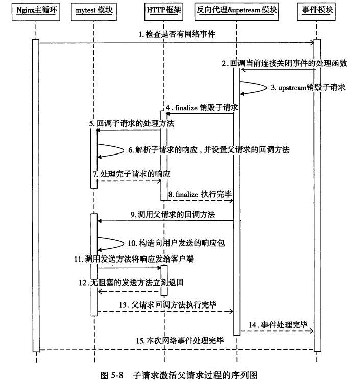
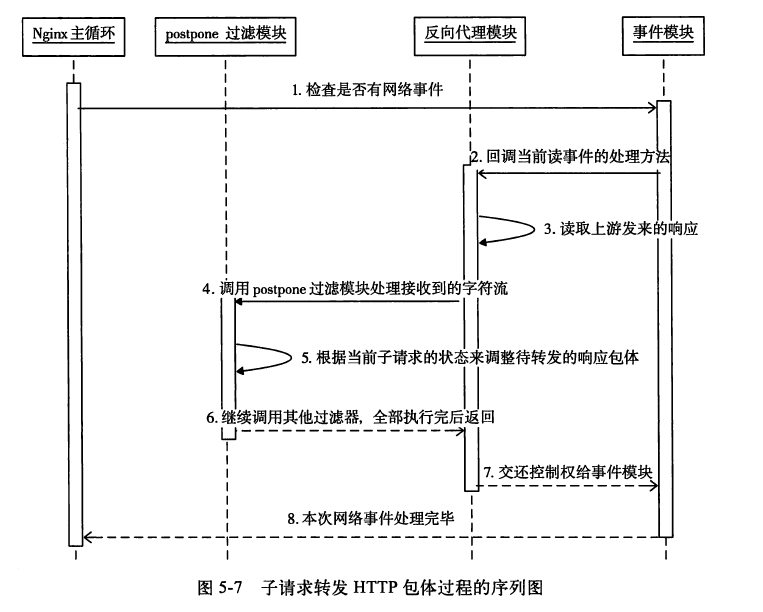

# subrequest

subrequest是由HTTP框架提供的一种分解复杂请求的设计模式。它可以把**原始请求分解为许多子请求，使得诸多请求协同完成一个用户请求，并且每个请求只关注一个功能**。当收到上游的响应后，再进行重新构造发送给下游客户端。

它与upstream的关系为：**subrequest专注于将客户端的请求拆分为若干个子请求**，而**upstream专注于通过nginx进行第三方的请求访问**。因此，**子请求在进行第三方访问并获取返回时，其实使用的是upstream机制**。

## 例子

假设如下的场景：当使用浏览器访问localhost/query?s_sh000001时，由nginx的mytest模块处理，它会生成一个subrequest。这个子请求会再交给upstream模块(例子中为反向代理，proxy_pass)访问新浪的http://hq.sinajs.cn服务器。得到子请求响应后，mytest对其进行解析，重新构造发往客户端的HTTP响应。
其nginx.conf配置如下：
```
location /list {
	proxy_pass 			http://hq.sinajs.cn;
	proxy_set_header	Accept-Encoding  "";
}

location /query {
	mytest;
}
```

## 需要考虑的点

根据上面提到的例子，可得到需要关心的以下几个问题：
1. 创建subrequest的时机？
2. 子请求如何构造？
3. 子请求返回后，如何处理子响应？
4. 父请求怎么激活，如何返回响应给客户端？

## demo实现

1. **前置结构体定义**

没啥说的，三板斧，定义mytest的ngx_module_t/ngx_http_module_t/ngx_command_t，不再赘述：
```c
//定义command，执行mytest项的解析定义
static ngx_command_t  ngx_http_mytest_commands[] ={
    {
        ngx_string("mytest"),
        NGX_HTTP_MAIN_CONF | NGX_HTTP_SRV_CONF | NGX_HTTP_LOC_CONF | NGX_HTTP_LMT_CONF | NGX_CONF_NOARGS,
		//mytest的解析回调
		ngx_http_mytest,
        NGX_HTTP_LOC_CONF_OFFSET,
        0,
        NULL
    },
    ngx_null_command
};
//这里全部为null，有点意思，说明没啥需要初始化的内容，也不用merge
static ngx_http_module_t  ngx_http_mytest_module_ctx ={
    NULL,                              /* preconfiguration */
    NULL,                  		/* postconfiguration */

    NULL,                              /* create main configuration */
    NULL,                              /* init main configuration */

    NULL,                              /* create server configuration */
    NULL,                              /* merge server configuration */

    NULL,       			/* create location configuration */
    NULL         			/* merge location configuration */
};
//http模块
ngx_module_t  ngx_http_mytest_module =
{
    NGX_MODULE_V1,
    &ngx_http_mytest_module_ctx,           /* module context */
    ngx_http_mytest_commands,              /* module directives */
    NGX_HTTP_MODULE,                       /* module type */
    NULL,                                  /* init master */
    NULL,                                  /* init module */
    NULL,                                  /* init process */
    NULL,                                  /* init thread */
    NULL,                                  /* exit thread */
    NULL,                                  /* exit process */
    NULL,                                  /* exit master */
    NGX_MODULE_V1_PADDING
};
```

2. **创建subrequest**

subrequest的创建时机同样是在command定义的set方法中，即ngx_http_mytest。当nginx解析到mytest项后，构造subrequest：
```c
static char *ngx_http_mytest(ngx_conf_t * cf, ngx_command_t * cmd, void * conf){
    ngx_http_core_loc_conf_t  *clcf;

    //根据nginx对于配置项的解析，根据扫描的具体块，从对应的ngx_http_conf_ctx_t取出ngx_http_core_module模块的loc_conf配置项
    clcf = ngx_http_conf_get_module_loc_conf(cf, ngx_http_core_module);

    //http框架在处理用户请求进行到NGX_HTTP_CONTENT_PHASE阶段时，如果
	//请求的主机域名、URI与mytest配置项所在的配置块相匹配，就将调用我们
	//实现的ngx_http_mytest_handler方法处理这个请求
    clcf->handler = ngx_http_mytest_handler;

    return NGX_CONF_OK;
}
```
实际工作由handler完成：
```c
static ngx_int_t ngx_http_mytest_handler(ngx_http_request_t * r){
    //创建http上下文，具体这个上下文稍后解答
    ngx_http_mytest_ctx_t* myctx = ngx_http_get_module_ctx(r, ngx_http_mytest_module);
    if (myctx == NULL){
        myctx = ngx_palloc(r->pool, sizeof(ngx_http_mytest_ctx_t));
        ...
        //将上下文设置到原始请求r中
        ngx_http_set_ctx(r, myctx, ngx_http_mytest_module);
    }

    // 设置请求的回调结构体ngx_http_post_subrequest_t
    ngx_http_post_subrequest_t *psr = ngx_palloc(r->pool, sizeof(ngx_http_post_subrequest_t));
    ...

    //设置子请求回调方法为mytest_subrequest_post_handler
    psr->handler = mytest_subrequest_post_handler;

    //data设为myctx上下文，这样回调mytest_subrequest_post_handler
	//时传入的data参数就是myctx
    psr->data = myctx;

    //子请求的URI前缀是/list，这是因为访问新浪服务器的请求必须是类
	//似/list=s_sh000001这样的URI，在nginx.conf中已设置对应location
    ngx_str_t sub_prefix = ngx_string("/list=");
    ngx_str_t sub_location;
    sub_location.len = sub_prefix.len + r->args.len;
    sub_location.data = ngx_palloc(r->pool, sub_location.len);
    ngx_snprintf(sub_location.data, sub_location.len,
                 "%V%V", &sub_prefix, &r->args);

    //sr即子请求
    ngx_http_request_t *sr;
    //调用ngx_http_subrequest创建子请求，它只会返回NGX_OK或者NGX_ERROR。
	//返回NGX_OK时，sr就已经是合法的子请求。
	
	//注意，这里的NGX_HTTP_SUBREQUEST_IN_MEMORY参数将告诉upstream模块把上游服务器的响应全部保存在子请求的sr->upstream->buffer内存缓冲区中
    ngx_int_t rc = ngx_http_subrequest(r, &sub_location, NULL, &sr, psr, NGX_HTTP_SUBREQUEST_IN_MEMORY);
    ...
    //必须返回NGX_DONE，理由同upstream
    return NGX_DONE;
}
```
在以上代码中，初始化的subrequest并设置的回调。这里有几个关键的点：
- 设置请求上下文`myctx = ngx_palloc(r->pool, sizeof(ngx_http_mytest_ctx_t))`
- 请求的回调结构体`ngx_http_post_subrequest_t *psr = ngx_palloc(r->pool, sizeof(ngx_http_post_subrequest_t));`
- 请求的回调函数`psr->handler = mytest_subrequest_post_handler;`
- 子请求的创建`ngx_http_subrequest(r, &sub_location, NULL, &sr, psr, NGX_HTTP_SUBREQUEST_IN_MEMORY);`

其中，command函数以及子请求的创建解答了subrequest的触发和创建时机问题。子请求的上下文与回调用于处理子请求返回，在下节说明。

这里的关键是**启动subrequest子请求，函数为ngx_http_subrequest**，其定义如下：
```c
//位于nginx/src/http/ngx_http_core_module.h中，响应的实现位于ngx_http_core_module.c
//其参数定义如下：
//1.ngx_http_request *r 是指当前请求，也就是父请求。
//2.ngx_str_t *u 是子请求的URI。
//3.ngx_str_t *args  是子请求的URI参数，如果没有参数，可以传送NULL指针。
//4.ngx_http_request **psr  为输出参数，而非输入参数。ngx_http_subrequest产生的子请求将通过这个参数传出来。一般为建立一个指针，将其指针的地址传入后，如果成功返回，该指针将指向子请求
//5.ngx_http_post_subrequest_t *ps  用来设置子请求处理完毕时的回调方法，第4步有说明
//6.ngx_uint_t flags 一般设置为0。
ngx_int_t ngx_http_subrequest(ngx_http_request_t *r, ngx_str_t *uri, ngx_str_t *args, ngx_http_request_t **psr, ngx_http_post_subrequest_t *ps, ngx_uint_t flags);
```

总的来说，子请求的创建步骤如图:



3. **上下文定义**

subrequest请求创建完成后，如果成功执行，那么子请求的响应如何处理呢？答案即上节设置的subrequest的回调函数handler。在分析回调handler之前，需要有一个数据结构，来处理返回的请求，因此需要定义一个上下文：
```c
//上下文定义，使用stock数组来格式化子请求响应
typedef struct{
    ngx_str_t		stock[6];
} ngx_http_mytest_ctx_t;

```
4. **subrequest回调**

当子请求调用结束后，nginx都会调用ngx_http_post_subrequest_t回调方法，而调用的过程是通过定义`ngx_http_post_subrequest_t`结构体，来传具体的参数实现：
```c
//定义位于nginx/src/http/ngx_http_request.h中
//data为方法入参，rc为在子请求结束时的状态，因为子请求最终也有upstream处理，所以rc的取值为upstream模块执行ngx_http_finalize_request传递的rc
typedef ngx_int_t (*ngx_http_post_subrequest_pt)(ngx_http_request_t *r, void *data, ngx_int_t rc);

typedef struct {
	//上面的回调方法
    ngx_http_post_subrequest_pt       handler;
	//回调方法执行的参数
    void                             *data;
} ngx_http_post_subrequest_t;
```
因此，在上例中回调的实现为`mytest_subrequest_post_handler`：
```c
static ngx_int_t mytest_subrequest_post_handler(ngx_http_request_t *r, void *data, ngx_int_t rc){
    //当前请求r是子请求，它的parent成员就指向父请求
    ngx_http_request_t          *pr = r->parent;
	
    //根据nginx对于配置项的解析，根据扫描的具体块，从对应的ngx_http_conf_ctx_t取出ngx_http_mytest_module模块的loc_conf配置项，也就是由ngx_http_mytest_create_loc_conf创建的配置项
    ngx_http_mytest_ctx_t* myctx = ngx_http_get_module_ctx(pr, ngx_http_mytest_module);

    pr->headers_out.status = r->headers_out.status;
    //如果返回NGX_HTTP_OK（也就是200）意味着访问新浪服务器成功，接着将开始解析http包体
    if (r->headers_out.status == NGX_HTTP_OK){
        int flag = 0;

        //在不转发响应时，buffer中会保存着上游服务器的响应。特别是在使用
		//反向代理模块访问上游服务器时，如果它使用upstream机制时没有重定义
		//input_filter方法，upstream机制默认的input_filter方法会试图
		//把所有的上游响应全部保存到buffer缓冲区中
        ngx_buf_t* pRecvBuf = &r->upstream->buffer;

        //以下开始解析上游服务器的响应，并将解析出的值赋到上下文结构体myctx->stock数组中
        for (; pRecvBuf->pos != pRecvBuf->last; pRecvBuf->pos++){
            if (*pRecvBuf->pos == ',' || *pRecvBuf->pos == '\"'){
                if (flag > 0)
                {
                    myctx->stock[flag - 1].len = pRecvBuf->pos - myctx->stock[flag - 1].data;
                }
                flag++;
                myctx->stock[flag - 1].data = pRecvBuf->pos + 1;
            }

            if (flag > 6)
                break;
        }
    }
    //这一步很重要，设置接下来父请求的回调方法
    pr->write_event_handler = mytest_post_handler;

    return NGX_OK;
}
```

5. **父请求返回**

上一步中，子请求的响应已经被解析并写入上下文myctx了，此时，通过回调函数`write_event_handler`回调方法：
```c
static void mytest_post_handler(ngx_http_request_t * r){
    //如果没有返回200则直接把错误码发回用户
    if (r->headers_out.status != NGX_HTTP_OK){
        ngx_http_finalize_request(r, r->headers_out.status);
        return;
    }

    //当前请求是父请求，直接取其上下文
    ngx_http_mytest_ctx_t* myctx = ngx_http_get_module_ctx(r, ngx_http_mytest_module);

    //定义发给用户的http包体内容，格式为：
	//stock[…],Today current price: …, volumn: …
    ngx_str_t output_format = ngx_string("stock[%V],Today current price: %V, volumn: %V");

    //计算待发送包体的长度，数据从上下文中获取
    int bodylen = output_format.len + myctx->stock[0].len + myctx->stock[1].len + myctx->stock[4].len - 6;
    r->headers_out.content_length_n = bodylen;

    //在内存池上分配内存 保存将要发送的包体
    ngx_buf_t* b = ngx_create_temp_buf(r->pool, bodylen);
    ngx_snprintf(b->pos, bodylen, (char*)output_format.data,
                 &myctx->stock[0], &myctx->stock[1], &myctx->stock[4]);
    b->last = b->pos + bodylen;
    b->last_buf = 1;

    ngx_chain_t out;
    out.buf = b;
    out.next = NULL;
    //设置Content-Type，注意汉字编码新浪服务器使用了GBK
    static ngx_str_t type = ngx_string("text/plain; charset=GBK");
    r->headers_out.content_type = type;
    r->headers_out.status = NGX_HTTP_OK;
    r->connection->buffered |= NGX_HTTP_WRITE_BUFFERED;
    ngx_int_t ret = ngx_http_send_header(r);
    ret = ngx_http_output_filter(r, &out);
    //注意，这里发送完响应后必须手动调用ngx_http_finalize_request结束请求，因为这时http框架不会再帮忙调用它
    ngx_http_finalize_request(r, ret);
}
```
总的来说，父请求的激活步骤如图:



## 多个子请求的场景

当使用子请求访问第三方服务时，如果需要派生出许多子请求，并且希望将子请求的响应依次转发给客户端时，则需要使用**postpone模块**。该模块会把带子请求的响应包体放在一个链表中，按子请求创建的先后顺序转发响应给客户端。在每个ngx_http_request_t结构体中，都有一个postponed成员：
```c
struct ngx_http_request_s {
	...
	ngx_http_postponed_request_t	*postponed;
	...
}
//本质上是一个链表，定义位于ngx_http_request.h
typedef struct ngx_http_postponed_request_s  ngx_http_postponed_request_t;

struct ngx_http_postponed_request_s {
    ngx_http_request_t               *request;
    ngx_chain_t                      *out;		//指向来自上游，需要转发给下游的响应包体
    ngx_http_postponed_request_t     *next;
};
```
而对于子请求响应的处理，则需要HTTP过滤模块的参与，包括了postpone过滤模块，该模块会处理设置在子请求中的ngx_http_postponed_request_t链表。
以上例中的反向代理模块，其流程如图：

